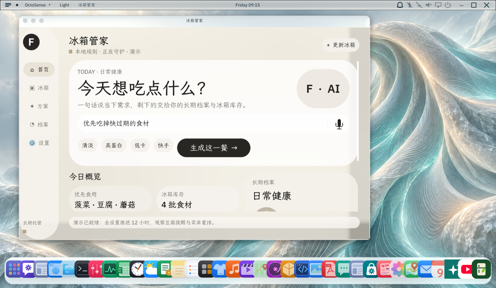

# Pantry Steward · 冰箱管家

English | [简体中文](README.md)

Turn confirmed fridge inventory into a practical dinner, with expiry checks and user-confirmed consumption.

This repository contains an entry for the [GOSIM Agentic App Hackathon 2026](https://create.gosim.org/agenticapp26/), using the OctoSense + AppCard scenario direction. The application is [`apps/pantry-steward/`](apps/pantry-steward/), version **0.4.1**: a non-system OctoScript bundle running in the unmodified official OctoSense desktop. It is not a Rust business module compiled into the shell.



Additional captures: [plan](apps/pantry-steward/bundle/screenshots/02-plan.png), [confirmation](apps/pantry-steward/bundle/screenshots/03-confirm.png), [updated inventory](apps/pantry-steward/bundle/screenshots/04-updated.png).

## Task and features

The workflow is profile setup → confirmed inventory → meal goal → candidate plan → acceptance → actual quantities → confirmed deduction → next-meal planning.

| Feature | Current behavior |
| --- | --- |
| Onboarding | Dietary scenario, basic profile, preferences, avoidances and initial inventory |
| Inventory | Names, grams and remaining days; preview before saving; confirmed edits/removal |
| Planning | Local expiry-based rules or the official host's structured `model.complete` service |
| Execution | Candidate and accepted menus remain distinct; deduction requires actual-quantity confirmation |
| Validation | Reject expired batches, excess quantities, stale plans and repeated consumption |
| Reminders | Periodic checks while running, pause, snooze and reminder settings |
| Persistence | Profile, inventory, plans, options, logs and backup recovery |
| Demonstration | Confirmed sample data, simulated time advance and restoration of pre-demo data |

Navigation contains Home, Fridge, Plans, Profile and Settings. The UI uses a sunlit background and translucent glass sections.

## Install and run

The recorded platform is Windows. Requires Git, Python **3.11+**, Rust stable, Windows C++ build tools and Windows SDK. First-time setup/build needs internet and disk space; this is source code, not a precompiled installer.

The following fresh-machine recipe was not rerun during this documentation update. Existing-environment build and launch evidence is in [VALIDATION.md](apps/pantry-steward/VALIDATION.md).

```powershell
git clone https://github.com/woshuoduijiushidui/OctoSense-AppCard.git
cd OctoSense-AppCard
python -X utf8 tools/setup.py
.\apps\pantry-steward\run.cmd --prepare-local-test
```

Executing `--prepare-local-test` means you approve creating local test keys outside the repository, under the platform's local app-data directory at `OctoSense/pantry-steward-local-test-keys`. These keys sign a separate local snapshot and catalog for installation through official App Hub checks. They are not the production publisher identity; no remote submission occurs. Keep the command window open during builds.

Reuse existing dependency repositories via setup's `--hub` option; see [official setup guidance](https://github.com/OctoSense-org/OctoSense). After the initial setup, double-click `apps/pantry-steward/run.cmd` or run it from the repository root.

## User flow and AI

1. Complete the dietary profile and confirm at least one inventory batch.
2. Enter a dinner goal on Home and generate a candidate.
3. Review ingredients, quantities and preparation, then accept the plan.
4. After eating, enter the actual grams and confirm deduction. Cancellation leaves inventory unchanged.
5. Update purchased or remaining food as needed. New plans use the latest confirmed inventory.

Configure the teacher-provided API details and token in **OctoSense's host-owned AI providers settings in the launched test desktop**. This version does not read the previous `ai.env`, collect keys in the bundle or inject custom host services.

The app sends the meal goal, dietary profile, available inventory, previous menu title and trigger to `model.complete`. The host manages providers and keys; the app validates the returned plan before presenting it. A successful `model.budget` query proves budget-service availability, not provider readiness or a successful model request. Live provider calls and the complete no-provider error path remain **unverified**. Local rules remain available through Settings. Standalone official card-host has no model services.

## Three-minute demonstration

Complete onboarding, select local rules, confirm loading demo data, inspect the original menu, advance demo time by 12 hours, inspect the tofu expiry candidate, accept it and review actual quantities. Cancel once to show unchanged inventory, then confirm deduction and inspect the next candidate. Restart to show persistence. Pre-demo data can be restored.

This demonstrates the local workflow, not successful online inference. An online presentation requires a configured provider and a real request verified beforehand.

## Competition and publication

The [competition page](https://create.gosim.org/agenticapp26/) currently requires a scenario, runnable prototype, public Apache-2.0 source, screenshots and demonstration for qualifying, due **October 4, 2026, 23:59 UTC+8**. Submission entry points, team details and any supplementary requirements follow organizer announcements.

Competition submission and App Hub publication are separate. Only `apps/pantry-steward/bundle/` is the store submission candidate. Publisher identity, privacy text, production signing and submission remain pending; a local signed test mirror is not publication. Follow the [official publishing contract](https://github.com/OctoSense-org/OctoScript-App-Design-Flow/blob/main/docs/PUBLISHING.md).

## Layout, evidence and limits

Application code is in `bundle/main.splash`; the manifest declares storage/model, listing contains screenshots and publisher fields, and assets contain the icon/background. `tools/launch.py` builds official CLI tools and installs a local test snapshot. `.local-state/` holds the isolated desktop and installed app data; never submit it. Pantry files are under its `apps/pantry-steward/` runtime sandbox. `--app-data` selects another test profile. Original inventory and AI settings were not migrated.

Recorded on **2026-10-02**, not rerun for this README update:

- Official OctoSense baseline [`b221f7b4`](https://github.com/OctoSense-org/OctoSense/commit/b221f7b4c877dd823d04e4ee510cc74880de5535), App Hub pin [`58c3c8ae`](https://github.com/OctoSense-org/OctoSense-App-Hub/commit/58c3c8aed8fc811a16d67c5f784a8a44214ff876).
- `pantry-steward 0.4.1 — PASSED`, with only the unsigned source-bundle warning; separate local signed snapshots passed too.
- 18 official-shell UI/data checks and 6 launcher checks passed. Logs and four real screenshots were inspected.

Speech recognition is unavailable: the microphone icon explains this and records no audio. Camera recognition, OCR, external shopping, Android devices/APK and other operating systems are unverified or not delivered. Checks stop when the host closes. Nutrition/calorie figures and preference summaries are prototype estimates/simple rules, not professional measurements or a learned model. Users must review dietary constraints and food condition.

Recorded developer commands from the repository root:

```powershell
python -X utf8 apps/pantry-steward/tools/launch.py --check
python -X utf8 -m unittest discover -s apps/pantry-steward/tools -p 'test_*.py'
python -X utf8 apps/pantry-steward/tools/launch.py --standalone
```

Native UI regression requires a separate running hidden test shell and the matching smoke port/profile. See [validation](apps/pantry-steward/VALIDATION.md), [privacy draft](apps/pantry-steward/PRIVACY.md) and [review answers](apps/pantry-steward/REVIEW-ANSWERS.md).

## License and upstream

[Apache License 2.0](LICENSE). Third-party notices are in [NOTICE](NOTICE) and [LICENSES/](LICENSES/). The application is developed in this project; its host is [official OctoSense](https://github.com/OctoSense-org/OctoSense), and its packaging follows [App Design Flow](https://github.com/OctoSense-org/OctoScript-App-Design-Flow) and [App Hub](https://github.com/OctoSense-org/OctoSense-App-Hub).

Further upstream product documentation: [desktop](desktop/README.md), [Home](phone/README.md), [ROM](rom/README.md).
