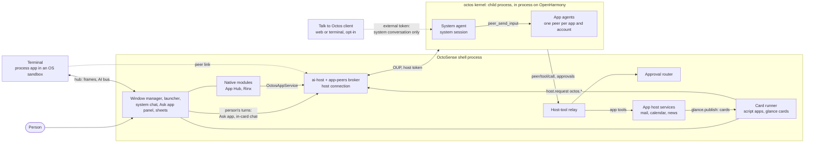
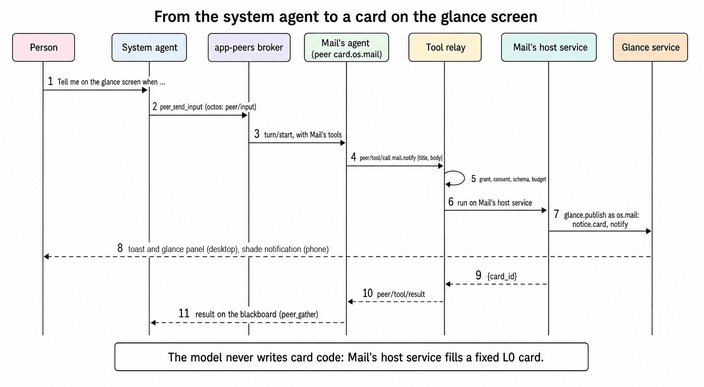
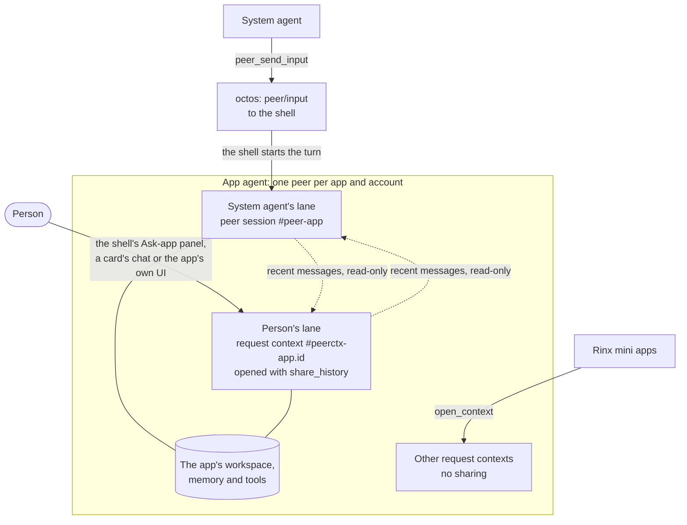
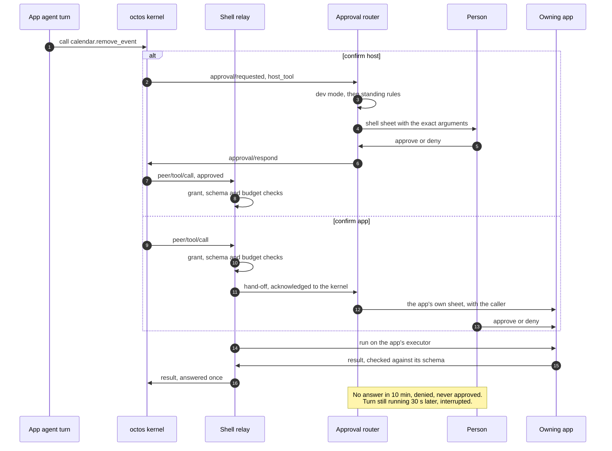

# OctoSense

English | [简体中文](README.zh-CN.md)

[OctoSense](https://github.com/OctoSense-org) is an agent shell on top of your operating system: a launcher and apps that look like the ones you know, with a system agent coordinating app agents. This repository holds all of OctoSense's own code in one place ([ADR 0001](docs/adr/0001-one-octosense-repository.md)): the shell, its services, the first-party system apps, and the three products built from them.

| Product | What it is | Where |
| --- | --- | --- |
| **OctoSense desktop** | The shell as one Makepad window on macOS (Windows and Linux untested): launcher, dock, tiles, hosted apps | [`desktop/`](desktop/README.md) |
| **OctoSense Home** | The phone shell, an ordinary Home app for any Android phone (also OpenHarmony and the iOS simulator) | [`phone/`](phone/README.md) |
| **OctoSense ROM** | LineageOS 22.2 for the OnePlus 6 with Home, the privileged system bridge, Quickstep and SystemUI preinstalled | [`rom/`](rom/README.md) |

It was OctoSense-Desktop; OctoSense-ROM (retired; merged into this repository) and OctoSense-System-Apps were imported into it with their history on 2026-09-27. OctoSense-System-Apps is archived; the OctoSense-ROM repository no longer exists.

> **Building an OctoSense app?** You do not need this repository to build, check or publish one. Start at the [OctoSense-org profile](https://github.com/OctoSense-org)'s reading list: [OctoScript-App-Design-Flow](https://github.com/OctoSense-org/OctoScript-App-Design-Flow) (`AGENTS.md`, then `docs/QUICKSTART.md`) and [OctoSense-App-Hub](https://github.com/OctoSense-org/OctoSense-App-Hub). The system apps in [`apps/`](apps/README.md) are complete examples of the same app shape (`apps/<name>/bundle/`). Build the desktop shell from here only to see your app in a shell before it is published ([PUBLISHING §4](https://github.com/OctoSense-org/OctoScript-App-Design-Flow/blob/main/docs/PUBLISHING.md#4-rehearse-the-store-path-locally)).

## Start with the code walkthrough

New to the codebase? Start with [From an app window to an agent turn](docs/architecture-walkthrough.md). It follows executable entry points, native and script hosting, app data access, human/system conversations, tool routing and the actual Tokio tasks. The [product walkthrough](desktop/docs/code-walkthrough.md) adds desktop, Home, ROM and system-app run recipes.

## How it fits together

One shell process per device, one octos kernel per shell, and every agent is a session in that kernel. App-agent access goes through the shell broker. The shell holds the host connection and the host token, relays every agent tool call to the app that owns the tool, and routes approvals through developer mode, the person's standing rules or confirmation sheets. The opt-in AppCard prototype accesses the shared kernel service directly, bypassing the app-peer broker, as described below. The full picture, with the code paths and what is on `main` versus planned: [docs/architecture.md](docs/architecture.md); the decisions: [ADR 0004](docs/adr/0004-native-apps-hosting-and-peers.md).

### Processes and connections


<details><summary>Text version (Mermaid)</summary>



</details>

- **The shell** (`crates/shell`, one process) hosts the window manager, the native modules (App Hub, Rinx), App Hub's Card runner (every script app in its own isolate), the system chat, the approval router, the host-tool relay and [`crates/ai-host`](crates/ai-host/README.md), whose [app-peers broker](crates/app-peers/README.md) is the kernel's host connection.
- **The octos kernel** ([`crates/kernel`](crates/kernel/README.md)) starts on first use: a child process speaking OUP over stdio on the desktop (the packaged `octos-kernel` beside the shell, or `OCTOS_APP_CORE_BIN`) and Android (`liboctos.so`), an in-process task on OpenHarmony, none on iOS. It exits with the shell.
- **Process apps**: on the desktop the Terminal runs as its own process, attached over the shell's hub (frames and the AI bus), in an OS sandbox built from its `native-apps.json` entry (Seatbelt on macOS, Landlock and seccomp on Linux, not yet on Windows). A process app reaches its own agent over the **peer link**; the shell side is on `main`, but the Terminal is not granted an agent, so no process app uses it yet.
- **External clients**: Talk to Octos (opt-in) lets a web or terminal client use the system conversation with a limited external token: an allowlist of methods, no `peer/*` method, no app agent's session, no host-routed tools.

### Every path into octos goes through the shell

| Who | Path | Status |
| --- | --- | --- |
| In-process native module | the same peer link as a process app, through Makepad's `OctosPeer` client (the module host claims the link for the instance that opened it) | on `main`; no module uses it yet |
| In-process native module (Rinx) | the injected `OctosAppService`: `open_conversation` (the app's conversation with its agent) and `open_context` (a per-client request context, such as a Rinx mini app) | on `main` |
| Script app, and its cards | `host.request("octos.session.open" / "octos.session.history" / "octos.turn.start" / "octos.turn.interrupt")` to the `octos` host service, for the names its manifest declares; a card's in-card chat (`sys.chat`) through the shell | on `main`, after first-use consent (the shipped gate; `OCTOSENSE_CONTAINED_APPS=1` skips first-use consent, `0` turns it off). Today's system apps with an agent declare no `octos.*` name: the shell drives their agents |
| Process app | the peer link on its hub connection (`octos.session.open`, `octos.turn.start`, …), identity stamped by the shell | shell side on `main`; no process app granted an agent yet |
| The system agent | the kernel's own session `_main:api:octosense#system`, reached from the shell's system chat | on `main` |
| Talk to Octos client | the system conversation only, with the external token | on `main` |

### The system agent and the app agents

**The system agent** is the kernel session `_main:api:octosense#system` on the `_main` profile (`crates/kernel/src/network.rs`). It owns every app agent and supervises them.

The person talks to it in the shell's **assistant pane**, the system chat (`crates/shell/src/system_chat/`: the dock's Assistant icon, the phone home's Assistant tile or F8; a medium pane at the left on a desktop that moves and resizes and renders Markdown, full screen on a phone), or from a paired Talk to Octos client.

Its kernel tools are exactly `SYSTEM_AGENT_TOOLS` (`crates/kernel/src/system_tools.rs`): `peer_send_input`, `peer_gather`, `peer_list` and `peer_respond` to supervise app agents, its workspace's file tools, memory, `ask_user_question`, media viewing, `web_search`, `web_fetch` and `tool_search`. Every kernel start sets that list with octos's `session/tool_list/set`, so octos's own shell, the spawn family and `peer_close` are never offered.

The system chat also registers host tools on the session: `agents.list` and `agents.ask` (`crates/shell/src/agents.rs`: which apps have an agent, and the first-use sheet and ready-peer wait for one), `terminal.run` while Setup › Assistant › Command execution is on, and the native apps' own read tools their `native-apps.json` entries name (`agent.system_tools`): Calculator's `calculator.eval`, Clock's `clock.now`, Notes' `notes.search` and `notes.read`, Reminders' `reminders.due` and `reminders.list`, Weather's `weather.current`. Such a call reaches the app's open instance (its AI bus service); a closed app answers "Open Notes first".

**An app agent** is one host-owned octos peer per (app, account) ([`crates/app-peers`](crates/app-peers/README.md)). These apps have one on `main` (`crates/shell/src/apps.rs`, `agent_apps`):

| App | Declared by | Its tools (run by) | What it puts on the glance screen |
| --- | --- | --- | --- |
| Rinx (native) | `native-apps.json` `agent.octos` (the four `octos.*` services) and `agent.generic_tools` | octos's generic tools in its list; its own assistant UI | – |
| News (`os.news`) | `apps/news/bundle/tools.json`, the manifest's `agent` block | `news.list`, `news.read`, `news.notify` (the `news` host service and shell notice callback) | a notice card with a notification |
| Mail (`os.mail`) | `apps/mail/bundle/tools.json`, the manifest's `agent` block and `glance` | `mail.notify` (the `mail` host service) | a notice card with a notification |
| Calendar (`os.calendar`, desktop only) | `apps/calendar/bundle/tools.json`, the manifest's `agent` block and `glance` | `calendar.events`, `calendar.add_event`, `calendar.remove_event` (destructive: enters the approval router), `calendar.notify`, `calendar.agenda` (the `calendar` host service) | an event card or an agenda card, with a notification |
| Photos, Maps, YouTube; Camera on phone | Their bundle `tools.json`, `agent` block and `glance` | Each app's `<app>.notify` (shell `NoticeService`) | a notice card with a notification |

AI providers has no app agent.

A script app has an agent when its manifest declares `octos.*` names or an `agent` block (`"tools": ["ask_user_question"]` names the kernel tools it may use), or its bundle ships `tools.json` (each tool `<app>.<tool>` with its schemas, `risk`, `confirm` and `shareable`). The broker identifies the app as `card.<app id>`; the kernel returns its peer slug during preparation. The person allows the agent once, on the first-use sheet (from the shell's "Ask <app>" panel, the app's own `octos` call or the system agent's `agents.ask`). From then on the shell prepares the peer at startup, with the app's tools registered, so the system agent's `peer_list` shows it.

On Unix, a consented app agent with an available workspace also gets the host read tools `files.list`, `files.read` and `files.search` over its account folder; these do not expose every host-service database. On the phone, which builds `toolbox-peers` by default, it also gets the system toolbox's tools when its manifest asks for `research` or `crawl`, which no app does yet.

`AGENT.md`, skills and triggers ([ADR 0002](docs/adr/0002-event-driven-app-agents.md)) are not built: an app agent runs only when the system agent, the person or a card asks it.

**From the system agent to a card on the glance screen**:



<details><summary>Text version (Mermaid)</summary>

```mermaid
sequenceDiagram
  autonumber
  actor P as Person
  participant S as System agent
  participant B as Shell: app-peers broker
  participant A as Mail's agent (kernel-issued peer)
  participant R as Shell: tool relay
  participant M as Mail's host service
  participant G as Shell: glance service
  P->>S: "Tell me on the glance screen when ..."
  S->>B: peer_send_input (octos delivers peer/input)
  B->>A: turn/start on the peer's session, with Mail's tools
  A->>R: peer/tool/call mail.notify {title, body}
  R->>R: grant, consent, schema, budget
  R->>M: run on Mail's host service
  M->>G: glance.publish as os.mail: notice.card, notify
  G-->>P: desktop: a toast and the glance panel; phone: a shade notification
  M-->>R: {card_id}
  R-->>A: peer/tool/result
  A-->>S: the turn's result on the blackboard (peer_gather)
```

</details>

The model supplies text, never card code. The host fills fixed templates:

- **Notice cards.** Mail, News, Photos and the other `<app>.notify` tools use the shell’s [`notice.card`](crates/shell/resources/glance/notice.card). The shell supplies the app’s icon and name; the call supplies the title and body. Reusing a `card_id` replaces the app’s earlier notice.
- **Calendar cards.** `calendar.notify` and `calendar.agenda` use Calendar’s [event and agenda templates](apps/calendar/host-service/resources).

Mail and News forward `notify` from their host services to the shell. For apps without their own service, the shell’s [`glance_notice.rs`](crates/shell/src/glance_notice.rs) handles the call directly. In either case, the shell publishes as the app and requires its `glance` grant (`glance::publish_for`).

Pressing one of these cards opens the app. To discuss a Mail notice with Mail’s agent, open “Ask Mail” ([below](#talking-to-an-apps-agent-yourself)). [In-card chat](#in-card-chat) describes the separate chat feature and its current availability.

`mail.notify` and `calendar.add_event` are `act` tools and normally run without a per-call sheet. Destructive and outward calls enter the approval path; the shell’s approval router decides which requests need a person ([below](#a-tool-call-with-an-approval)).

### One app agent, two lanes

An app agent is one host-owned octos **peer** per (app, account), owned by the system agent, with its own workspace, memory namespace, model and tool list. The system agent and the person each talk to it in their own lane:


<details><summary>Text version (Mermaid)</summary>



</details>

- **The system agent's lane** is the peer's own session, `…#peer-<app>`. The system agent sends `peer_send_input`; octos delivers it to the shell's host connection as `peer/input`, and the shell starts the turn itself, so it runs with the app's tools, memory and approvals (or refuses it with `peer/input/reject` for a signed-out account or an app the person has not allowed). The peer's results go to the peers' blackboard, which the system agent reads.
- **The person's lane** is a request context, `…#peerctx-<app>.<id>`, opened with `share_history` by the shell's "Ask <app>" panel (`agents::conversation`, client instance `shell-ask`), by a card's in-card chat, or by the app's own UI (a native module's `open_conversation`, a script app's `octos.session.open`, a process app's peer link), a new one for every handle ([octos#2636](https://github.com/octos-org/octos/pull/2636), UPCR-2026-034). The two lanes run in parallel, one turn at a time per session: a person's message never waits for the system agent's turn. Each turn sees the other lane's recent messages as a read-only block that is never written into its own transcript, and every turn is labelled by its speaker (`[from the person: <app>]`, `[from the system agent]`). The app follows both lanes, each event tagged with its `lane` and speaker; `octos.session.history` merges both transcripts by time. The person's turns also leave rounds on the blackboard (`origin: person`), so the system agent sees them with `peer_gather`.
- *Until 2026-09-29 both spoke in one shared conversation on the peer's session ([#166](https://github.com/OctoSense-org/OctoSense/pull/166), octos#2626): one queue per peer, one turn at a time.*
- **Rinx mini apps** keep their own request contexts (`open_context`), each with its own transcript and folder, not shared with either lane.

### Talking to an app's agent yourself

The person is not limited to the system agent: they can talk to any app's own agent directly. Every turn the person starts is a person turn in the person's lane of that app's peer, beside the system agent's lane. It runs with the app's tools, memory and approvals, as a system agent's turn does.

| Surface | Where it is | How it opens |
| --- | --- | --- |
| **"Ask <app>"** (`crates/shell/src/app_chat/`) | A shell panel for every app with an agent, whether or not the app draws a chat of its own: the system chat's pane drawn as the app's conversation (`app_panel: true`). On a desktop it stands right of the system chat, so the two lanes show side by side. | The bar's "Ask <app>" button (shown while the focused window's app has an agent), Shift+F8, or the menu row "Ask this app's agent". With an app without an agent focused, the shell says "No app agent here". On the phone the pane is drawn as a full-screen sheet, but no touch control opens it on `main` yet. |
| **A card’s in-card chat** (`sys.chat`, `crates/shell/src/glance_chat.rs`) | A glance card that declares a chat | The person types in the card; the publishing app’s own agent answers, with its reply marked AI-written. See [in-card chat](#in-card-chat) for current availability and the demo. |
| **The app's own UI** | A native module's `open_conversation`, a script app's `octos.session.open`, a process app's peer link | Inside the app. Rinx draws its own assistant UI; none of the system apps draws a chat, so the “Ask <app>” panel is their current conversation entry. |

How the "Ask <app>" panel behaves:

- **Consent first.** An agent the person has not decided on shows the first-use sheet, and the panel waits ("<App>'s assistant is not allowed yet: allow it on the sheet."). An agent turned off says so: "<App>'s assistant is off. Turn it on in Setup › Assistant › Approvals."
- **Both lanes, labelled.** The panel follows both lanes and loads their merged history; every row shows its speaker (the person, the system agent, the app's agent).
- **Send** starts a person turn (`TurnTrigger::Person`). It never waits for the system agent's turn: Send stays available while only the system agent's lane runs. With a question from the app's agent open, the text answers it instead.
- **Stop** (in Send's place while the person's own turn runs) stops only that turn ("Stopped.", or "Nothing of yours was running."). A running system agent turn has its own row with **"Stop the system agent's task"**, which stops only that lane. The **"Stop <App>'s agent"** button on the shell's approval and question sheets stops both lanes (`approvals::stop_agent`): the person owns the device.
- **Questions** from turns the person or the app started are shown and answered in the panel; the system agent's go to the system chat (F8). Approvals are the shell's sheets, as everywhere.
- **Close** hides the panel. Its context stays open with its follower, so a reopen shows the person's rows again. The context closes when the panel opens for another app, when the agent is turned off, or when the app's peer goes (a signed-out account, for Mail).

### A tool call with an approval


<details><summary>Text version (Mermaid)</summary>



</details>

- **Tool calls**: octos sends `peer/tool/call` to the shell's relay (`crates/shell/src/host_tools/`), which checks the grant by (owning app, tool) and caller, the arguments against the tool's schema and the caller's budget, and routes the call to the owning app's executor: an in-process module's, a script app's host service, a process app's peer link, or the Terminal's `run` on the AI bus.
- **Approvals** go to `crates/shell/src/approvals/`: external clients retain their prompts; developer mode approves calls for covered apps; `confirm: app` uses the owning app's registered sheet; mandatory live decisions bypass rules; then standing rules may decide, otherwise a shell sheet asks the person. The system agent cannot approve. [The walkthrough](docs/architecture-walkthrough.md#approval-order) gives the complete order, deadlines and audit behavior.
- **Deadlines and Stop** ([#167](https://github.com/OctoSense-org/OctoSense/pull/167)): an approval or question the shell holds for an app peer expires after 10 minutes (`OCTOSENSE_PROMPT_DEADLINE_SECS`): the router denies it, a question is declined, both stay visible as "Expired: no answer in 10 min". If the turn is still running 30 s later, the broker interrupts it so the next turn can start. The sheets' "Stop <App>'s agent" ends the running turns of both lanes, the person's and the system agent's; the "Ask <app>" panel's Stop ends only the person's own turn ([above](#talking-to-an-apps-agent-yourself)).
- **External clients' prompts** stay with the client: the shell does not answer or expire approvals of a Talk to Octos client's turns (octos#2624).

### Cards and questions

#### Publishing and opening cards

An app with the `glance` capability publishes as itself with `glance.publish`; it can also use `glance.withdraw` and `glance.list`. The shell takes the publisher from the caller, never from the arguments. A card is either an L0 `source` filled from `data` (presentation only, checked by Octoscript’s L0 checker) or a Splash `script`.

The limits are 6 publishes per minute and 4 cards per app. The shell keeps 32 cards, ordered by priority, then recency: a phone’s glance page shows the first 6, and the desktop’s panel lists them all. See [`glance.rs`](crates/shell/src/glance.rs).

| Surface | What happens |
| --- | --- |
| Desktop panel | A new card opens the glance panel unless a card window is already open. The bar’s bell or F9 also opens the panel. A press on a card outside its own controls opens it in the card window. The hovered card shows its open and dismiss actions, and a card that just came wears an accent mark for a few seconds. A card that does not fit whole peeks in at the end of the list. A card taller than its tile scrolls inside it with the wheel; a card with an in-card chat stays at its newest rows, so its field and the latest exchange stay in view. Opened with F9 (or a press in it), the panel has the keyboard: the arrows move a focus ring from card to card, Return opens the card, Delete dismisses it and Esc closes the panel. |
| Desktop notification | A card published with `notify` also posts a toast with the app’s icon and name, the card’s title and its `summary` (else the card’s own). Selecting the toast opens the card in its own window. At most three toasts show at once; a “+N more” chip under them shows the rest. While the panel is open, toasts stack to its left. |
| Desktop dismissal | The hovered card shows a dismiss button: `glance::dismiss` removes the card as if the app had withdrawn it. Clear all dismisses every card. A dismissal can be undone from the toast that reports it, or with ⌘Z while the panel has the keyboard. The panel has a separate close button. |
| Phone | `notify` posts a shade notification. Selecting it opens the glance page. |

A card that names no theme takes the shell’s light or dark palette. Toasts and the panel slide in; `OCTOSENSE_REDUCE_MOTION=1` keeps them still. The desktop surfaces are implemented in [`glance_panel.rs`](crates/shell/src/glance_panel.rs), [`glance_sheet.rs`](crates/shell/src/glance_sheet.rs) and [`notifications.rs`](crates/shell/src/shell/notifications.rs) (`keep_clear_of`, [#273](https://github.com/OctoSense-org/OctoSense/pull/273)).

#### Interactive cards

A card runs under its app’s own policy, as the app’s UI does in the Card runner. A person’s action on a card passes through the app’s capability gate and host services. It is an app action, so it needs no extra shell approval for an agent tool call ([#153](https://github.com/OctoSense-org/OctoSense/pull/153)).

#### In-card chat

**Current availability:** none of the cards published by app agents on `main` declares a chat. The only shipped card with a chat is [`mail-request.card`](crates/shell/resources/glance/mail-request.card), enabled by `OCTOSENSE_GLANCE_DEMO=mail`; it gives canned replies.

An L0 card can declare `sys.chat(app, thread, fields)` and draw `ChatEntry` rows. It can also display model-written text (`class: model-copy`), which is marked AI-written and never executed as an action ([#263](https://github.com/OctoSense-org/OctoSense/pull/263)).

The host owns the transcript. Only the publishing app’s own agent answers, in the person’s lane, and only text the person typed is recorded as theirs. Threads are stored in `apps/<app>/accounts/<account>/chat/<thread>.json`. See [`crates/l0-chat`](crates/l0-chat/README.md) and [`glance_chat.rs`](crates/shell/src/glance_chat.rs).

#### Questions

Questions (`ask_user_question`) follow the turn’s trigger. A turn from the person’s lane or the app asks in the app’s conversation; a turn from the system agent’s lane asks in the system chat. Only the person answers, on a shell surface.

## Layout

| Path | What it is |
| --- | --- |
| [`desktop/`](desktop/README.md) | Desktop packaging, package `octosense`: the entry point (`src/main.rs` only), catalogs (`config/apps.json`), the window-manager sync from upstream Makepad (`upstream/`, `scripts/upstream.py`), the desktop's system-app selection. |
| [`phone/`](phone/README.md) | The Home app, package `octosense-home` (APK id `dev.makepad.octosense`): the entry point that wraps the shell (`src/main.rs`), the built-in Settings app (`src/settings_*.rs`, `src/android_settings.rs`, `resources/settings/`), Android, OpenHarmony and iOS packaging, the phone side of the system bridge (`android/`), the phone's system-app selection. |
| [`rom/`](rom/README.md) | The OnePlus 6 ROM image only: `vendor/` (product, privileged permissions, overlays, Settings backends, the privileged agent), `patches/`, image, flash and OTA scripts, the Home APK build scripts, `web-installer/`, product tests. |
| `crates/shell/` | The one shell, package `octosense-shell`, linked by both packages: window manager (desk, styles, tiling, scene), hosting (processes, in-process modules, App Hub, the AI pane), the phone layer (home pages, shade, gestures, the Android launcher bridge), themes, wallpapers and icons (`resources/`). |
| [`crates/ai-host/`](crates/ai-host/README.md) | The shell's AI services behind one entry point, package `octosense-ai-host`: the octos kernel service, the `llm` host service with the platform's QR import, the `model` service (`model.complete`), the `octos` host service that gives each script app its agent (`card.<app id>`), and native apps' assistant access. |
| [`crates/kernel/`](crates/kernel/README.md) | The octos kernel service, package `octosense-kernel`: the [octos](https://github.com/octos-org/octos) agent kernel as a shell service, one per process, configured by AI providers and shared by its consumers; the system agent's exact tool list. |
| [`crates/app-peers/`](crates/app-peers/README.md) | The app-agent broker, package `octosense-app-peers`: one host-owned octos peer per (app, account), its two lanes, its tools, `peer/input`, deadlines, purge ([Rinx ADR 0007](https://github.com/hagency-org/Rinx/blob/main/docs/adr/0007-host-owned-octos-app-peers.md)). |
| [`crates/l0-chat/`](crates/l0-chat/README.md) | The host side of an L0 card's in-card chat (`sys.chat`), package `octosense-l0-chat`, shared by the shell's glance cards and AppCard. |
| [`crates/toolbox/`](crates/toolbox/README.md) | The system toolbox, package `octosense-toolbox`: workflow templates, their runner, forks and evaluation, and `mod.research`, offered to app agents as host tools behind the `toolbox-peers` feature. |
| [`apps/`](apps/README.md) | The system apps (News, Photos, Maps, Camera, Mail, Calendar, AI providers, YouTube) as contained script apps, their host services (`mail`, `calendar`, `news`, `llm`), `apps/reference`, and the opt-in AppCard assistant (`apps/appcard`). |
| `tools/` | `setup.py` (the pinned framework sources), the reviewed Makepad runtime patch (`runtime-patches/`), `kernel-artifact.py` (the octos kernel an Android APK bundles as `liboctos.so`), `check-shell-graph.sh` (the dependency-graph guards every shell build passes). |
| [`docs/adr/`](docs/adr/README.md) | Architecture decisions: this repository's, and the Home decisions 0001–0006 kept as history. |
| `Cargo.toml`, `Cargo.lock` | One workspace. Every external dependency is pinned once in `[workspace.dependencies]`. |
| `native-runtime.lock.json`, `runtime-patches.lock.json` | The OctoScript-Makepad release (and through it Makepad and OctoScript), and the reviewed patch on top of Makepad. |

The shell exists once, in `crates/shell` ([ADR 0001](docs/adr/0001-one-octosense-repository.md)): desktop and phone differ by target and features, not by copies of the source. CI fails if a shell source file appears in two crates.

## What it depends on

Pinned exactly once, in the root `Cargo.toml` and the runtime locks:

| Repository | Role |
| --- | --- |
| [makepad (OctoSense fork)](https://github.com/OctoSense-org/makepad) | The UI framework and the `cargo-makepad` packager. Checked out in `.sources/makepad`, plus the reviewed runtime patch. |
| [OctoScript-Makepad](https://github.com/OctoSense-org/OctoScript-Makepad), [OctoScript](https://github.com/OctoSense-org/OctoScript) | The runtime release that names the Makepad and OctoScript revisions (`native-runtime.lock.json`). |
| [OctoSense-App-Hub](https://github.com/OctoSense-org/OctoSense-App-Hub) | The signed catalog, the store, the Card runner that contains every app (`octosense-app-hub-app`). |
| [octos](https://github.com/octos-org/octos) | The agent kernel. On Android the APK bundles it as `liboctos.so`; on a desktop the kernel service runs the packaged `octos-kernel` beside the shell, checked against this revision (`tools/kernel-artifact.py --host --stage` builds it); `OCTOS_APP_CORE_BIN` overrides it. |
| [Rinx](https://github.com/hagency-org/Rinx) | Matrix chats and mini apps, hosted as a native module. |

Related, not build inputs: [OctoScript-App-Design-Flow](https://github.com/OctoSense-org/OctoScript-App-Design-Flow) (how apps are built and published), [OctoScript-Android](https://github.com/OctoSense-org/OctoScript-Android) and [OctoScript-OH](https://github.com/OctoSense-org/OctoScript-OH) (other renderers), the [OctoSense website](https://github.com/OctoSense-org/octosense-org.github.io).

## AI services (octos)

Each shell runs one [octos](https://github.com/octos-org/octos) agent kernel, started on first use: the APK's `liboctos.so` on Android, in process on OpenHarmony, on a desktop the packaged `octos-kernel` beside the shell (or the binary `OCTOS_APP_CORE_BIN` names), none on iOS. The person chooses its models and types keys in the **AI providers** system app, on host sheets; keys stay in the platform's secret store and never reach an app. [`crates/ai-host`](crates/ai-host/README.md) is the shells' one entry point, and [`crates/app-peers`](crates/app-peers/README.md) gives each granted native app its own octos peer (private contexts, workspace and memory `app/<app>/acct-<hash>`), owned by the shell's system agent. Peer tool approvals use the shell router: developer mode, eligible standing rules or a person on the owning app/Shell confirmation sheet. The system agent cannot answer them.

What works today: native modules (Rinx) use their peer; AppCard (opt-in) uses the kernel directly. Contained script apps, system or store, reach it through the `octos` host service in a shell that hosts a kernel: each app gets its own host-owned peer (`card.<app id>`), and its tool approvals go to the shell's approval sheets like every other app agent's ([#155](https://github.com/OctoSense-org/OctoSense/pull/155)). The `llm` service manages providers for `os.*` apps only. An app's own agent (`tools.json`, `AGENT.md`, skills, triggers, glance cards) is [ADR 0002](docs/adr/0002-event-driven-app-agents.md); host-service-backed `tools.json` tools reach their agents through the shell relay since [#160](https://github.com/OctoSense-org/OctoSense/pull/160). Tools marked `implemented_by: "app"` still lack a Card-runner executor; declaring a tool does not implement it.

The architecture, the trust model, what each kind of app can use, the plan with its status, and how to run and test it locally: [docs/ai-services.md](docs/ai-services.md). How it fits into the whole system: [docs/architecture.md](docs/architecture.md). For app developers: OctoScript-App-Design-Flow's [AI-SERVICES](https://github.com/OctoSense-org/OctoScript-App-Design-Flow/blob/main/docs/AI-SERVICES.md).

## Set up

Stable Rust (`cargo` in `~/.cargo/bin`), Git, Python 3.9+ (3.11 for `desktop/scripts/upstream.py`) and, on macOS, the Xcode Command Line Tools. Makepad and OctoScript resolve to checkouts in `.sources/` (git-ignored) that the setup script prepares at the pinned revisions:

```sh
git clone https://github.com/OctoSense-org/OctoSense.git
cd OctoSense
python3 tools/setup.py                  # prepare .sources/ (makepad, octoscript, octoscript-makepad)
python3 tools/setup.py --check --cargo  # verify: one Makepad, App Hub, octos and Rinx in the graph
```

`--update` moves clean checkouts after the locks change; `--cache DIR` borrows Git objects from existing clones (`DIR/makepad`, `DIR/octoscript`, `DIR/octoscript-makepad`). Local changes in `.sources/` are preserved.

**Already have clones of these repositories?** Keep one clone of each on the machine and make every `.sources/` entry a `git worktree` of it, so there is one object store per repository and no stale copy. Name the directory that holds the clones (as `<dir>/makepad`, `<dir>/octoscript`, `<dir>/octoscript-makepad`) once, in `~/.config/octosense/sources.json`:

```json
{ "hub": "/path/to/clones" }
```

or per run with `--hub DIR` or `OCTOSENSE_SOURCES_HUB=DIR`; `OCTOSENSE_MAKEPAD_HUB=CLONE` (and `_OCTOSCRIPT_`, `_OCTOSCRIPT_MAKEPAD_`) names one clone, as does `"repositories": {"makepad": "CLONE"}` in the file. Setup then fetches each pinned revision into that clone and runs `git worktree add --detach .sources/<name> <rev>` instead of cloning; `--update` moves the worktrees. Without a hub (CI, a fresh machine) it clones as before, and `--no-hub` forces that. A `.sources/` entry that is already a full clone is reported, not deleted; `--convert` replaces it with a worktree when it holds no local work.

Before deleting a checkout of this repository, remove its `.sources/` worktrees so the clones keep no stale entries:

```sh
python3 tools/setup.py --remove-worktrees   # git worktree remove + prune in each clone; stops on local work
git worktree remove <this checkout>         # if it is itself a worktree
```

By hand, the same is `git -C <clone> worktree remove --force .sources/<name>` (the reviewed Makepad patch is staged, hence `--force`; check `git status` first) and `git -C <clone> worktree prune`.

## Build

**Desktop** (from the root or `desktop/`; details in [desktop/README.md](desktop/README.md)):

```sh
cargo run --release -p octosense
cargo check --locked -p octosense --features mobile-apps                        # the set phones link
cargo check --locked -p octosense -p octosense-appcard --features mobile-apps,app-appcard
```

The assistant needs the octos kernel beside the shell: `python3 tools/kernel-artifact.py --host --stage target/release` builds the pinned revision and stages it, once per octos pin; the desktop refuses a staged kernel of another revision and says so ([Build and run](desktop/README.md#build-and-run)). Without one the desktop runs without an assistant.

**Phone** (from `phone/`, which selects the phone's system apps; details in [phone/README.md](phone/README.md)):

```sh
cd phone
cargo run --release -p octosense-home --features mobile-only    # Home in a phone-sized window
cargo check --locked -p octosense-home --features mobile-apps
python3 ../rom/scripts/build-home.py --help                     # the Home and Bridge APK pair, liboctos.so bundled
```

**ROM image** (Linux build host, external LineageOS tree; not in CI): [rom/README.md](rom/README.md).

Hosted apps and UI tests run with hidden windows and a local control surface: `MAKEPAD_HIDE_WINDOWS=1 MAKEPAD_REMOTE=<port>` (routes under `/help`).

## CI

Path-filtered workflows in `.github/workflows/`, so a change runs only the jobs its paths need:

| Workflow | Runs for | Checks |
| --- | --- | --- |
| `desktop.yml` | `desktop/`, `crates/`, `apps/`, the workspace files, `tools/` | compiles the desktop (default, `mobile-apps`, `mobile-apps,app-appcard`), the shell graph guards (`tools/check-shell-graph.sh`), one copy of every shell source, the `tools/` tests |
| `phone.yml` | `phone/`, `crates/`, `apps/`, the workspace files, `tools/` | compiles Home and its bundled modules, the shell graph guards, and runs the tests of the shell, Home, the AI services, App Hub admission and runtime policy on macOS; the longest job |
| `apps.yml` | `apps/`, `crates/`, the workspace files, `tools/setup.py` | the kernel service, app peers, AI providers config, the Mail and `llm` host services, the shell's AI services (`crates/ai-host`), AppCard |
| `rom.yml` | `rom/`, `phone/android/`, the phone's Android resources and tests, `tools/kernel-artifact.py` | product tests, the generated Agent Binder client, the web installer |
| `release-desktop.yml` | a pushed `desktop-v*` tag, a manual run, or a pull request that changes the packaging (build and scan only) | unsigned desktop packages for macOS, Windows and Linux, the private-path scan; for a tag, signing in the `release` environment and a draft release ([desktop/README.md](desktop/README.md#release-builds)). Not run by `tools/ci-local.sh`. |

Each workflow's graph check (`tools/setup.py --check --cargo`) asserts one Makepad, one App Hub, one octos and one Rinx in the locked graph.

## Releases

ADR 0001 tags each product on its own: `desktop-v*`, `home-v*` (APK), `rom-v*` (image), with build receipts that record the repository commit. A `desktop-v*` tag builds the desktop packages (`.dmg`, Windows installer, `.deb`, `.AppImage`) into a draft release ([Release builds](desktop/README.md#release-builds)). System apps ship only inside the shells, admitted by digest; they are not released separately. The ROM release published before the merge, `20260919-j`, is here as [`rom-v20260919-j`](https://github.com/OctoSense-org/OctoSense/releases/tag/rom-v20260919-j). Phones read `update.json` from the moving `rom-latest` release, not from `releases/latest` ([rom/docs/updates.md](rom/docs/updates.md)). Images `20260919-j` and earlier check the retired OctoSense-ROM repository instead, so a phone flashed with one must be reflashed once to receive updates over the air.

## Contributing

`main` is protected: every change goes through a pull request, and force pushes are blocked. One change is one pull request, across `desktop/`, `phone/`, `crates/` and `apps/` as needed; there are no internal pins to move. Rules for people and coding agents are in [AGENTS.md](AGENTS.md).

## License

Apache License 2.0 ([LICENSE](LICENSE), [NOTICE](NOTICE)). Source copied from Makepad keeps its MIT notice ([LICENSES/](LICENSES)). Dependencies keep their own licenses.
