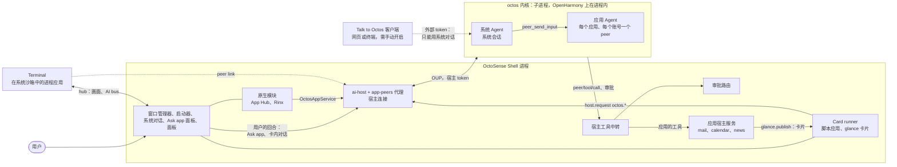
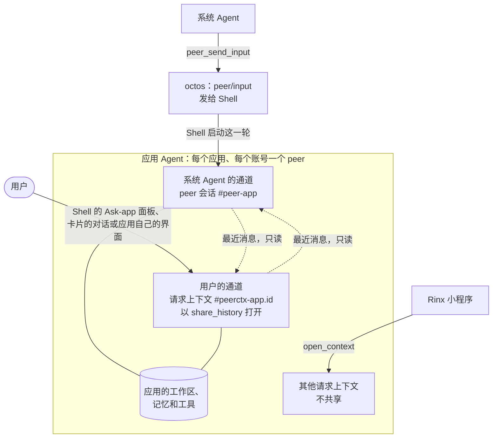
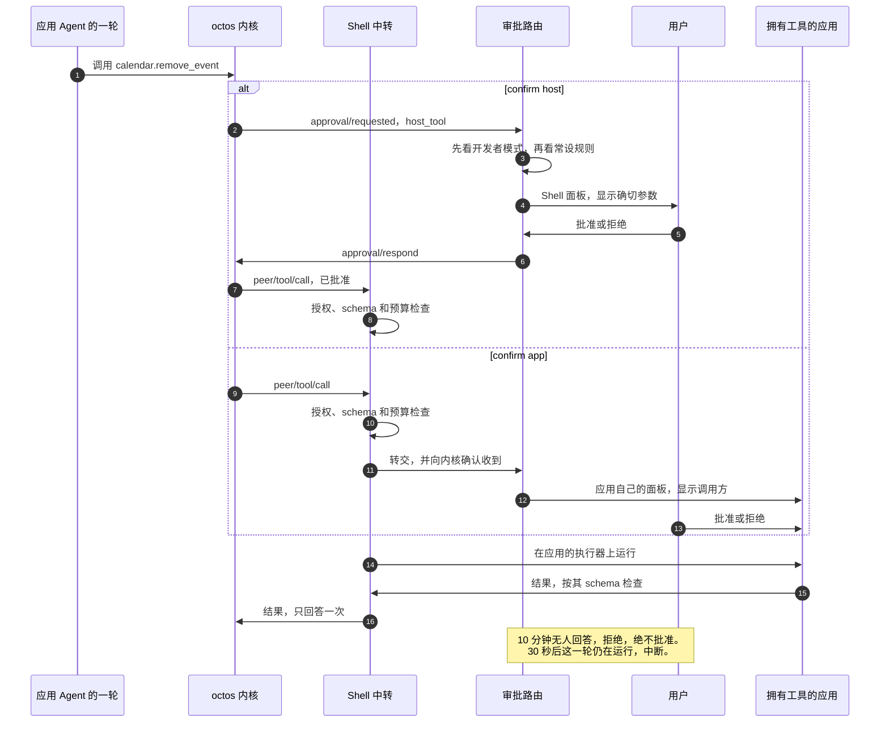

# OctoSense

[English](README.md) | 简体中文

[OctoSense](https://github.com/OctoSense-org) 是运行在操作系统之上的 Agent 交互 Shell：启动器和应用看起来与你熟悉的一样，背后由系统 Agent 协调各应用 Agent。本仓库集中存放 OctoSense 自己的全部代码（[ADR 0001（英文）](docs/adr/0001-one-octosense-repository.md)）：Shell、Shell 服务、第一方系统应用，以及由它们构建的三个产品。

| 产品 | 是什么 | 位置 |
| --- | --- | --- |
| **OctoSense 桌面端** | 在 macOS 上作为一个 Makepad 窗口运行的 Shell（Windows 和 Linux 未经测试）：启动器、dock、平铺窗口、托管应用 | [`desktop/`](desktop/README.zh-CN.md) |
| **OctoSense Home** | 手机 Shell，可作为普通 Home 应用安装在任意 Android 手机上（也支持 OpenHarmony 和 iOS 模拟器） | [`phone/`](phone/README.zh-CN.md) |
| **OctoSense ROM** | 面向 OnePlus 6 的 LineageOS 22.2，预装 Home、具有系统权限的系统桥、Quickstep 和 SystemUI | [`rom/`](rom/README.zh-CN.md) |

本仓库原名 OctoSense-Desktop；OctoSense-ROM（已停用，并入本仓库）和 OctoSense-System-Apps 已于 2026-09-27 连同历史一起导入本仓库。OctoSense-System-Apps 已归档；OctoSense-ROM 仓库已不存在。

> **要开发 OctoSense 应用？** 开发、检查或发布应用都不需要本仓库。请从 [OctoSense-org 主页](https://github.com/OctoSense-org)的阅读列表开始：[OctoScript-App-Design-Flow](https://github.com/OctoSense-org/OctoScript-App-Design-Flow)（先读 `AGENTS.md`，再读 `docs/QUICKSTART.md`）和 [OctoSense-App-Hub](https://github.com/OctoSense-org/OctoSense-App-Hub)。[`apps/`](apps/README.zh-CN.md) 中的系统应用是同样应用结构的完整示例（`apps/<name>/bundle/`）。只有想在发布前先在 Shell 里看到自己的应用时，才需要从这里构建桌面端 Shell（[PUBLISHING §4](https://github.com/OctoSense-org/OctoScript-App-Design-Flow/blob/main/docs/PUBLISHING.md#4-rehearse-the-store-path-locally)）。

## 从代码导读开始

初次阅读源码？从[从应用窗口到 Agent 回合](docs/architecture-walkthrough.zh-CN.md)开始，沿着入口、原生/脚本托管、数据访问、人类/系统对话、工具路由以及实际 Tokio 任务阅读源码。[产品导读](desktop/docs/code-walkthrough.zh-CN.md)补充桌面、Home、ROM 和系统应用的运行方式。

## 整体如何运作

每台设备一个 Shell 进程，每个 Shell 一个 octos 内核，每个 Agent 都是这个内核中的一个会话。应用 Agent 通过 Shell broker 访问内核。Shell 持有宿主连接和宿主 token，把每个 Agent 工具调用转交给拥有该工具的应用，并通过开发者模式、用户预设的常设规则或确认面板处理审批。下文的可选 AppCard 原型绕过应用 peer broker，直接访问共享内核服务。完整说明，包括代码路径以及哪些已在 `main` 上、哪些还在规划中：[docs/architecture.zh-CN.md](docs/architecture.zh-CN.md)；相关决策：[ADR 0004（英文）](docs/adr/0004-native-apps-hosting-and-peers.md)。

### 进程与连接


<details><summary>文字版（Mermaid）</summary>



</details>

- **Shell**（`crates/shell`，一个进程）承载窗口管理器、原生模块（App Hub、Rinx）、App Hub 的 Card runner（每个脚本应用都在自己的隔离环境中）、系统对话、审批路由、宿主工具中转，以及 [`crates/ai-host`](crates/ai-host/README.md)；其中的 [app-peers 代理](crates/app-peers/README.md)就是内核的宿主连接。
- **octos 内核**（[`crates/kernel`](crates/kernel/README.zh-CN.md)）首次使用时启动：桌面端（Shell 旁随附的 `octos-kernel`，或 `OCTOS_APP_CORE_BIN`）和 Android（`liboctos.so`）上是通过 stdio 讲 OUP 的子进程，OpenHarmony 上是进程内的任务，iOS 上没有。它随 Shell 一起退出。
- **进程应用**：桌面端的 Terminal 作为独立进程运行，通过 Shell 的 hub 连接（画面和 AI bus），运行在按其 `native-apps.json` 条目构建的系统沙箱中（macOS 上是 Seatbelt，Linux 上是 Landlock 和 seccomp，Windows 上尚未实现）。进程应用通过 **peer link** 使用自己的 Agent；Shell 一侧已在 `main` 上，但 Terminal 没有被授予 Agent，所以目前还没有进程应用使用它。
- **外部客户端**：Talk to Octos（需手动开启）让网页或终端客户端以受限的外部 token 使用系统对话：只有一份方法白名单，不能调用任何 `peer/*` 方法，不能进入任何应用 Agent 的会话，也拿不到宿主路由的工具。

### 进入 octos 的每条路径都经过 Shell

| 谁 | 路径 | 状态 |
| --- | --- | --- |
| 进程内原生模块 | 与进程应用相同的 peer link，经 Makepad 的 `OctosPeer` 客户端（模块宿主把链接归给打开它的实例） | 已在 `main` 上；尚无模块使用 |
| 进程内原生模块（Rinx） | 注入的 `OctosAppService`：`open_conversation`（应用与自己 Agent 的对话）和 `open_context`（每个客户端一个请求上下文，例如 Rinx 小程序） | 已在 `main` 上 |
| 脚本应用及其卡片 | 向 `octos` 宿主服务发送 `host.request("octos.session.open" / "octos.session.history" / "octos.turn.start" / "octos.turn.interrupt")`，限于其 manifest 声明的名称；卡片的卡内对话（`sys.chat`）经过 Shell | 已在 `main` 上，需用户首次使用时同意（发布时的默认闸门；`OCTOSENSE_CONTAINED_APPS=1` 跳过首次使用同意，`0` 关闭）。如今带 Agent 的系统应用都没有声明 `octos.*`：它们的 Agent 由 Shell 驱动 |
| 进程应用 | 其 hub 连接上的 peer link（`octos.session.open`、`octos.turn.start` 等），身份由 Shell 标注 | Shell 一侧已在 `main` 上；尚无进程应用被授予 Agent |
| 系统 Agent | 内核自己的会话 `_main:api:octosense#system`，从 Shell 的系统对话进入 | 已在 `main` 上 |
| Talk to Octos 客户端 | 只能用系统对话，使用外部 token | 已在 `main` 上 |

### 系统 Agent 与应用 Agent

**系统 Agent** 是 `_main` profile 上的内核会话 `_main:api:octosense#system`（`crates/kernel/src/network.rs`）。它拥有并监督所有应用 Agent。

用户在 Shell 的**助手面板**（即系统对话，`crates/shell/src/system_chat/`：Dock 上的 Assistant 图标、手机主屏的 Assistant 磁贴或 F8；桌面端是左侧一个中等大小、可移动、可调整大小并渲染 Markdown 的面板，手机上是全屏）或已配对的 Talk to Octos 客户端中与它对话。

它的内核工具恰好是 `SYSTEM_AGENT_TOOLS`（`crates/kernel/src/system_tools.rs`）：用于监督应用 Agent 的 `peer_send_input`、`peer_gather`、`peer_list` 和 `peer_respond`，其工作区的文件工具，记忆，`ask_user_question`，媒体查看，`web_search`、`web_fetch` 和 `tool_search`。每次内核启动都用 octos 的 `session/tool_list/set` 设置这份列表，所以 octos 自带的 shell、spawn 一族和 `peer_close` 永远不会提供给它。

系统对话还会在这个会话上注册宿主工具：`agents.list` 和 `agents.ask`（`crates/shell/src/agents.rs`：哪些应用有 Agent，以及某个 Agent 的首次使用面板与就绪等待），在 Setup › Assistant › Command execution 打开期间的 `terminal.run`，以及原生应用在 `native-apps.json` 条目中列出的只读工具（`agent.system_tools`）：Calculator 的 `calculator.eval`、Clock 的 `clock.now`、Notes 的 `notes.search` 和 `notes.read`、Reminders 的 `reminders.due` 和 `reminders.list`、Weather 的 `weather.current`。这样的调用会到达该应用已打开的实例（它的 AI bus 服务）；应用未打开时会回答“Open Notes first”。

**应用 Agent** 是每个（应用，账号）一个由宿主拥有的 octos peer（[`crates/app-peers`](crates/app-peers/README.md)）。`main` 上以下应用有 Agent（`crates/shell/src/apps.rs`，`agent_apps`）：

| 应用 | 声明方式 | 它的工具（由谁执行） | 它放到 glance 屏幕上的内容 |
| --- | --- | --- | --- |
| Rinx（原生） | `native-apps.json` 的 `agent.octos`（四个 `octos.*` 服务）和 `agent.generic_tools` | 其列表中的 octos 通用工具；它自己的助手界面 | – |
| 新闻（`os.news`） | `apps/news/bundle/tools.json`、manifest 中的 `agent` 块 | `news.list`、`news.read`、`news.notify`（`news` 宿主服务与 Shell 通知回调） | 通知卡片与通知 |
| 邮件（`os.mail`） | `apps/mail/bundle/tools.json`、manifest 中的 `agent` 块和 `glance` | `mail.notify`（`mail` 宿主服务） | 一张通知卡片，并发出一条通知 |
| 日历（`os.calendar`，仅桌面端） | `apps/calendar/bundle/tools.json`、manifest 中的 `agent` 块和 `glance` | `calendar.events`、`calendar.add_event`、`calendar.remove_event`（破坏性操作：进入审批路由）、`calendar.notify`、`calendar.agenda`（`calendar` 宿主服务） | 一张日程卡片或议程卡片，并发出一条通知 |
| Photos、Maps、YouTube；手机上的 Camera | 各自包内的 `tools.json`、`agent` 块与 `glance` | 各应用的 `<app>.notify`（Shell `NoticeService`） | 通知卡片与通知 |

AI providers 没有应用 Agent。

脚本应用在以下情况下拥有 Agent：manifest 声明了 `octos.*` 名称或 `agent` 块（`"tools": ["ask_user_question"]` 列出它可以使用的内核工具），或者应用包附带 `tools.json`（每个工具名为 `<app>.<tool>`，带 schema、`risk`、`confirm` 和 `shareable`）。Broker 用 `card.<应用 id>` 标识应用；内核在准备 peer 时返回 peer slug。用户只需在首次使用面板上允许一次（从 Shell 的 “Ask <app>” 面板、应用自己的 `octos` 调用，或系统 Agent 的 `agents.ask` 打开）。此后 Shell 在启动时就准备好这个 peer 并注册应用的工具，所以系统 Agent 的 `peer_list` 能看到它。

在 Unix 上，已获同意且有可用 workspace 的应用 Agent 还能用宿主只读工具 `files.list`、`files.read` 和 `files.search` 读取账号文件夹；这些工具不会暴露所有宿主服务数据库。手机默认构建 `toolbox-peers`，因此在手机上，manifest 申请了 `research` 或 `crawl` 的应用 Agent 还会得到系统工具箱的工具；目前还没有应用申请。

`AGENT.md`、技能和触发器（[ADR 0002（英文）](docs/adr/0002-event-driven-app-agents.md)）尚未实现：应用 Agent 只在系统 Agent、用户或卡片请求时运行。

**从系统 Agent 到 glance 屏幕上的一张卡片**：


<details><summary>文字版（Mermaid）</summary>

```mermaid
sequenceDiagram
  autonumber
  actor P as Person
  participant S as System agent
  participant B as Shell: app-peers broker
  participant A as Mail's agent (kernel-issued peer)
  participant R as Shell: tool relay
  participant M as Mail's host service
  participant G as Shell: glance service
  P->>S: "Tell me on the glance screen when ..."
  S->>B: peer_send_input (octos delivers peer/input)
  B->>A: turn/start on the peer's session, with Mail's tools
  A->>R: peer/tool/call mail.notify {title, body}
  R->>R: grant, consent, schema, budget
  R->>M: run on Mail's host service
  M->>G: glance.publish as os.mail: notice.card, notify
  G-->>P: desktop: a toast and the glance panel; phone: a shade notification
  M-->>R: {card_id}
  R-->>A: peer/tool/result
  A-->>S: the turn's result on the blackboard (peer_gather)
```

</details>

模型只提供文字，从不编写卡片代码。宿主填充固定模板：

- **通知卡片。** 邮件、新闻、照片及其他 `<app>.notify` 工具使用 Shell 的 [`notice.card`](crates/shell/resources/glance/notice.card)。Shell 提供应用图标和名称；调用提供标题和正文。重复使用同一个 `card_id` 会替换该应用之前的通知。
- **日历卡片。** `calendar.notify` 和 `calendar.agenda` 使用日历自己的[日程与议程模板](apps/calendar/host-service/resources)。

邮件和新闻的宿主服务把 `notify` 转交给 Shell。没有独立宿主服务的应用则由 Shell 的 [`glance_notice.rs`](crates/shell/src/glance_notice.rs) 直接处理。无论哪种方式，Shell 都以应用的身份发布，并要求应用获准使用 `glance`（`glance::publish_for`）。

点击这些卡片会打开应用。要就邮件通知与邮件的 Agent 对话，请打开 “Ask Mail”（[见下文](#直接与应用的-agent-对话)）。独立的[卡内对话](#卡内对话)功能及其当前可用情况见后文。

`mail.notify` 和 `calendar.add_event` 是 `act` 工具，通常不需要逐次调用的审批面板。破坏性和对外调用进入审批流程；Shell 的审批路由决定哪些请求需要用户处理（[见下文](#一次带审批的工具调用)）。

### 一个应用 Agent，两条通道

一个应用 Agent 就是每个（应用，账号）一个由宿主拥有的 octos **peer**，归系统 Agent 所有，有自己的工作区、记忆命名空间、模型和工具列表。系统 Agent 和用户各自在自己的通道里与它对话：


<details><summary>文字版（Mermaid）</summary>



</details>

- **系统 Agent 的通道**是 peer 自己的会话 `…#peer-<app>`。系统 Agent 发送 `peer_send_input`；octos 把它作为 `peer/input` 交给 Shell 的宿主连接，由 Shell 自己启动这一轮，所以这一轮带着应用的工具、记忆和审批运行（对已退出登录的账号或用户未允许的应用，Shell 以 `peer/input/reject` 拒绝）。peer 的结果写到 peer 黑板上，由系统 Agent 读取。
- **用户的通道**是一个请求上下文 `…#peerctx-<app>.<id>`，以 `share_history` 打开，打开方可以是 Shell 的 “Ask <app>” 面板（`agents::conversation`，客户端实例 `shell-ask`）、卡片的卡内对话，或应用自己的界面（原生模块的 `open_conversation`、脚本应用的 `octos.session.open`、进程应用的 peer link），每个句柄一个新的上下文（[octos#2636](https://github.com/octos-org/octos/pull/2636)，UPCR-2026-034）。两条通道并行运行，每个会话同一时间只有一轮：用户的消息不必等系统 Agent 的回合。每一轮都会以只读块的形式看到另一条通道的最近消息，这个块不会写入自己的对话记录；每一轮都标明说话者（`[from the person: <app>]`、`[from the system agent]`）。应用跟随两条通道，每个事件带有 `lane` 和说话者；`octos.session.history` 按时间合并两份对话记录。用户的回合也会在黑板上留下结果（`origin: person`），系统 Agent 用 `peer_gather` 就能看到。
- *2026-09-29 之前两者在 peer 会话上的同一个共享对话中说话（[#166](https://github.com/OctoSense-org/OctoSense/pull/166)，octos#2626）：每个 peer 一个队列，一次一轮。*
- **Rinx 小程序**保留各自的请求上下文（`open_context`），各有自己的对话记录和文件夹，不与任一通道共享。

### 直接与应用的 Agent 对话

用户不只能和系统 Agent 对话：任何应用自己的 Agent，用户都可以直接与它对话。用户发起的每一轮都是该应用 peer 上用户通道里的一轮，与系统 Agent 的通道并列。它和系统 Agent 发起的一轮一样，带着应用的工具、记忆和审批运行。

| 入口 | 位置 | 如何打开 |
| --- | --- | --- |
| **“Ask <app>”**（`crates/shell/src/app_chat/`） | Shell 为每个拥有 Agent 的应用提供的面板，不论应用自己是否绘制对话界面：它就是系统对话的窗格，以应用对话的形式绘制（`app_panel: true`）。在桌面端，它位于系统对话的右侧，两条通道并排显示。 | 顶栏的 “Ask <app>” 按钮（当前聚焦窗口的应用拥有 Agent 时显示）、Shift+F8，或菜单项 “Ask this app's agent”。如果聚焦的应用没有 Agent，Shell 会提示 “No app agent here”。在手机上，这个窗格绘制为全屏面板，但 `main` 上还没有可以打开它的触控入口。 |
| **卡片的卡内对话**（`sys.chat`，`crates/shell/src/glance_chat.rs`） | 声明了对话的 glance 卡片 | 用户在卡片中输入，由发布卡片的应用自己的 Agent 回答，回复标为 AI 撰写。当前可用情况和演示见[卡内对话](#卡内对话)。 |
| **应用自己的界面** | 原生模块的 `open_conversation`、脚本应用的 `octos.session.open`、进程应用的 peer link | 在应用内。Rinx 绘制自己的助手界面；系统应用都不绘制对话界面，目前通过 “Ask <app>” 面板与它们的 Agent 对话。 |

“Ask <app>” 面板的行为：

- **先征得同意。** 用户还没有决定的 Agent 会先弹出首次使用面板，面板等待用户（“<App>'s assistant is not allowed yet: allow it on the sheet.”）。已关闭的 Agent 会直接说明：“<App>'s assistant is off. Turn it on in Setup › Assistant › Approvals.”
- **两条通道，标明说话者。** 面板跟随两条通道，并加载合并后的历史；每一行都显示说话者（用户、系统 Agent、应用的 Agent）。
- **发送**会发起用户的一轮（`TurnTrigger::Person`）。它从不等待系统 Agent 的回合：只有系统 Agent 的通道在运行时，“发送”仍然可用。如果应用的 Agent 有一个提问正在等待，输入的文字就作为对它的回答。
- **停止**（用户自己的回合运行时取代“发送”的位置）只停止这一轮（“Stopped.”，或 “Nothing of yours was running.”）。正在运行的系统 Agent 回合有自己的一行，带 **“Stop the system agent's task”**，只停止那条通道。Shell 的审批和提问面板上的 **“Stop <App>'s agent”** 按钮会停止两条通道（`approvals::stop_agent`）：设备归用户所有。
- **提问**：用户或应用发起的回合中的提问在面板中显示和回答；系统 Agent 的提问出现在系统对话（F8）中。审批与其他地方一样，都是 Shell 的面板。
- **关闭**只是隐藏面板。它的上下文和跟随者保持打开，所以再次打开时仍能看到用户自己的那些行。面板为另一个应用打开、Agent 被关闭，或应用的 peer 消失（对邮件来说，就是账号退出登录）时，这个上下文才会关闭。

### 一次带审批的工具调用


<details><summary>文字版（Mermaid）</summary>



</details>

- **工具调用**：octos 把 `peer/tool/call` 发给 Shell 的中转（`crates/shell/src/host_tools/`）。中转按（拥有工具的应用，工具）和调用方检查授权，按工具的 schema 检查参数，检查调用方的预算，再把调用路由到拥有工具的应用的执行器：进程内模块的执行器、脚本应用的宿主服务、进程应用的 peer link，或 AI bus 上 Terminal 的 `run`。
- **审批**交给 `crates/shell/src/approvals/`：外部客户端保留自己的提示；开发者模式批准覆盖应用的调用；`confirm: app` 使用所属应用注册的确认面板；必须现场决定的请求跳过规则；随后常设规则可决定符合条件的调用，其余由 Shell 面板询问用户。系统 Agent 无法批准。[导读](docs/architecture-walkthrough.zh-CN.md#审批顺序)列出完整顺序、时限与审计行为。
- **时限与停止**（[#167](https://github.com/OctoSense-org/OctoSense/pull/167)）：Shell 为应用 peer 持有的审批或提问在 10 分钟后过期（`OCTOSENSE_PROMPT_DEADLINE_SECS`）：审批路由拒绝它，提问被婉拒，两者都保持显示为 "Expired: no answer in 10 min"。如果 30 秒后这一轮仍在运行，代理会中断它，好让下一轮开始。面板上的 “Stop <App>'s agent” 会结束两条通道上正在运行的回合，包括用户的和系统 Agent 的；“Ask <app>” 面板的“停止”只结束用户自己的回合（[见上文](#直接与应用的-agent-对话)）。
- **外部客户端的提示**留在客户端：Shell 不回答、也不让 Talk to Octos 客户端各轮的审批过期（octos#2624）。

### 卡片与提问

#### 发布与打开卡片

拥有 `glance` 权限的应用通过 `glance.publish` 以自己的身份发布卡片，也可以使用 `glance.withdraw` 和 `glance.list`。Shell 从调用方取得发布者，从不读取参数中的发布者。卡片可以是由 `data` 填充的 L0 `source`（只用于呈现，由 Octoscript 的 L0 检查器检查），也可以是 Splash `script`。

每个应用每分钟最多发布 6 次、保留 4 张卡片。Shell 总共保留 32 张，按优先级、再按时间排序：手机的 glance 页面显示前 6 张，桌面的面板列出全部卡片。详见 [`glance.rs`](crates/shell/src/glance.rs)。

| 界面 | 行为 |
| --- | --- |
| 桌面面板 | 新卡片会打开 glance 面板，除非已有卡片窗口打开。顶栏铃铛或 F9 也可以打开面板。点击卡片上自身控件以外的地方，会在卡片窗口中打开它。鼠标悬停的卡片会显示打开和移除操作，刚到的卡片旁会有几秒钟的强调色标记。放不下的那张卡片会在列表末尾露出一部分。卡片在面板里有高度上限，更高的卡片可以用滚轮在原处滚动；带卡内对话的卡片停在最新的消息处，输入框和最近一轮对话始终可见。用 F9（或在面板里点击）打开时，面板接管键盘：方向键在卡片之间移动焦点环，Return 打开卡片，Delete 移除卡片，Esc 关闭面板。 |
| 桌面通知 | 以 `notify` 发布的卡片还会弹出 toast，显示应用的图标和名称、卡片标题及其 `summary`（没有时用卡片自带的摘要）。点击 toast 会在独立窗口中打开卡片。同时最多显示三条 toast，其余的由下方的“+N more”标签展开。面板打开时，toast 叠放在面板左侧。 |
| 桌面关闭操作 | 鼠标悬停的卡片会显示移除按钮：`glance::dismiss` 会移除卡片，效果如同应用撤回了它。“Clear all”会移除所有卡片。移除的卡片可以在报告这次移除的 toast 上撤销（Undo），面板接管键盘时也可以按 ⌘Z 撤销。面板本身另有关闭按钮。 |
| 手机 | `notify` 在通知栏发出通知，点击后打开 glance 页面。 |

未声明主题的卡片使用 Shell 的浅色或深色配色。toast 和面板会滑入；设置 `OCTOSENSE_REDUCE_MOTION=1` 则保持静止。桌面界面实现在 [`glance_panel.rs`](crates/shell/src/glance_panel.rs)、[`glance_sheet.rs`](crates/shell/src/glance_sheet.rs) 和 [`notifications.rs`](crates/shell/src/shell/notifications.rs) 中（`keep_clear_of`，[#273](https://github.com/OctoSense-org/OctoSense/pull/273)）。

#### 交互式卡片

卡片在应用自己的策略下运行，与应用界面在 Card runner 中一样。用户在卡片上的操作经过应用的能力闸门和宿主服务。这属于应用操作，因此不需要额外进行 Agent 工具调用的 Shell 审批（[#153](https://github.com/OctoSense-org/OctoSense/pull/153)）。

#### 卡内对话

**当前可用情况：**`main` 上应用 Agent 发布的卡片都没有声明对话。唯一带对话的内置卡片是 [`mail-request.card`](crates/shell/resources/glance/mail-request.card)，通过 `OCTOSENSE_GLANCE_DEMO=mail` 启用，使用固定的演示回复。

L0 卡片可以声明 `sys.chat(app, thread, fields)` 并绘制 `ChatEntry` 行。它也可以显示模型撰写的文字（`class: model-copy`），这些文字会标为 AI 撰写，且从不作为操作执行（[#263](https://github.com/OctoSense-org/OctoSense/pull/263)）。

对话记录归宿主所有。只有发布卡片的应用自己的 Agent 可以回答，回答在用户通道中进行；只有用户亲手输入的内容才会记为用户的话。线程保存在 `apps/<app>/accounts/<account>/chat/<thread>.json`。详见 [`crates/l0-chat`](crates/l0-chat/README.md) 和 [`glance_chat.rs`](crates/shell/src/glance_chat.rs)。

#### 提问

提问（`ask_user_question`）按这一轮的触发方路由。来自用户通道或应用的回合在应用对话中提问；来自系统 Agent 通道的回合在系统对话中提问。只有用户能回答，而且只能在 Shell 界面上回答。

## 目录结构

| 路径 | 内容 |
| --- | --- |
| [`desktop/`](desktop/README.zh-CN.md) | 桌面端打包，package `octosense`：入口（只有 `src/main.rs`）、应用目录（`config/apps.json`）、从上游 Makepad 同步窗口管理器（`upstream/`、`scripts/upstream.py`），以及桌面端的系统应用选择。 |
| [`phone/`](phone/README.zh-CN.md) | Home 应用，package `octosense-home`（APK id `dev.makepad.octosense`）：包装 Shell 的入口（`src/main.rs`）、内置设置应用（`src/settings_*.rs`、`src/android_settings.rs`、`resources/settings/`）、Android、OpenHarmony 和 iOS 打包、系统桥的手机端（`android/`），以及手机端的系统应用选择。 |
| [`rom/`](rom/README.zh-CN.md) | 仅 OnePlus 6 ROM 镜像：`vendor/`（产品定义、特权权限、overlay、设置后端、特权 agent）、`patches/`、镜像/刷机/OTA 脚本、Home APK 构建脚本、`web-installer/`、产品测试。 |
| `crates/shell/` | 唯一的一份 Shell，package `octosense-shell`，两个包都链接它：窗口管理器（desk、样式、平铺、场景）、托管（子进程、进程内模块、App Hub、AI 面板）、手机层（主屏页面、下拉面板、手势、Android 启动器桥），以及主题、壁纸和图标（`resources/`）。 |
| [`crates/ai-host/`](crates/ai-host/README.md) | Shell 的 AI 服务，统一入口，package `octosense-ai-host`：octos 内核服务、带平台二维码导入的 `llm` 宿主服务、`model` 服务（`model.complete`）、为每个脚本应用提供 Agent（`card.<应用 id>`）的 `octos` 宿主服务，以及原生应用访问助手的通道。 |
| [`crates/kernel/`](crates/kernel/README.md) | octos 内核服务，package `octosense-kernel`：把 [octos](https://github.com/octos-org/octos) Agent 内核作为 Shell 服务，每个进程一个，由 AI 服务商配置，供所有使用方共享；以及系统 Agent 的精确工具列表。 |
| [`crates/app-peers/`](crates/app-peers/README.md) | 应用 Agent 的代理，package `octosense-app-peers`：每个（应用，账号）一个由宿主拥有的 octos peer，它的两条通道、工具、`peer/input`、时限和清除（[Rinx ADR 0007（英文）](https://github.com/hagency-org/Rinx/blob/main/docs/adr/0007-host-owned-octos-app-peers.md)）。 |
| [`crates/l0-chat/`](crates/l0-chat/README.md) | L0 卡片卡内对话（`sys.chat`）的宿主一侧，package `octosense-l0-chat`，由 Shell 的 glance 卡片和 AppCard 共用。 |
| [`crates/toolbox/`](crates/toolbox/README.md) | 系统工具箱，package `octosense-toolbox`：工作流模板、运行器、分支（fork）与评估，以及 `mod.research`；在 `toolbox-peers` 特性下作为宿主工具提供给应用 Agent。 |
| [`apps/`](apps/README.zh-CN.md) | 系统应用（新闻、相册、地图、相机、邮件、日历、AI 服务商、YouTube），均为受隔离约束的脚本应用；它们的宿主服务（`mail`、`calendar`、`news`、`llm`）；`apps/reference`；以及需显式启用的 AppCard 助手（`apps/appcard`）。 |
| `tools/` | `setup.py`（锁定版本的框架源码）、经审查的 Makepad 运行时补丁（`runtime-patches/`）、`kernel-artifact.py`（Android APK 以 `liboctos.so` 形式打包的 octos 内核）、`check-shell-graph.sh`（每个 Shell 构建都要通过的依赖图检查）。 |
| [`docs/adr/`](docs/adr/README.zh-CN.md) | 架构决策记录：本仓库的决策，以及作为历史保留的 Home 决策 0001–0006。 |
| `Cargo.toml`、`Cargo.lock` | 一个工作区。所有外部依赖都只在 `[workspace.dependencies]` 中锁定一次。 |
| `native-runtime.lock.json`、`runtime-patches.lock.json` | OctoScript-Makepad 发行版（并通过它确定 Makepad 和 OctoScript），以及 Makepad 之上经审查的补丁。 |

Shell 只有一份，位于 `crates/shell`（[ADR 0001（英文）](docs/adr/0001-one-octosense-repository.md)）：桌面端与手机端以目标平台和 feature 区分，而不是各持一份源码副本。若某个 Shell 源文件同时出现在两个 crate 中，CI 会失败。

## 依赖

只在根目录 `Cargo.toml` 和运行时锁文件中锁定一次：

| 仓库 | 作用 |
| --- | --- |
| [makepad（OctoSense fork）](https://github.com/OctoSense-org/makepad) | UI 框架和 `cargo-makepad` 打包工具。检出到 `.sources/makepad`，并应用经审查的运行时补丁。 |
| [OctoScript-Makepad](https://github.com/OctoSense-org/OctoScript-Makepad)、[OctoScript](https://github.com/OctoSense-org/OctoScript) | 指定 Makepad 和 OctoScript 版本的运行时发行版（`native-runtime.lock.json`）。 |
| [OctoSense-App-Hub](https://github.com/OctoSense-org/OctoSense-App-Hub) | 签名目录、商店，以及隔离运行每个应用的 Card runner（`octosense-app-hub-app`）。 |
| [octos](https://github.com/octos-org/octos) | Agent 内核。在 Android 上 APK 以 `liboctos.so` 形式内置它；在桌面上内核服务运行 Shell 旁随附的 `octos-kernel`，并核对其版本与此处固定的一致（由 `tools/kernel-artifact.py --host --stage` 构建）；`OCTOS_APP_CORE_BIN` 可覆盖它。 |
| [Rinx](https://github.com/hagency-org/Rinx) | Matrix 聊天与小程序，作为原生模块托管。 |

相关但不参与构建：[OctoScript-App-Design-Flow](https://github.com/OctoSense-org/OctoScript-App-Design-Flow)（如何构建和发布应用）、[OctoScript-Android](https://github.com/OctoSense-org/OctoScript-Android) 和 [OctoScript-OH](https://github.com/OctoSense-org/OctoScript-OH)（其他渲染后端）、[OctoSense 网站](https://github.com/OctoSense-org/octosense-org.github.io)。

## AI 服务（octos）

每个 Shell 运行一个 [octos](https://github.com/octos-org/octos) Agent 内核，首次使用时启动：Android 上是 APK 中的 `liboctos.so`，OpenHarmony 上在进程内运行，桌面端运行 Shell 旁随附的 `octos-kernel`（或 `OCTOS_APP_CORE_BIN` 指定的二进制），iOS 上没有。用户在系统应用 **AI providers** 中、在宿主面板上选择模型并输入密钥；密钥保存在平台的密钥存储中，永远不会到达应用。[`crates/ai-host`](crates/ai-host/README.md) 是两个 Shell 的统一入口，[`crates/app-peers`](crates/app-peers/README.md) 为每个获授权的原生应用分配自己的 octos peer（私有的上下文、工作区和记忆 `app/<app>/acct-<hash>`），归 Shell 的系统 Agent 所有。Peer 工具审批经 Shell 路由，由开发者模式、符合条件的常设规则，或用户在所属应用/Shell 确认面板上决定。系统 Agent 无法代答。

目前可用的：原生模块（Rinx）使用自己的 peer；AppCard（需主动开启）直接使用内核。隔离运行的脚本应用，无论系统应用还是商店应用，在托管了内核的 Shell 中通过 `octos` 宿主服务使用助手：每个应用有自己的、由宿主拥有的 peer（`card.<应用 id>`），它的工具审批和其他应用 Agent 一样交给 Shell 的审批面板（[#155](https://github.com/OctoSense-org/OctoSense/pull/155)）。`llm` 服务只为 `os.*` 应用管理提供方。应用自己的 Agent（`tools.json`、`AGENT.md`、skills、触发器、glance 卡片）见 [ADR 0002](docs/adr/0002-event-driven-app-agents.md)；自 [#160](https://github.com/OctoSense-org/OctoSense/pull/160) 起，应用 `tools.json` 中由宿主服务实现的工具已通过 Shell relay 提供给其 Agent。标为 `implemented_by: "app"` 的工具仍缺少 Card runner 执行器；声明不等于实现。

架构、信任模型、各类应用能用什么、规划及其状态，以及如何在本地运行和测试：[docs/ai-services.zh-CN.md](docs/ai-services.zh-CN.md)。它在整个系统中的位置：[docs/architecture.zh-CN.md](docs/architecture.zh-CN.md)。面向应用开发者：OctoScript-App-Design-Flow 的 [AI-SERVICES](https://github.com/OctoSense-org/OctoScript-App-Design-Flow/blob/main/docs/AI-SERVICES.zh-CN.md)。

## 环境准备

需要稳定版 Rust（`cargo` 位于 `~/.cargo/bin`）、Git、Python 3.9+（`desktop/scripts/upstream.py` 需要 3.11），macOS 上还需要 Xcode Command Line Tools。Makepad 和 OctoScript 解析到 `.sources/`（已被 git 忽略）中的检出，由环境准备脚本按锁定版本准备好：

```sh
git clone https://github.com/OctoSense-org/OctoSense.git
cd OctoSense
python3 tools/setup.py                  # prepare .sources/ (makepad, octoscript, octoscript-makepad)
python3 tools/setup.py --check --cargo  # verify: one Makepad, App Hub, octos and Rinx in the graph
```

锁文件变化后，`--update` 会把没有本地修改的检出移到新版本；`--cache DIR` 从已有克隆（`DIR/makepad`、`DIR/octoscript`、`DIR/octoscript-makepad`）借用 Git 对象。`.sources/` 中的本地修改会被保留。

**本机已有这些仓库的克隆？** 每个仓库在本机只保留一个克隆，`.sources/` 中的每一项都作为它的 `git worktree`，这样每个仓库只有一个对象库，不会出现过时的副本。在 `~/.config/octosense/sources.json` 中一次性写明存放克隆的目录（其中为 `<dir>/makepad`、`<dir>/octoscript`、`<dir>/octoscript-makepad`）：

```json
{ "hub": "/path/to/clones" }
```

也可以每次运行时用 `--hub DIR` 或 `OCTOSENSE_SOURCES_HUB=DIR` 指定；`OCTOSENSE_MAKEPAD_HUB=CLONE`（以及 `_OCTOSCRIPT_`、`_OCTOSCRIPT_MAKEPAD_`）或文件中的 `"repositories": {"makepad": "CLONE"}` 可单独指定某一个克隆。之后环境准备脚本会把锁定的版本 fetch 到该克隆，并运行 `git worktree add --detach .sources/<name> <rev>`，而不是重新克隆；`--update` 会移动这些 worktree。未配置时（CI、新机器）仍像以前一样克隆，`--no-hub` 可强制如此。`.sources/` 中已经是完整克隆的项只会被报告，不会被删除；其中没有本地工作时，`--convert` 会把它替换为 worktree。

删除本仓库的某个检出之前，先移除它的 `.sources/` worktree，免得各克隆里留下失效的记录：

```sh
python3 tools/setup.py --remove-worktrees   # git worktree remove + prune in each clone; stops on local work
git worktree remove <this checkout>         # if it is itself a worktree
```

手动操作等价于 `git -C <clone> worktree remove --force .sources/<name>`（经审查的 Makepad 补丁处于暂存状态，因此需要 `--force`；先检查 `git status`）以及 `git -C <clone> worktree prune`。

## 构建

**桌面端**（在根目录或 `desktop/` 中运行；详见 [desktop/README.zh-CN.md](desktop/README.zh-CN.md)）：

```sh
cargo run --release -p octosense
cargo check --locked -p octosense --features mobile-apps                        # the set phones link
cargo check --locked -p octosense -p octosense-appcard --features mobile-apps,app-appcard
```

助手需要 Shell 旁的 octos 内核：`python3 tools/kernel-artifact.py --host --stage target/release` 构建固定版本并放到该处，每个 octos 固定版本做一次；桌面会拒绝版本不符的内核并说明原因（[构建与运行](desktop/README.zh-CN.md#构建与运行)）。没有内核时桌面在没有助手的情况下运行。

**手机端**（在 `phone/` 中运行，它会选择手机端的系统应用；详见 [phone/README.zh-CN.md](phone/README.zh-CN.md)）：

```sh
cd phone
cargo run --release -p octosense-home --features mobile-only    # Home in a phone-sized window
cargo check --locked -p octosense-home --features mobile-apps
python3 ../rom/scripts/build-home.py --help                     # the Home and Bridge APK pair, liboctos.so bundled
```

**ROM 镜像**（Linux 构建主机，外部 LineageOS 源码树；不在 CI 中）：[rom/README.zh-CN.md](rom/README.zh-CN.md)。

托管应用和 UI 测试使用隐藏窗口和本地控制接口运行：`MAKEPAD_HIDE_WINDOWS=1 MAKEPAD_REMOTE=<port>`（路由见 `/help`）。

## CI

`.github/workflows/` 中的工作流按路径过滤，每次改动只运行其路径需要的任务：

| 工作流 | 触发路径 | 检查内容 |
| --- | --- | --- |
| `desktop.yml` | `desktop/`、`crates/`、`apps/`、工作区文件、`tools/` | 编译桌面端（默认、`mobile-apps`、`mobile-apps,app-appcard`），Shell 依赖图检查（`tools/check-shell-graph.sh`），每个 Shell 源文件只有一份，`tools/` 的测试 |
| `phone.yml` | `phone/`、`crates/`、`apps/`、工作区文件、`tools/` | 在 macOS 上编译 Home 及其内置模块，Shell 依赖图检查，并运行 Shell、Home、AI 服务、App Hub 准入和运行时策略的测试；耗时最长的任务 |
| `apps.yml` | `apps/`、`crates/`、工作区文件、`tools/setup.py` | 内核服务、app peers、AI 服务商配置、邮件与 `llm` 宿主服务、Shell 的 AI 服务（`crates/ai-host`）、AppCard |
| `rom.yml` | `rom/`、`phone/android/`、手机端的 Android 资源与测试、`tools/kernel-artifact.py` | 产品测试、生成的 Agent Binder 客户端、网页安装器 |
| `release-desktop.yml` | 推送的 `desktop-v*` 标签、手动运行，或修改打包的 pull request（只构建和扫描） | macOS、Windows、Linux 的未签名桌面包和私有路径扫描；对标签还会在 `release` 环境中签名并生成草稿 release（[desktop/README.zh-CN.md](desktop/README.zh-CN.md#发布构建)）。`tools/ci-local.sh` 不运行它。 |

每个工作流的依赖图检查（`tools/setup.py --check --cargo`）确保锁定的依赖图中只有一个 Makepad、一个 App Hub、一个 octos 和一个 Rinx。

## 发布

按 ADR 0001，每个产品单独打标签：`desktop-v*`、`home-v*`（APK）、`rom-v*`（镜像），构建回执记录仓库提交。`desktop-v*` 标签会把桌面包（`.dmg`、Windows 安装包、`.deb`、`.AppImage`）构建到草稿 release 中（[发布构建](desktop/README.zh-CN.md#发布构建)）。系统应用只随 Shell 一起发布、按摘要准入，不单独发布。仓库合并前发布的 ROM 版本 `20260919-j` 现为本仓库的 [`rom-v20260919-j`](https://github.com/OctoSense-org/OctoSense/releases/tag/rom-v20260919-j)。手机从固定移动的 `rom-latest` release 读取 `update.json`，而不是 `releases/latest`（[rom/docs/updates.md（英文）](rom/docs/updates.md)）。`20260919-j` 及更早的镜像检查的是已停用的 OctoSense-ROM 仓库，因此刷了这些镜像的手机需要重新刷写一次，才能收到 OTA 更新。

## 参与贡献

`main` 受保护：每个改动都要通过 pull request，禁止强制推送。一个改动就是一个 pull request，按需同时修改 `desktop/`、`phone/`、`crates/` 和 `apps/`；没有内部版本锁需要移动。面向人和编码 Agent 的规则见 [AGENTS.md（英文）](AGENTS.md)。

## 许可证

Apache License 2.0（[LICENSE](LICENSE)、[NOTICE](NOTICE)）。从 Makepad 复制的源码保留其 MIT 声明（[LICENSES/](LICENSES)）。依赖项保留各自的许可证。
