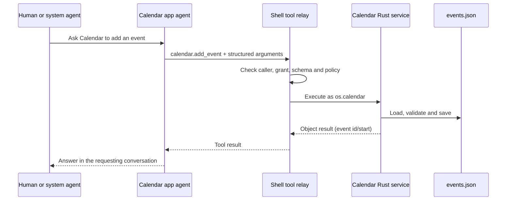

# Walking through the desktop, Home, ROM and system apps

English | [简体中文](code-walkthrough.zh-CN.md)

Follow an app from its executable entry point through hosting, data access and
agent interaction. Paths below are relative to the repository root. The
[agent architecture walkthrough](../../docs/architecture-walkthrough.md) continues
into the kernel, peers, tool routing and Tokio tasks.

**Launch recipes: unverified.** Prepare dependencies with the root README's setup
instructions first; use its sources-hub configuration to reuse existing clones.

## 1. Locate the running components

| Component | Entry point and responsibility |
| --- | --- |
| Desktop | `desktop/src/main.rs` starts `octosense`, a thin entry point for `octosense-shell`. |
| Home | `phone/src/main.rs` starts `octosense-home`, adding Settings and platform integration to the shared shell. |
| Native app | Rust implementing Makepad's `AppModule`, or an executable hosted through the window-manager protocol. |
| Contained script app | App Hub's Card runner admits `manifest.json` and runs `main.splash` in a restricted Makepad Script/Splash VM. |
| Host service | Rust performs operations for an attributed app and returns data. |
| App agent | An octos peer scoped to an app/account, with sessions, a workspace and granted tools. |
| System agent | The shell's assistant session, with tools for discovery, delegation and selected system operations. |
| ROM privileged agent | Android's Java/Binder platform service, `AgentPlatformService`. |

Contained `main.splash` programs use Makepad Script/Splash. L0 `.card` files pass
through Octoscript's separate parser/checker and Makepad lowering path. Both
appear in this product; follow the loading path for the artifact you are editing.

## 2. Run Reference and follow native hosting

From the repository root, after setup:

```sh
# Standalone Reference window.
cargo run --locked -p octosense-reference

# Reference linked into the desktop and opened at startup.
MAKEPAD_WM_TEST_APP=reference cargo run --locked -p octosense --features app-reference -- --module reference

# Standard desktop: App Hub, Rinx, Terminal, the native Makepad apps and kernel integration.
cargo run --locked --release -p octosense
```

For hidden-window inspection, add `MAKEPAD_HIDE_WINDOWS=1 MAKEPAD_REMOTE=8000`,
use the Makepad control endpoints documented by `/help`, and exit through `/quit`.
`--module` selects hosting; `MAKEPAD_WM_TEST_APP` requests startup launch.

Read these files in order:

1. [`apps/reference/src/lib.rs`](../../apps/reference/src/lib.rs):
   `ReferenceView` owns `count`; `handle_event` receives button/text actions and
   changes labels; `draw_walk` delegates to the contained `View`.
2. In the same file, `ReferenceModule::register` registers its widget type.
   `create` returns `InstanceParts`: the root widget, service executor and
   shutdown callback. `ReferenceExecutor` exposes no tools.
3. [`native-apps.json`](../../native-apps.json) declares Reference's source,
   feature, hosting, storage and empty agent grants. The generator uses it to
   produce the native registry and Cargo feature blocks.
4. [`desktop/src/main.rs`](../src/main.rs) imports the shell's `App` and invokes
   `octosense_main!`. In [`crates/shell/src/lib.rs`](../../crates/shell/src/lib.rs),
   the macro calls Makepad's `app_main!` and selects the package directory.
5. `App::launch_app_with_args` finds the registered app, checks script-app
   identity/admission where needed, prepares storage, optionally focuses an
   existing window, then selects module or process hosting.
6. [`ModuleHost::create`](../../crates/shell/src/module_host.rs) creates the
   instance scope, storage namespace, reply handles, viewport and VM, then the
   module. Host policy controls which declared agent services it receives.

For process hosting, continue to
[`clients.rs`](../../crates/shell/src/clients.rs) and
[`crates/process-apps`](../../crates/process-apps). The shell starts a child,
connects the window-manager protocol, forwards input and displays its surface.
Terminal normally uses this path on macOS/Windows and in a Vulkan-enabled Linux
Wayland session; see the [desktop README](../README.md) for module fallback and
overrides.

A native app can also reach its agent over
[`peer_link`](../../crates/shell/src/peer_link/mod.rs). Process apps send an
`octos_peer` envelope over their existing authenticated hub socket. The shell
attributes frames to the launched app, checks its `agent.octos` grants and
consent, and connects requests to the same app-peer broker used by modules.
Module `OctosPeer` channels enter this link through `module_connected` and
`on_module_frame`. Tool outcomes and cancellations travel back through the link;
when a process dies, its contexts close and pending calls fail while the durable
peer remains. **No shipped process app currently requests an agent:** Terminal's
manifest exposes tools but has an empty `agent.octos` list.

## 3. Run and follow a script bundle

The desktop packages selected system bundles; open News or Calendar from the
launcher. For standalone preview, run App Hub's `card-host` from an App Hub
checkout after following that repository's setup:

```sh
# Replace the path with your OctoSense checkout.
cargo run --locked --release -p octosense-card-host --bin card-host -- --bundle /path/to/OctoSense/apps/news/bundle --system
```

`--system` admits the shipped `os.*` bundle. Shell host services and agent UI
require the full shell. For example, run Mail's demo service from the OctoSense
root:

```sh
MAKEPAD_APP_CONFIG='{"mail_demo":true}' cargo run --locked --release -p octosense
```

The demo account uses password `demo`; sends stay in the demo. Develop new store
apps in OctoScript-App-Design-Flow and use App Hub's admission/publishing flow.
The [local-catalog recipe](../README.md#try-your-own-app-before-it-is-published)
tests installation into the shell before publication.

[`desktop/system-apps.json`](../system-apps.json) and
[`phone/system-apps.json`](../../phone/system-apps.json) select bundles from
`apps/`. Follow [`apps.rs`](../../crates/shell/src/apps.rs) for launcher entries,
`agent_apps` and `register_host_services`. App Hub's native `CARD_MODULE` hosts
these interpreted programs. The optional AppCard assistant has its own module.

Admission resolves manifest capability requests into policy. A script's
`host.request(...)` runs under that app's identity. App Hub's
`crates/appstore/src/services.rs` defines `HostService`, `ServiceCall` and replies;
the call supplies an app identity and host directory for the service to check.
Only explicitly declared agent tools make corresponding operations available
to a model.

## 4. Follow a tool into app data and Glance

Start with [`Calendar's tools.json`](../../apps/calendar/bundle/tools.json) and
[`CalendarService`](../../apps/calendar/host-service/src/lib.rs). JSON declares
schemas and policy; Rust `handle` dispatches methods and `load`/`save` manage
`<host_dir>/calendar/events.json`.



Read [`script_apps.rs`](../../crates/shell/src/host_tools/script_apps.rs) for tool
loading and `HostServiceExecutor`, then
[`relay.rs`](../../crates/shell/src/host_tools/relay.rs) for authorization.
`calendar.remove_event` requires destructive-action approval. The shell's
[approval router](../../crates/shell/src/approvals/mod.rs) applies the person's
standing rules or presents a confirmation; registered `confirm: app` tools use
the owning app's sheet. Developer mode supplies a separate user-enabled override.
The router records decisions in its owner-only audit log. These paths determine
whether a tool runs; the model supplies only the call and arguments.

The shipped declarations provide these operations:

| Agent-enabled app | Tools and implementation |
| --- | --- |
| News | `news.list`, `news.read` and `news.notify`; News's host service handles them and hands notices to the shell. |
| Mail | `mail.notify` only; Mail's service calls the shell's `on_notify` hook. UI operations such as `mail.list`, `mail.message` and `mail.send` have no corresponding agent declarations. |
| Calendar | `calendar.events`, `add_event`, `remove_event`, `notify`, `agenda`; its Rust service owns events and event/agenda card templates. |
| Photos, Maps, YouTube, Camera | `<namespace>.notify` only; the shell's `NoticeService` handles each application's namespace. Camera is packaged by Home. |

AI providers configures the host and currently declares no app agent. Calendar's
script window explains how to ask its agent; its events are available through
the tools above while App Hub has no script `calendar` capability.

Follow [`glance_notice.rs`](../../crates/shell/src/glance_notice.rs) and
[`resources/glance/notice.card`](../../crates/shell/resources/glance/notice.card)
for the shared notice. Mail and News keep their own services and install notice
callbacks; `serve_system_apps` adds a `NoticeService` only for namespaces without
a service. `publish_args` fills app name/icon, time, title and body, then
`glance::publish_for` checks the app's `glance` grant. The notice opens its app and
sets `notify: true`. Calendar keeps its own event and agenda card templates.

The broader [`glance.publish`](../../crates/shell/src/glance.rs) API accepts either
L0 `source` with optional `data`, or a Splash `script` carrying its own values.
Both render under the publishing app's policy. `notify: true` queues a toast;
the host's `glance::dismiss` removes a card closed by the person. The fixed notice
tools above accept text arguments; the script-card API serves richer app-owned
surfaces. A person's action on such a surface uses the app's API permissions.

The tests beside these implementations show the contracts directly:
`a_host_service_tool_runs_as_the_apps_own_request` in `script_apps.rs`,
`system_apps_without_a_service_of_their_own_get_the_notice_service` in
`glance_notice.rs`, and `a_script_card_is_admitted_as_it_is` in `glance.rs`.
They check attribution, namespace fallback and the script-card admission path.

Keep the data boundaries visible when adding a tool:

| Boundary | Access path |
| --- | --- |
| Script storage | Runtime storage APIs under the app's capability and jail. |
| Agent workspace | The peer's app/account folder through granted file tools and shell policy. |
| Host-service database | Explicit Rust methods/tools for Calendar events, Mail cache or News data. Credentials stay with host sheets and vaults. |

For cross-app calls, the requester names a dotted tool in `agent.tools`; its
owner must declare it shareable and the relay must grant it. Admission also
checks `HostLimits.offered_tools`: names such as `mail.send` are absent from the
default offers. Add a complete declaration, admission offer and executor path
before documenting a usable integration. The
[agent walkthrough](../../docs/architecture-walkthrough.md) covers delegation
and requests for help from another agent.

## 5. Follow a person's conversation

On desktop, focus an agent-enabled app and open **Ask &lt;app&gt;** from the bar,
Shift+F8 or the menu. F8 opens the system agent. `agents.list` reports app agents;
`agents.ask` waits for first-use consent and peer preparation, then returns the
peer slug. The system agent sends the task with `peer_send_input` and gathers its
answer with `peer_gather`. A card declaring `sys.chat` can address its own app
agent. Shipped notice and Calendar templates have no chat, so use “Ask <app>”
for those agents; the Mail demo card answers with canned text.
Phone touch navigation has no Ask-app panel-opening control yet.

Follow [`app_chat/`](../../crates/shell/src/app_chat/mod.rs),
[`system_chat/`](../../crates/shell/src/system_chat/mod.rs),
[`agents.rs`](../../crates/shell/src/agents.rs),
[`contained.rs`](../../crates/ai-host/src/contained.rs) and
[`app-peers`](../../crates/app-peers/README.md). Human and system-agent work uses
separate sessions/lanes on the peer; the panel's Stop interrupts the human turn.
Makepad handles UI events, while broker/kernel channels carry requests and
notifications. The companion walkthrough maps these channels to Rust tasks.

Configure a compatible desktop `OCTOS_APP_CORE_BIN` and a provider in AI providers;
`octos-core` enables the integration in the build. See the
[kernel guide](../../crates/kernel/README.md). Android bundles `liboctos.so` and
runs it as a child; OpenHarmony runs the core in-process. App UI hosting and
kernel hosting are selected independently.

## 6. Follow Home's Settings and platform bridge

Run Cargo **from `phone/`** so its `.cargo/config.toml` selects the phone bundles:

```sh
cargo run --locked --release -p octosense-home --features mobile-only
# Also link Reference and Sheets.
cargo run --locked --release -p octosense-home --features mobile-only,mobile-apps
```

[`phone/src/main.rs`](../../phone/src/main.rs) defines `App` with `#[deref]
shell: ShellApp` and `SettingsRuntime`. `install_ext` registers the trusted
Settings module. `handle_event` first handles Settings startup/timing and entry
intents, passes the event to the shell, then consumes queued platform packets
and Settings requests. If a Settings update goes missing, check this ordering
first.

[`settings_app.rs`](../../phone/src/settings_app.rs),
[`settings_script.rs`](../../phone/src/settings_script.rs) and
[`settings_script_host_facade.rs`](../../phone/src/settings_script_host_facade.rs)
connect the script-owned controller/UI to Rust host checks. Privilege comes from
the compiled trusted singleton. [`android_settings.rs`](../../phone/src/android_settings.rs)
dispatches observations/results by channel. A command's accepted result and a
later observed platform state have separate handlers; the latter confirms what
the device currently does.

On Android, continue into
[`MakepadAppExtension.java`](../../phone/resources/android/java/dev/makepad/octosense/MakepadAppExtension.java),
its clients and [`phone/android/contracts/`](../../phone/android/contracts).
The bridge's [`SystemBridgeService.java`](../../phone/android/system-bridge/src/main/java/dev/makepad/octosense/bridge/SystemBridgeService.java)
uses Binder callbacks and caller checks. Standalone Home operates within its
Android permissions/roles; the ROM supplies additional privileged components.
Follow [Home's build instructions](../../phone/README.md#build-and-run) for APK
packaging and the separate device-validation steps.

## 7. Follow the ROM packaging and privileged service

Read [`octosense.mk`](../../rom/vendor/octosense/octosense.mk) and
[`Android.bp`](../../rom/vendor/octosense/Android.bp) for product inclusion,
then [`build-home.py`](../../rom/scripts/build-home.py),
[`stage-home.py`](../../rom/scripts/stage-home.py) and
[`stage-forks.sh`](../../rom/scripts/stage-forks.sh). Building produces the
Home/Bridge APK pair and receipt; staging verifies and copies artifacts; the
LineageOS build produces the image. Installation, flashing and OTA delivery have
separate scripts and validation steps.

[`AgentPlatformService.java`](../../rom/vendor/octosense/agent/src/dev/makepad/octosense/agent/AgentPlatformService.java)
checks Binder UID, allowed package identity and platform signature in `caller`.
Its [`IAgentPlatform.aidl`](../../rom/vendor/octosense/agent/src/dev/makepad/octosense/agent/IAgentPlatform.aidl)
methods invoke platform backends and return capabilities/results. Android owns
its service lifecycle and Binder execution; the LLM system conversation belongs
to the octos kernel described earlier.

Home's `AgentPlatformClient` connects to this optional ROM service. System
Bridge, Quickstep, SystemUI and Settings brokers have their own Android roles
and permission boundaries. Use the ROM's
[validation instructions](../../rom/README.md#testing-and-validation) to check
boot, platform operations and update behavior on an assigned device.

## 8. Follow the optional AppCard product

[`apps/appcard/module/src/lib.rs`](../../apps/appcard/module/src/lib.rs) adapts
AppCard to `AppModule`; [`apps/appcard/app/app`](../../apps/appcard/app/app)
implements its router/composer and generated cards, alongside the
transport/store/render crates. Enable `--features app-appcard`; default builds
and `mobile-apps` leave it out.

The shared shell implements system chat, app chat and contained-app peers
independently of AppCard. AppCard's legacy `personal-data` integration reads the
older native Mail format; current Mail owns its cache in a host service. Start
with Reference for native hosting, Calendar/News for app tools, and AppCard's
own docs when changing its routing and card-generation product.
