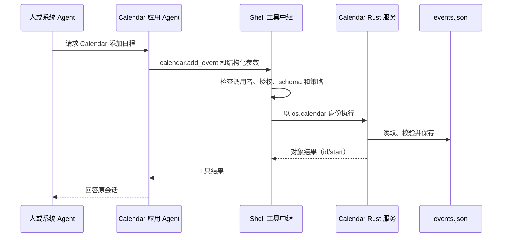

# 桌面、Home、ROM 与系统应用源码导读

[English](code-walkthrough.md) | 简体中文

沿着可执行程序入口，追踪应用托管、数据访问和 Agent 交互。以下路径相对于仓库根目录。
[Agent 架构导读](../../docs/architecture-walkthrough.zh-CN.md)继续介绍内核、peer、工具路由和 Tokio 任务。

**启动配方：未验证。** 先按根目录 README 准备依赖；已有框架克隆时，通过其 sources hub 配置复用。

## 1. 找到运行中的组件

| 组件 | 入口和职责 |
| --- | --- |
| 桌面 | `desktop/src/main.rs` 启动 `octosense`，为 `octosense-shell` 提供薄入口。 |
| Home | `phone/src/main.rs` 启动 `octosense-home`，在共用 Shell 上增加设置和平台集成。 |
| 原生应用 | 实现 Makepad `AppModule` 的 Rust 模块，或通过窗口管理协议托管的可执行程序。 |
| 隔离脚本应用 | App Hub 的 Card runner 校验 `manifest.json`，在受限 Makepad Script/Splash VM 中运行 `main.splash`。 |
| 宿主服务 | Rust 按明确的应用身份执行操作并返回数据。 |
| 应用 Agent | 按应用/账号限定的 octos peer，拥有会话、工作目录及获授予的工具。 |
| 系统 Agent | Shell 的助手会话，拥有发现、委派和选定系统操作的工具。 |
| ROM 特权 agent | Android 的 Java/Binder 平台服务 `AgentPlatformService`。 |

隔离应用的 `main.splash` 使用 Makepad Script/Splash。L0 `.card` 文件经过 Octoscript
独立的解析/检查器，再通过 lowering 转为 Makepad 可渲染内容。产品中同时使用这两条路径；
阅读或修改某个文件时，沿着它实际的加载路径追踪。

## 2. 运行 Reference，追踪原生托管

准备依赖后，在仓库根目录运行：

```sh
# 独立的 Reference 窗口。
cargo run --locked -p octosense-reference

# 把 Reference 链接进桌面，并在启动后打开。
MAKEPAD_WM_TEST_APP=reference cargo run --locked -p octosense --features app-reference -- --module reference

# 标准桌面：App Hub、Rinx、Terminal、原生 Makepad 应用和内核集成。
cargo run --locked --release -p octosense
```

隐藏窗口检查可添加 `MAKEPAD_HIDE_WINDOWS=1 MAKEPAD_REMOTE=8000`，
使用 `/help` 描述的 Makepad 控制接口，并通过 `/quit` 退出。
`--module` 选择托管方式；`MAKEPAD_WM_TEST_APP` 请求启动应用。

按以下顺序阅读：

1. [`apps/reference/src/lib.rs`](../../apps/reference/src/lib.rs)：
   `ReferenceView` 保存 `count`；`handle_event` 接收按钮和文本动作、修改标签；
   `draw_walk` 将绘图交给内部 `View`。
2. 同文件的 `ReferenceModule::register` 注册控件类型；`create` 返回
   `InstanceParts`，包含根控件、服务执行器和退出回调。`ReferenceExecutor` 不暴露工具。
3. [`native-apps.json`](../../native-apps.json) 声明 Reference 的源码、feature、
   托管、存储和空 Agent 授权。生成器据此生成原生应用注册表和 Cargo feature 区块。
4. [`desktop/src/main.rs`](../src/main.rs) 导入 Shell 的 `App` 并调用
   `octosense_main!`。在 [`crates/shell/src/lib.rs`](../../crates/shell/src/lib.rs)
   中，该宏调用 Makepad 的 `app_main!` 并设置包目录。
5. `App::launch_app_with_args` 查找注册的应用，按需检查脚本应用身份和准入，
   准备存储，必要时聚焦已有窗口，然后选择模块或进程托管。
6. [`ModuleHost::create`](../../crates/shell/src/module_host.rs) 创建实例范围、
   存储命名空间、回复句柄、视口和 VM，再创建模块。宿主策略决定它可以获得哪些已声明的 Agent 服务。

进程托管继续看 [`clients.rs`](../../crates/shell/src/clients.rs) 和
[`crates/process-apps`](../../crates/process-apps)。Shell 启动子进程、连接窗口管理协议，
转发输入并显示子进程画面。Terminal 在 macOS/Windows，以及启用 Vulkan 的 Linux
Wayland 会话中通常走这条路径；模块回退和覆盖配置见[桌面 README](../README.zh-CN.md)。

原生应用还可以通过 [`peer_link`](../../crates/shell/src/peer_link/mod.rs)
访问自己的 Agent。进程应用在已有的、经过认证的 hub socket 上发送 `octos_peer` 消息。
Shell 将帧归属到它启动的应用，检查 `agent.octos` 授权和用户同意，再把请求接到模块也使用的
app-peer broker。模块的 `OctosPeer` 通道则通过 `module_connected` 和
`on_module_frame` 接入同一路径。工具结果和取消沿该链路返回；进程死亡时，关闭它的上下文，
让等待中的调用失败，同时保留持久 peer。**当前发布的进程应用没有申请 Agent**：
Terminal 清单虽然暴露工具，但 `agent.octos` 列表为空。

## 3. 运行并追踪脚本 bundle

桌面会打包选定的系统 bundle；可以从启动器打开 News 或 Calendar。
单独预览时，先按 App Hub 仓库的说明准备依赖，然后在该检出目录运行 `card-host`：

```sh
# 将路径替换为你的 OctoSense 检出目录。
cargo run --locked --release -p octosense-card-host --bin card-host -- --bundle /path/to/OctoSense/apps/news/bundle --system
```

`--system` 接纳内置 `os.*` bundle。Shell 的宿主服务和 Agent UI 需要完整 Shell。
例如，在 OctoSense 根目录运行 Mail 的演示服务：

```sh
MAKEPAD_APP_CONFIG='{"mail_demo":true}' cargo run --locked --release -p octosense
```

演示账号密码为 `demo`，发送留在演示环境。新商店应用在 OctoScript-App-Design-Flow 中开发，
使用 App Hub 的准入/发布流程。[本地目录配方](../README.zh-CN.md#发布前试用自己的应用)
用于发布前验证安装到 Shell 的路径。

[`desktop/system-apps.json`](../system-apps.json) 和
[`phone/system-apps.json`](../../phone/system-apps.json) 选择 `apps/` 中的 bundle。
阅读 [`apps.rs`](../../crates/shell/src/apps.rs) 中的启动器条目、`agent_apps` 和
`register_host_services`。App Hub 的原生 `CARD_MODULE` 托管这些解释执行程序；
可选的 AppCard 助手使用自己的模块。

准入将 manifest 的能力请求解析为策略。脚本的 `host.request(...)` 按应用身份执行。
App Hub 的 `crates/appstore/src/services.rs` 定义 `HostService`、`ServiceCall` 和回复机制；
调用携带应用身份和宿主目录，供服务检查。只有明确声明的 Agent 工具，才会把相应操作提供给模型。

## 4. 将工具追到应用数据和 Glance

从 [Calendar 的 tools.json](../../apps/calendar/bundle/tools.json) 和
[`CalendarService`](../../apps/calendar/host-service/src/lib.rs) 开始。
JSON 声明 schema 和策略；Rust 的 `handle` 分派方法，`load`/`save` 管理
`<host_dir>/calendar/events.json`。



[`script_apps.rs`](../../crates/shell/src/host_tools/script_apps.rs) 加载工具并实现
`HostServiceExecutor`；[`relay.rs`](../../crates/shell/src/host_tools/relay.rs) 负责授权。
`calendar.remove_event` 需要破坏性操作审批。Shell 的
[审批路由](../../crates/shell/src/approvals/mod.rs) 应用用户设定的常设规则，或显示确认面板；
已注册的 `confirm: app` 工具使用所属应用的面板。开发者模式提供另外一种由用户开启的覆盖。
路由在仅所有者可访问的审计日志中记录决定。这些路径决定工具是否运行；模型只提供调用和参数。

内置声明提供以下操作：

| 拥有 Agent 的应用 | 工具与实现 |
| --- | --- |
| News | `news.list`、`news.read`、`news.notify`；News 宿主服务处理调用，并将通知交给 Shell。 |
| Mail | 只有 `mail.notify`；Mail 服务调用 Shell 的 `on_notify` 回调。`mail.list`、`mail.message`、`mail.send` 等 UI 操作没有对应的 Agent 声明。 |
| Calendar | `calendar.events`、`add_event`、`remove_event`、`notify`、`agenda`；Rust 服务管理日程及事件/议程卡片模板。 |
| Photos、Maps、YouTube、Camera | 只有 `<namespace>.notify`；Shell 的 `NoticeService` 处理各应用的命名空间。Camera 由 Home 打包。 |

AI providers 配置宿主，目前不声明应用 Agent。Calendar 的脚本窗口介绍如何询问其 Agent；
日程通过上述工具访问，App Hub 还没有提供脚本 `calendar` 能力。

共用通知的实现见 [`glance_notice.rs`](../../crates/shell/src/glance_notice.rs) 和
[`resources/glance/notice.card`](../../crates/shell/resources/glance/notice.card)。
Mail 和 News 保留自己的服务并安装通知回调；`serve_system_apps` 只为尚无服务的命名空间
注册 `NoticeService`。`publish_args` 填入应用名称/图标、时间、标题和正文，
再由 `glance::publish_for` 检查应用的 `glance` 授权。通知卡片可以打开所属应用，
并设置 `notify: true`。Calendar 继续使用自己的事件和议程模板。

更通用的 [`glance.publish`](../../crates/shell/src/glance.rs) API 接受 L0 `source`
和可选 `data`，或自带值的 Splash `script`，两种卡片都在发布应用的策略下渲染。
`notify: true` 排入一条 toast 通知；用户关闭卡片时，宿主的 `glance::dismiss` 删除它。
上述固定通知工具接受文本参数，script-card API 则用于更丰富的应用界面。
用户在这些界面上的操作使用应用自己的 API 权限。

实现旁的测试直接展示这些约定：`script_apps.rs` 中的
`a_host_service_tool_runs_as_the_apps_own_request`、`glance_notice.rs` 中的
`system_apps_without_a_service_of_their_own_get_the_notice_service`，以及 `glance.rs` 中的
`a_script_card_is_admitted_as_it_is`。它们分别检查调用归属、命名空间回退和脚本卡片准入路径。

增加工具时，保持数据边界清晰：

| 边界 | 访问路径 |
| --- | --- |
| 脚本存储 | 在应用能力和隔离目录限制下使用运行时 storage API。 |
| Agent 工作目录 | 通过获授权的文件工具和 Shell 策略访问 peer 的应用/账号目录。 |
| 宿主服务数据库 | 经明确的 Rust 方法/工具访问 Calendar 日程、Mail 缓存和 News 数据。凭据保留在宿主确认面板和保险库中。 |

跨应用调用由请求方在 `agent.tools` 中列出带点号的工具名，所有者必须声明可共享，
relay 也必须授权。准入还检查 `HostLimits.offered_tools`：默认提供的工具中没有
`mail.send` 等名称。先补齐声明、准入 offer 和执行器路径，再将其写成可用的集成方案。
[Agent 导读](../../docs/architecture-walkthrough.zh-CN.md)继续解释委派和向其他 Agent 请求帮助。

## 5. 追踪人的对话

桌面上聚焦拥有 Agent 的应用，从栏按钮、Shift+F8 或菜单打开 **Ask &lt;app&gt;**。
F8 打开系统 Agent。`agents.list` 报告应用 Agent；`agents.ask` 等待首次同意和 peer
准备完成，再返回 peer slug。系统 Agent 用 `peer_send_input` 发送任务，用 `peer_gather`
获取答案。声明了 `sys.chat` 的卡片也可以访问其应用 Agent。随产品提供的通知与 Calendar 模板没有聊天，应通过 “Ask <app>” 访问其 Agent；Mail 演示卡片返回预设文本。手机触控导航尚无打开 Ask-app 面板的控件。

继续阅读 [`app_chat/`](../../crates/shell/src/app_chat/mod.rs)、
[`system_chat/`](../../crates/shell/src/system_chat/mod.rs)、
[`agents.rs`](../../crates/shell/src/agents.rs)、
[`contained.rs`](../../crates/ai-host/src/contained.rs) 和
[`app-peers`](../../crates/app-peers/README.md)。人的工作和系统 Agent 的工作使用 peer 上
不同的 session/lane；面板的 Stop 中断人的回合。Makepad 处理 UI 事件，broker/内核通道
传递请求和通知；配套导读将这些通道映射到 Rust 任务。

桌面需配置兼容的 `OCTOS_APP_CORE_BIN`，并在 AI providers 中设置提供方；
`octos-core` 在构建中启用集成。详见[内核指南](../../crates/kernel/README.zh-CN.md)。
Android 打包 `liboctos.so` 并作为子进程运行，OpenHarmony 在进程内运行内核。
应用 UI 托管与内核托管分别选择。

## 6. 追踪 Home 的设置和平台桥接

在 **`phone/` 中运行 Cargo**，让其 `.cargo/config.toml` 选择手机版 bundle：

```sh
cargo run --locked --release -p octosense-home --features mobile-only
# 同时链接 Reference 和 Sheets。
cargo run --locked --release -p octosense-home --features mobile-only,mobile-apps
```

[`phone/src/main.rs`](../../phone/src/main.rs) 定义含有 `#[deref] shell: ShellApp`
和 `SettingsRuntime` 的 `App`。`install_ext` 注册受信任的设置模块。`handle_event`
先处理设置启动/计时及入口 intent，把事件传给 Shell，最后消费排队的平台包和设置请求。
如果设置更新丢失，先检查这个顺序。

[`settings_app.rs`](../../phone/src/settings_app.rs)、
[`settings_script.rs`](../../phone/src/settings_script.rs) 和
[`settings_script_host_facade.rs`](../../phone/src/settings_script_host_facade.rs)
将脚本控制器/UI 接到 Rust 宿主校验。权限来自编译进来的受信任单例。
[`android_settings.rs`](../../phone/src/android_settings.rs) 根据 channel 分派观测与结果。
命令被接受的结果和随后观测到的平台状态使用不同处理器；后者确认设备当前实际状态。

Android 路径继续进入
[`MakepadAppExtension.java`](../../phone/resources/android/java/dev/makepad/octosense/MakepadAppExtension.java)、
其客户端，以及 [`phone/android/contracts/`](../../phone/android/contracts)。
桥接的 [`SystemBridgeService.java`](../../phone/android/system-bridge/src/main/java/dev/makepad/octosense/bridge/SystemBridgeService.java)
使用 Binder 回调和调用者检查。独立 Home 在 Android 授予的权限/角色内工作，
ROM 提供额外的特权组件。[Home 构建说明](../../phone/README.zh-CN.md#构建与运行)
介绍 APK 打包及单独的设备验证步骤。

## 7. 追踪 ROM 打包和特权服务

阅读 [`octosense.mk`](../../rom/vendor/octosense/octosense.mk) 和
[`Android.bp`](../../rom/vendor/octosense/Android.bp) 中的产品配置，再看
[`build-home.py`](../../rom/scripts/build-home.py)、
[`stage-home.py`](../../rom/scripts/stage-home.py) 和
[`stage-forks.sh`](../../rom/scripts/stage-forks.sh)。构建产生 Home/Bridge APK 对和回执，
staging 校验并复制产物，LineageOS 构建产生镜像。安装、刷机和 OTA 分别有自己的脚本和验证步骤。

[`AgentPlatformService.java`](../../rom/vendor/octosense/agent/src/dev/makepad/octosense/agent/AgentPlatformService.java)
在 `caller` 中检查 Binder UID、允许的包身份和平台签名。
[`IAgentPlatform.aidl`](../../rom/vendor/octosense/agent/src/dev/makepad/octosense/agent/IAgentPlatform.aidl)
定义的方法调用平台后端并返回能力/结果。Android 管理其服务生命周期和 Binder 执行；
LLM 系统对话则归前文介绍的 octos 内核所有。

Home 的 `AgentPlatformClient` 连接这一可选 ROM 服务。System Bridge、Quickstep、
SystemUI 和 Settings broker 各自有 Android 角色及权限边界。
按照 ROM 的[验证说明](../../rom/README.zh-CN.md#测试与验证)，
在分配给本任务的设备上检查启动、平台操作和更新行为。

## 8. 追踪可选的 AppCard 产品

[`apps/appcard/module/src/lib.rs`](../../apps/appcard/module/src/lib.rs) 将 AppCard
适配为 `AppModule`；[`apps/appcard/app/app`](../../apps/appcard/app/app) 实现
router/composer 和生成卡片，旁边还有 transport/store/render crates。
使用 `--features app-appcard` 启用；默认构建和 `mobile-apps` 不包含它。

共用 Shell 独立实现系统聊天、应用聊天和隔离应用 peer。AppCard 的旧 `personal-data`
集成读取较早的原生 Mail 格式，而当前 Mail 在宿主服务中管理缓存。
学习原生托管先看 Reference，学习应用工具先看 Calendar/News；
修改 AppCard 的路由和卡片生成产品时，再读它自己的文档。
