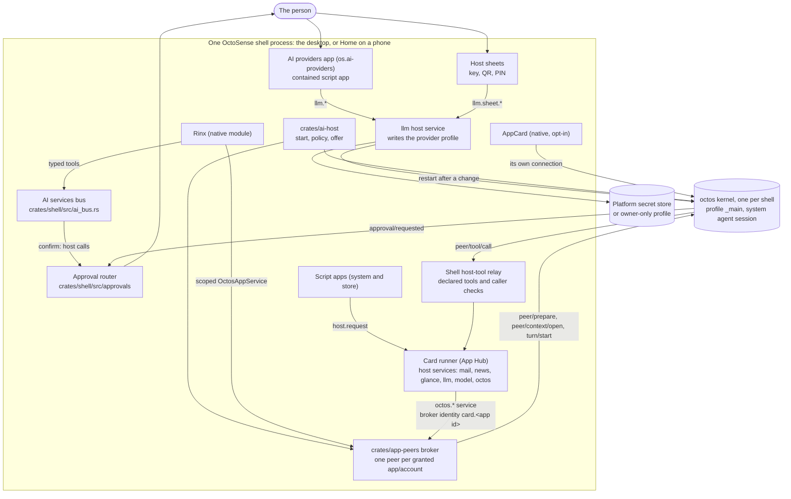

# AI services in OctoSense (octos)

English | [简体中文](ai-services.zh-CN.md)

How the assistant is wired into OctoSense: the octos kernel, provider configuration, app peers and tools. Use the [Cargo.toml](../Cargo.toml) dependency pins when following external code. For calls and the execution model, read the [architecture walkthrough](architecture-walkthrough.md). Status descriptions refer to this checkout. Dated runs below are historical validation records.

Earlier source reviews took place on 2026-09-28 (OctoSense `ad0d738`) and 2026-09-29 (`baa90bd`). Those dates do not date the current status table.

This page is about the assistant *inside* OctoSense. Building an app needs no AI service and no particular coding agent: the app harness, [OctoScript-App-Design-Flow](https://github.com/OctoSense-org/OctoScript-App-Design-Flow), works with any agent or none. Its [AI-SERVICES](https://github.com/OctoSense-org/OctoScript-App-Design-Flow/blob/main/docs/AI-SERVICES.md) page is the app developer's short version of this one.

For the whole system around it (processes per platform, agents, protocols, tools and grants, approvals, storage and trust boundaries), see [OctoSense architecture](architecture.md). This page does not repeat it: the native app manifest (`native-apps.json`), the system agent's tool set, the approval router, first-use consent and developer mode are described there and only linked from here.

## Contents

- [At a glance](#at-a-glance)
- [Architecture](#architecture)
- [The trust model](#the-trust-model)
- [What each kind of app can use today](#what-each-kind-of-app-can-use-today)
- [Planned: event-driven app agents (ADR 0002)](#planned-event-driven-app-agents-adr-0002)
- [Run and test locally](#run-and-test-locally)
- [Source map](#source-map)

## At a glance

| Piece | Status | Where |
| --- | --- | --- |
| One octos kernel per shell process, started on first use, restarted after a provider change | Works today (desktop with its packaged `octos-kernel` or `OCTOS_APP_CORE_BIN`, Android, OpenHarmony; none on iOS) | [`crates/kernel`](../crates/kernel/README.md) |
| AI providers: the person's model providers and keys, keys only on host sheets | Works today | [`apps/ai-providers`](../apps/ai-providers/host-service/README.md) |
| The shell's AI entry point (`start`, policy, per-instance offer, QR import) | Works today | [`crates/ai-host`](../crates/ai-host/README.md) |
| Host-owned app peers: one octos peer per granted app/account, owned by the system agent | Implemented for native modules (Rinx) and contained script apps after per-app consent | [`crates/app-peers`](../crates/app-peers/README.md), [Rinx ADR 0007](https://github.com/hagency-org/Rinx/blob/main/docs/adr/0007-host-owned-octos-app-peers.md) |
| AppCard ("Ask anything") on the shell's kernel | Works today, opt-in (`--features app-appcard`), not shipped | [`apps/appcard`](../apps/appcard) |
| A contained script app (system or store) asking the assistant | Implemented through exact declared `octos.*` services, with a kernel and first-use consent by default. Host tools and kernel-tool approvals route through the shell. `OCTOSENSE_CONTAINED_APPS=0` disables access; `1` is a developer consent bypass, not normal setup | [below](#contained-script-apps-system-and-store) |
| One-shot model calls for contained apps (`model`, `model.complete`) | Works today ([#95](https://github.com/OctoSense-org/OctoSense/pull/95)): registered by `crates/ai-host` with the `llm` service, for apps granted `model` ([App-Hub#24](https://github.com/OctoSense-org/OctoSense-App-Hub/pull/24), in the shells' App Hub pin) | [below](#contained-script-apps-system-and-store) |
| News data service (`news`, no model) | Merged ([#69](https://github.com/OctoSense-org/OctoSense/pull/69)); answers `os.*` apps only | [`apps/news/host-service`](../apps/news/host-service/README.md) |
| `glance.publish`: L0/L1 source cards or Splash script cards | Merged ([#72](https://github.com/OctoSense-org/OctoSense/pull/72)); contained apps granted the `glance` capability publish ([#86](https://github.com/OctoSense-org/OctoSense/pull/86)). `sys.digest` integration is a separate runtime path; [#87](https://github.com/OctoSense-org/OctoSense/pull/87) is historical tracking, not a current PR-status claim | [`crates/shell/src/glance.rs`](../crates/shell/src/glance.rs) |
| Approvals, first-use consent, developer mode | Works today ([#120](https://github.com/OctoSense-org/OctoSense/pull/120), [#118](https://github.com/OctoSense-org/OctoSense/pull/118)): the shell's approval router, standing rules and sheets, fed by the AI services bus and by the kernel's `host_tool` approvals through the host-tool relay ([#145](https://github.com/OctoSense-org/OctoSense/pull/145)); consent before an app's agent first runs; developer mode turned on only by the person | [architecture § Approvals](architecture.md#5-approvals) |
| The system agent's tool set | Works today, enforced: octos's shell is never offered (the `_main` profile's `tool_policy`, [#117](https://github.com/OctoSense-org/OctoSense/pull/117)), and every kernel start sets the system session's exact kernel tool list (`session/tool_list/set`, octos#2648). Command execution is the Setup → Assistant → Command execution switch ([#132](https://github.com/OctoSense-org/OctoSense/pull/132)): `terminal.run`, each command approved live, in both module and process hosting where Terminal is available | [architecture § Tools and grants](architecture.md#4-tools-and-grants) |
| Native apps declared once (`native-apps.json`), hosting per target; the Terminal a system app in its own process on the desktop | Works today ([#113](https://github.com/OctoSense-org/OctoSense/pull/113)) | [architecture § Native apps](architecture.md#native-apps-in-process-or-their-own-process) |
| An app's own agent: declarations versus execution | `tools.json`, generic-tool grants, peers and host-service executors are implemented for News/Mail/Calendar/Photos/Maps/Camera/YouTube. `AGENT.md` prompt loading, bundle skills/model selection and automatic triggers remain gaps | [below](#planned-event-driven-app-agents-adr-0002) |
| Native apps in their own process reaching their agent (the peer link, ADR 0004 §5) | Makepad’s client and the shell’s `crates/shell/src/peer_link/` are implemented. No process app currently requests its own agent; Terminal declares tools but does not request a peer. | [architecture § An app and its own agent](architecture.md#an-app-and-its-own-agent) |

## Architecture



### The octos kernel: one per shell

The kernel is a **shell service** ([`crates/kernel`](../crates/kernel/README.md), package `octosense-kernel`), not an app. The shell configures it once at startup; nothing runs until the first consumer calls `octosense_kernel::connect()`, and later consumers share the same process. octos holds a single-writer lock on its data dir, so there is one kernel per core dir. In ordinary mode, when the last connection closes the kernel stops; Talk to Octos keeps the shared kernel alive while enabled; `shutdown()` stops it with the shell (5 s at most).

How it runs, by platform (`crates/kernel/src/launch.rs`, `KernelSource::platform()` in `crates/ai-host`):

| Platform | Kernel | Core dir (the octos home) |
| --- | --- | --- |
| Desktop (macOS; Windows and Linux untested) | `<kernel> serve --stdio --data-dir <core dir>` (plus `--config <core dir>/config.json` if present), where the kernel is an explicit kernel program (`Options::program`), else `$OCTOS_APP_CORE_BIN`, else the packaged `octos-kernel` beside the shell, run only when its receipt names the pinned octos revision and its SHA-256 matches ([desktop/README.md, Build and run](../desktop/README.md#build-and-run)). **With none of these there is no desktop kernel**, and a developer's own `octos serve` is never touched. | `$OCTOS_APP_CORE_DIR`, else `<OctoSense state dir>/octos-home/.octos` (`~/.octosense/octos-home/.octos`): OctoSense's own, no longer the person's `~/octos-home/.octos`, whose provider settings it copies once |
| Android (Home) | The APK's `liboctos.so serve --stdio`, built by [`tools/kernel-artifact.py`](../tools/kernel-artifact.py) from the octos revision the root `Cargo.toml` pins | `<app data dir>/octos-home/.octos` |
| OpenHarmony | In process (`octos_cli::embedded::serve_io`), because a HAP may not exec | `<app data dir>/octos-home/.octos` |
| iOS | **None.** Providers are still saved; no app gets an assistant | – |

With Talk to Octos enabled, the kernel uses host-managed loopback WebSocket transport instead of stdio. Consumers speak the octos UI Protocol (JSON-RPC frames, as `octos serve --stdio` does) over a `Connection`. Each consumer gets the replies to its own requests and the notifications of its own sessions. When the providers change, the kernel restarts and every connection ends with `CloseReason::Restarted`; a consumer reconnects and reopens its sessions (AppCard's transport is the reference).

### AI providers and the `llm` host service

**AI providers** (`os.ai-providers`, [`apps/ai-providers/bundle`](../apps/ai-providers/bundle)) is where the person chooses the assistant's models: a primary and fallbacks, each from octos's model catalog, with Test connection, and a PIN-protected `OCTOS1E` QR to move them between devices. It opens from **Start → Settings → AI providers** on the desktop and **OctoSense Settings → Accounts → AI providers** on a phone.

It is a contained script app like any other; the privileged half is the **`llm` host service** ([`apps/ai-providers/host-service`](../apps/ai-providers/host-service/README.md)):

- It writes the kernel's profile, `<core dir>/profiles/_main.json` (`config.llm` and the key variables in `config.env_vars`), then restarts the kernel.
- Keys go to the macOS login keychain (service `octos`), on Linux to `<core dir>/secrets/<ENV>` (0600), on Android and iOS into the app-private profile (0600), since octos has no secret store there. `OCTOSENSE_LLM_VAULT=file` keeps them in the profile for development.
- Keys, PINs and QR codes are typed, drawn and scanned only on the service's **host sheets**. Only a sheet may call `llm.sheet.*`; the app sees masked status (`"set ••••1234"`, `"missing"`).
- It serves **`os.*` apps only** (`"llm is for OctoSense's own apps."`). It manages providers; it has no method that sends a prompt to a model.

### `crates/ai-host`: the shell's one entry point

[`crates/ai-host`](../crates/ai-host/README.md) (`octosense-ai-host`) is what both shells call: `start(Host::platform(data_dir))` at startup (configures the kernel, installs the host policy, registers `llm` with the platform's QR import), `handle_event` every event, `offer(module, scope)` / `finish()` around a native module's `create`, and `shutdown()`.

The host **policy** grants exact native `octos.*` services from the generated `native-apps.json` declarations (currently Rinx).

#### Contained-app consent

Contained apps use first-use consent by default. The environment variable `OCTOSENSE_CONTAINED_APPS` controls this policy:

| Setting | Behavior |
| --- | --- |
| Unset (default) | Ask the person before an app first uses its agent (`ContainedGate::Consent`). |
| `1` | Developer override: skip first-use consent. Declared-service limits and individual tool approval rules still apply. |
| `0` | Turn off the `octos` service for contained apps. |

On first use, the shell shows what the app’s agent may read and use and where the model runs. **Settings → Assistant → Approvals** lists each app’s agent and lets the person turn it off.

The policy is selected by `contained_gate_from` in [`crates/ai-host/src/lib.rs`](../crates/ai-host/src/lib.rs). Per-app consent is handled by [`crates/shell/src/approvals/consent.rs`](../crates/shell/src/approvals/consent.rs) ([#120](https://github.com/OctoSense-org/OctoSense/pull/120)); see [architecture § Approvals](architecture.md#5-approvals).

### `crates/app-peers`: host-owned app peers

[`crates/app-peers`](../crates/app-peers/README.md) is the broker between an app and the kernel (Rinx [ADR 0007](https://github.com/hagency-org/Rinx/blob/main/docs/adr/0007-host-owned-octos-app-peers.md); kernel side octos UPCR-2026-034):

- A native module whose declared `octos.*` services the policy grants gets **one octos peer per account**, created or resumed with `peer/prepare` on the shell's kernel. A module with nothing granted allocates no peer.
- The peer's **owner** is the shell's system agent session, `_main:api:octosense#system`. The kernel mints a host token for the peer; the shell keeps it in `<core dir>/../app-peers` (0600), outside every app's reach.
- The peer's **memory namespace** is `app/<app>/acct-<hash>`: per app and per app account (the hash is a non-secret tag of the account id). The shell selects the permitted account workspace; the kernel provisions and verifies it. A kernel without this contract is refused, never replaced by an ordinary session on the profile's memory.
- The app never sees the kernel protocol. It gets a scoped `OctosAppService` for the instance being created, binds its signed-in account, and opens one **request context** per client instance (`peer/context/open`). A request context is a distinct kernel session under the same peer, not another app peer. `open_conversation` creates the human lane with bounded shared history; the peer session handles system-delegated work. A change of account revokes every context of the old account; late events are dropped.
- The operations are `Open`, `History`, `Turn { text }`, `Interrupt` and `Approval { id, approve }`, each gated by its exact service (`octos.session.open`, `octos.session.history`, `octos.turn.start`, `octos.turn.interrupt`; an approval needs `octos.turn.start`). The broker default turn timeout is 180 s.

### The system agent

The system agent owns the app peers and uses `peer_send_input` to delegate, then `peer_gather` to obtain results. `agents.list` discovers available app agents; `agents.ask` requests first-use consent/preparation, not the delegated task itself.

The person reaches the system chat through F8 or the shell's Assistant entry (`crates/shell/src/system_chat/`), and can talk directly to an app through the desktop “Ask &lt;app&gt;” panel or a card's `sys.chat`. Phone touch navigation has no Ask-app panel entry yet.

The system agent has a restricted kernel roster (`system_tools.rs`) and selected shell tools such as opt-in `terminal.run`; it does not inherit every app tool and cannot approve for the person. Talk to Octos is a separate client-access option. Automatic trigger orchestration, learning overlays and richer glance ranking remain planned; cards currently sort by priority and recency.

### Other assistants in the shell

- **AppCard** ([`apps/appcard`](../apps/appcard)), the "Ask anything" assistant, is a native module that takes its own kernel connection and sessions. It is opt-in (`--features app-appcard`) and not shipped.
- The desktop's **AI pane** seats Makepad's own `aichat` app, which reaches apps' typed tools over the window manager's AI services bus (`crates/shell/src/ai_bus.rs`). Rinx's assistant tools are reached this way today (below). It is separate from the octos app peers.

## The trust model

| Rule | How it holds today |
| --- | --- |
| **Keys stay with the host.** | Only the `llm` service reads or writes keys; they live in the platform vault or the owner-only profile under the kernel's core dir, never in an app's jail. The app-peers contract carries no credentials (`ModelInfo` has none). No `octos.*` service lets an app choose a provider or submit a key. |
| **Secrets are the host's.** | No app collects a password, PIN, key or one-time code, not even to pass it on. The runtime makes a password field inert in a policed isolate, App Hub's gate refuses a bundle that declares one, and services ask on their own sheets (`<family>.sheet.*` is accepted only from the sheet). |
| **Approvals belong to the person.** | The shell routes both `host_tool` and other kernel-tool approvals through its host-owned router; the app receives `approval/handled_by_host`. `confirm: app` uses an explicitly registered owning-app sheet. A system agent cannot approve for the person. Standing rules and developer mode are user-controlled; tool-specific restrictions still apply, including Terminal's non-auto-approvable command confirmation. See [Approvals](architecture.md#5-approvals). |
| **Delegation and tool execution have separate authority.** | The system agent delegates to app peers; the relay executes declared tools as their owner after grant/schema/policy checks. Cross-app direct tool grants are explicit, not access to all app APIs or databases. The system session separately has reviewed shell tools such as `terminal.run`. |
| **Memory is private per app and account.** | Each peer's memory namespace is `app/<app>/acct-<hash>`; contexts of one account are never restored under another. Promotion to shared memory is planned (ADR 0002 §9). |
| **Least privilege, by exact name.** | An app gets `declared ∩ supported ∩ host policy` services, compared by exact name: `octos.` or `octos.admin` grants nothing. |

## What each kind of app can use today

### Native modules (Rinx-style)

A native module is trusted Rust linked into the shell. **Rinx** ([hagency-org/Rinx](https://github.com/hagency-org/Rinx)) is the reference and, under `Policy::shipped()`, the only one granted the assistant.

1. The module lists the exact services in `capabilities()`, for example all four of `octosense_app_peers::OCTOS_SERVICES`.
2. The shell calls `ai_host::offer(module, &scope)` before `module.create` and `offer.finish()` after it; the returned `Assistant` lives with the instance and releases it when dropped.
3. In `create`, the module claims its service; `None` means hosted without assistant access, and the module must not fall back to a kernel of its own:

   ```rust
   // Option<Arc<dyn OctosAppService>>; None: no assistant for this instance.
   let Some(service) = octosense_app_peers::injection::claim("rinx", &handles.scope.to_string()) else { return };
   service.set_account(Some(&user_id));
   let ctx = service.open_context(ContextSpec { account, instance, services })?;
   ctx.call(ContextOp::Turn { text }, sink)?;   // Data(..)* then Complete(..)
   ctx.close();                                  // instance closed
   service.release();                            // app closed
   ```

4. `availability()` reports `Unavailable` (no kernel, not granted, signed out), `Idle`, `Ready` or `Failed`; the app's ordinary UI keeps working in every state. `settings_entry()` is `Host`: the app offers no provider form of its own and points the person to AI providers.

**Tools.** Rinx defines its UI assistant tools in `src/assistant/mod.rs` and exposes them through `ServiceExecutor` on the AI services bus. Reads and sends still use Rinx’s own confirmation sheets.

The kernel supports host-registered tools, and the shell implements their relay. Rinx has not yet declared those peer tools or registered its send sheet with `OctosAppService::set_confirm_sheet`. Tools available on the AI bus are therefore not automatically available to Rinx’s peer.

**Rinx mini apps.** Rinx hosts reviewed OctoScript mini apps and serves them the same four `octos.*` services, each running instance in its own request context of Rinx's peer ([example](https://github.com/hagency-org/Rinx/tree/main/examples/miniapps/matrix-octos-script)). That is Rinx's own mini-app host, for bundles a person imports into Rinx after review; it is not the App Hub install path.

### Contained script apps (system and store)

A script app runs in App Hub's Card runner and reaches the shell only through `host.request("<family>.<method>", args, fn(r){…})`, for a family its manifest was granted. The services a shell registers today (`crates/shell/src/apps.rs`, `crates/ai-host`):

| Family | Who may call it | What it is |
| --- | --- | --- |
| `mail` | any app granted `mail` | Mail accounts the person signs in to on the host's sheet |
| `calendar` | Calendar's agent as `os.calendar`; no public script capability | Rust event storage and fixed glance-card tools. The script window currently shows instructions; it cannot call this family through a general Calendar capability. |
| `llm` | `os.*` apps only | Managing the assistant's providers (`llm.providers`, `llm.add_provider`, `llm.test`, `llm.import_qr`, …); **no prompt or completion method** |
| `news` | `os.*` apps only (`may_call` in the service) | News data, without a model. The News bundle now declares `news`; its agent exposes `news.list`/`news.read`/`news.notify`. The background fetch timer does not yet trigger an LLM turn. |
| `glance` | apps granted the `glance` capability ([#86](https://github.com/OctoSense-org/OctoSense/pull/86), [App-Hub#22](https://github.com/OctoSense-org/OctoSense-App-Hub/pull/22)) | Publishing L0 cards to the glance screen, under the app's own id (`crates/shell/src/glance.rs`) |
| `model` | apps granted the `model` capability ([App-Hub#24](https://github.com/OctoSense-org/OctoSense-App-Hub/pull/24)) | One-shot `model.complete {task, input, schema, class?, allow_urls?}` and `model.budget` ([#95](https://github.com/OctoSense-org/OctoSense/pull/95), `apps/ai-providers/host-service/src/complete/`, registered in `crates/ai-host/src/lib.rs`): `class` `fast` or `strong`; the host picks the model from the person's providers, validates the reply against the schema, refuses URLs unless asked, keeps a per-app daily budget; no tools, memory or history, and the app never sees a key |
| `octos` | Apps declaring the exact `octos.*` service names, in a shell that hosts a kernel, subject to [contained-app consent](#contained-app-consent) | The app’s assistant, reached through a host-owned peer. The broker identifies the app as `card.<app id>`; `peer/prepare` returns its kernel-issued peer slug ([`contained.rs`](../crates/ai-host/src/contained.rs), [#106](https://github.com/OctoSense-org/OctoSense/pull/106)). Call rules are below. |

The four `octos.*` calls have separate argument, origin, approval and reply rules:

- **Arguments.** `octos.turn.start` requires non-blank `text` of at most 32 KiB and accepts optional `trigger` (`person`, `app` or `incoming`) and `from`. The other calls accept only `{}`.
- **Origin.** `trigger: "person"` is classified as `AppSaysPerson`. It is an app assertion, not a trusted human gesture, and cannot bypass approval.
- **Approvals.** Both host-tool and other peer approvals route to the shell. Existing grants and approval rules still apply; developer mode answers for the apps it covers. A host without a router declines requests and lists them in `denied_approvals`. See [`host_approvals.rs`](../crates/app-peers/src/host_approvals.rs).
- **Replies.** The host refuses replies larger than 2 MiB. The response table below lists successful calls and common errors.

A script's own assistant calls use declared `octos.*` services. Separately, the shell can drive an app peer from `agent`/`tools.json` without the script declaring those UI calls. Replies on the script service path:

| Call | Answer |
| --- | --- |
| a family the manifest did not grant | `r.error`: `this app was not granted "<family>", which "<service>" needs` (at once, from the isolate) |
| `octos.turn.start {text}`, granted, kernel and provider configured | `r.data`: `{turn_id, text}`, the reply of the app's peer |
| `octos.*` with arguments beyond the rules | `r.error`: `Unsupported Octos arguments`, or `Provide text (at most 32 KiB)` |
| `octos.*` with the assistant turned off for apps (`OCTOSENSE_CONTAINED_APPS=0`) | `r.error`: `The assistant is turned off for apps on this device` |
| `octos.*` before the person allowed the app's agent | `r.error`: `Waiting for the person to allow this app's agent (OctoSense asks the first time)`, and the shell shows its first-use sheet (read in `contained.rs` and `approvals/mod.rs`; **unverified** in a running shell) |
| `octos.*` on a desktop without a packaged kernel or `OCTOS_APP_CORE_BIN` | `r.error`: `no octos kernel: no packaged octos-kernel beside <dir> and no OCTOS_APP_CORE_BIN override; …` (a stale packaged kernel: `no octos kernel: refusing the packaged kernel …`) |
| `octos.*` in a build that links no kernel (iOS) | `r.error`: `no service answers "octos" on this device` (**unverified**) |
| `llm.*` from a store app granted `llm` | `llm is for OctoSense's own apps.` |
| anything in App Hub's `card-host` | `no service answers "<family>" on this device` (`card-host` registers no services) |

**Historical validation (not rerun for this revision).** The first row, the `llm` row and the `card-host` row were run in `card-host` (App Hub `362d832`) on 2026-09-27. The reply, the unsupported-arguments answer and the missing-kernel answer were run on macOS on 2026-09-28 in a release desktop with hidden windows, through a system app declaring `octos.session.open` and `octos.turn.start` opened from the launcher; with a kernel built at the then-pinned octos `7bec0918` and the person's provider, the reply came from the peer `card.<app id>`, whose memory namespace `app/card.<app id>/…` appeared in the kernel's data. The text-length and switch-off answers are covered by `cargo test -p octosense-ai-host`, through the same dispatch. OctoScript-App-Design-Flow's [AI-SERVICES](https://github.com/OctoSense-org/OctoScript-App-Design-Flow/blob/main/docs/AI-SERVICES.md) has the example app and the argument and answer shapes of the four `octos.*` calls as Rinx serves them.

The manifest's `agent` and admitted `tools.json` participate in shell agent discovery, tool loading and grants. News/Mail/Calendar/Photos/Maps/Camera/YouTube have working host-service-backed declarations. The `profile`/model requirements, `AGENT.md` prompt content, bundle skills and automatic triggers are not fully consumed; `implemented_by: "app"` has no script executor. Mail currently declares only `mail.notify`, not its UI's read/send methods. The agent workspace does not automatically expose host-service databases. Rinx mini-app admission is a separate contract; do not assume App Hub metadata is supported there.

## Planned: event-driven app agents (ADR 0002)

[ADR 0002](adr/0002-event-driven-app-agents.md) (status **Proposed**) describes the broader plan for event-driven app agents. App peers, tool execution and human conversations already work. Automatic triggers and other remaining pieces are listed separately below; the ADR’s proposed status does not mean every component is still planned.

| Piece | ADR | Status |
| --- | --- | --- |
| `tools.json`: names, input/output schemas, risk, confirmation, sharing and implementation | §4, §12 | Loaded by `host_tools/script_apps.rs`, registered on peers and routed to host-service executors. News, Mail, Calendar, Photos, Maps, Camera and YouTube ship declarations; AI providers has no app agent. Arbitrary `implemented_by: "app"` script execution remains unavailable. |
| `AGENT.md`, data-only skills, model requirements, `background`, triggers | §2, §3 | Admitted metadata. Prompt/skill loading, model selection from these requirements and trigger scheduling remain unimplemented in the shell. Tool background eligibility alone does not schedule a turn. |
| Kernel: host-registered tools per peer (`peer/tools/register`, `peer/tool/call`/`result`/`cancel`), tool-list and risk enforcement, approvals only on the host connection, an allowlist of generic tools, `peer/input` | §4, §13 | Kernel side merged: [octos#2567](https://github.com/octos-org/octos/pull/2567) (UPCR-2026-035), in the pin with its follow-ups (octos#2616). The shell side is on main: [#145](https://github.com/OctoSense-org/OctoSense/pull/145) (tool registration, the relay, `peer/input`) and G3 (per-app `generic_tools` from the manifests, `tools.json` loading, grants, executors for script apps' host services, schema and budget checks; `peer/input/reject`, octos#2621). |
| Tool approval policy | §4, §12 | Destructive and outward calls enter the shell’s approval router. It applies standing rules, host or registered app confirmation surfaces, and developer mode. Grants, schemas and caller budgets are checked separately. See [Approvals](architecture.md#5-approvals). |
| News M1: the `news` data service (no model) | First slice | Merged ([#69](https://github.com/OctoSense-org/OctoSense/pull/69)); issue [#60](https://github.com/OctoSense-org/OctoSense/issues/60). |
| News M2: `os.news` gets a peer and tools | First slice | Implemented: manifest `agent`, `news.list`/`news.read`/`news.notify` tools, shell peer preparation and relay. |
| News M3: triggers and an unattended run | First slice | Planned: [#62](https://github.com/OctoSense-org/OctoSense/issues/62). |
| News M4: glance cards (`glance.publish`, the glance page and desktop panel) | §7, §8 | `glance.publish` ([#72](https://github.com/OctoSense-org/OctoSense/pull/72)) and the `glance` capability for contained apps ([#86](https://github.com/OctoSense-org/OctoSense/pull/86), with [App-Hub#22](https://github.com/OctoSense-org/OctoSense-App-Hub/pull/22)) merged; `sys.digest` integration has separate runtime/host requirements; [#87](https://github.com/OctoSense-org/OctoSense/pull/87) is historical tracking; issue [#63](https://github.com/OctoSense-org/OctoSense/issues/63). |
| M5: the system toolbox as granted tools | §6 | Implemented behind `toolbox-peers`: `crates/ai-host/src/toolbox_peers.rs` and the shell toolbox executor. Home enables the feature by default; desktop opts in. Tools still require admission/grants and consent; this is not a general conversation with the system agent. |
| M6: render and critique (`card-studio`) | §7 | App Hub's `card-studio` crate merged ([App-Hub#19](https://github.com/OctoSense-org/OctoSense-App-Hub/pull/19)); the skill is planned ([#65](https://github.com/OctoSense-org/OctoSense/issues/65)). |
| M7: app conversations, questions and memory | §9, §10 | Implemented human/system lanes, Ask-app panel, `sys.chat`, host-routed questions/approvals and scoped peer/context memory. See the [walkthrough](architecture-walkthrough.md). |
| M8: the outer loop (overlays on `AGENT.md`) | §11 | Planned: [#67](https://github.com/OctoSense-org/OctoSense/issues/67). |

The tracking issue is [#68](https://github.com/OctoSense-org/OctoSense/issues/68). App Hub's [PUBLISHING § The app's agent and tools](https://github.com/OctoSense-org/OctoSense-App-Hub/blob/main/docs/PUBLISHING.md#the-apps-agent-and-tools) has the file formats.

## Run and test locally

The build/launch recipes below are **unverified**; read dependency versions from the root Cargo.toml.

### Desktop, with a throwaway kernel and profile

1. Build the desktop kernel from the OctoSense repository root. The existing helper reads the octos revision from `Cargo.lock` and uses its own `target/octos-kernel/` directory, leaving other checkouts alone. The build and subsequent launch steps are **unverified**; only the `--plan` output was checked for this revision.

   ```sh
   python3 tools/kernel-artifact.py --host --plan
   python3 tools/kernel-artifact.py --host
   ```

2. Run the desktop with its own state, core dir and file vaults, so neither `~/.octosense`, `~/octos-home` nor the login keychain is touched:

   ```sh
   T=$(mktemp -d)
   OCTOS_APP_CORE_BIN="$PWD/target/octos-kernel/target/release/octos" \
   OCTOS_APP_CORE_DIR=$T/octos-home/.octos \
   OCTOSENSE_HOME=$T/state OCTOSENSE_APP_DATA=$T/apps \
   OCTOSENSE_LLM_VAULT=file OCTOSENSE_MAIL_VAULT=file \
     cargo run --release -p octosense
   ```

   The log says `octos: kernel service ready (starts on first use), core dir …`. Without `OCTOS_APP_CORE_BIN` it uses the packaged `octos-kernel` beside the shell if there is one (`python3 tools/kernel-artifact.py --host --stage target/release`), else says there is no kernel, and AI providers still saves providers.

3. Open **Start → Settings → AI providers**, add a model (family, model, route, key, **Test connection**, save). The profile is `$T/octos-home/.octos/profiles/_main.json`; with the file vault the key is in it, so delete `$T` afterwards.
4. Use the assistant through a consumer: Rinx (linked by default and in-process; open it from the launcher; sign in to Matrix, allow its agent on the first-use sheet, then use its assistant), or AppCard (`--features app-appcard`). A contained app reaches it through the `octos` host service ([above](#contained-script-apps-system-and-store)); leave `OCTOSENSE_CONTAINED_APPS` unset and allow the app's agent when the shell asks. F8 also opens the system chat; use `agents.ask` for consent/preparation, then `peer_send_input` for delegation.

**Hidden windows.** Add `MAKEPAD_HIDE_WINDOWS=1 MAKEPAD_REMOTE=<port>` to drive the shell over the remote bridge without taking the screen ([desktop README § Remote-control bridge](../desktop/README.md#remote-control-bridge)). `desktop/scripts/ai_providers_remote.sh` runs AI providers end to end this way with fake keys and outbound HTTPS denied, and `desktop/scripts/glance_remote.sh` does the same for the glance panel.

**Tests** (from the repository root):

```sh
cargo test --locked -p octosense-kernel                              # against a stand-in kernel
cargo test --locked -p octosense-app-peers --features octos-core,ws  # the broker, scripted kernel
cargo test -p octosense-ai-host --features octos-core,llm
cargo test --locked -p octosense-shell --lib approvals              # router, rules, sheets, consent, contacts
# The real kernel (build it as in step 1):
OCTOS_CORE_TEST_KERNEL=/path/to/octos cargo test -p octosense-kernel --test real_kernel -- --nocapture
OCTOS_APP_PEERS_TEST_KERNEL=/path/to/octos cargo test -p octosense-app-peers --features octos-core --test real_kernel -- --nocapture
```

### Phone

- **Android (Home):** the Home APK bundles the kernel as `liboctos.so`. The configured `rom/scripts/build-home.py` pipeline builds the APK pair (see [phone/README.md](../phone/README.md)), using [`tools/kernel-artifact.py`](../tools/kernel-artifact.py) at the locked octos revision. The kernel starts on first use.
- Configure providers in **OctoSense Settings → Accounts → AI providers**, or move them from a desktop: **Show QR for phone** on the desktop, then import on the phone by camera, image or pasted code, with the PIN.
- **OpenHarmony** runs the kernel in process. **iOS** has no kernel: providers are saved, no app gets an assistant.

## Source map

| What | Where |
| --- | --- |
| Kernel service | [`crates/kernel`](../crates/kernel/README.md) (`src/launch.rs`, `src/lib.rs`) |
| Shell entry point, policy, offer | [`crates/ai-host/src/lib.rs`](../crates/ai-host/src/lib.rs) |
| App peers: contract, broker, shell side | [`crates/app-peers/src`](../crates/app-peers/src) (`contract.rs`, `broker.rs`, `hosted.rs`) |
| `llm` service, vault, sheets | [`apps/ai-providers/host-service/src`](../apps/ai-providers/host-service/src) |
| `octos` service for contained apps | [`crates/ai-host/src/contained.rs`](../crates/ai-host/src/contained.rs) |
| `model` service | [`apps/ai-providers/host-service/src/complete`](../apps/ai-providers/host-service/src/complete) |
| Host services a shell registers | `crates/shell/src/apps.rs` (`register_host_services`), [`crates/shell/src/glance.rs`](../crates/shell/src/glance.rs) |
| Approvals, consent, contacts, Settings page; developer mode | [`crates/shell/src/approvals/`](../crates/shell/src/approvals/mod.rs), [`crates/shell/src/dev_mode.rs`](../crates/shell/src/dev_mode.rs) |
| The system agent's tool set | [`crates/kernel/src/system_tools.rs`](../crates/kernel/src/system_tools.rs) |
| Everything else (native app manifest, hosting, storage, protocols) | [architecture § Source map](architecture.md#source-map) |
| Capabilities, `tools.json`, agent fields | OctoSense-App-Hub [`crates/app-policy/src`](https://github.com/OctoSense-org/OctoSense-App-Hub/tree/main/crates/app-policy/src) (`manifest.rs`, `services.rs`, `agent.rs`) |
| Rinx's assistant and mini-app adapter | hagency-org/Rinx `src/assistant/`, `src/host/octos.rs` |
