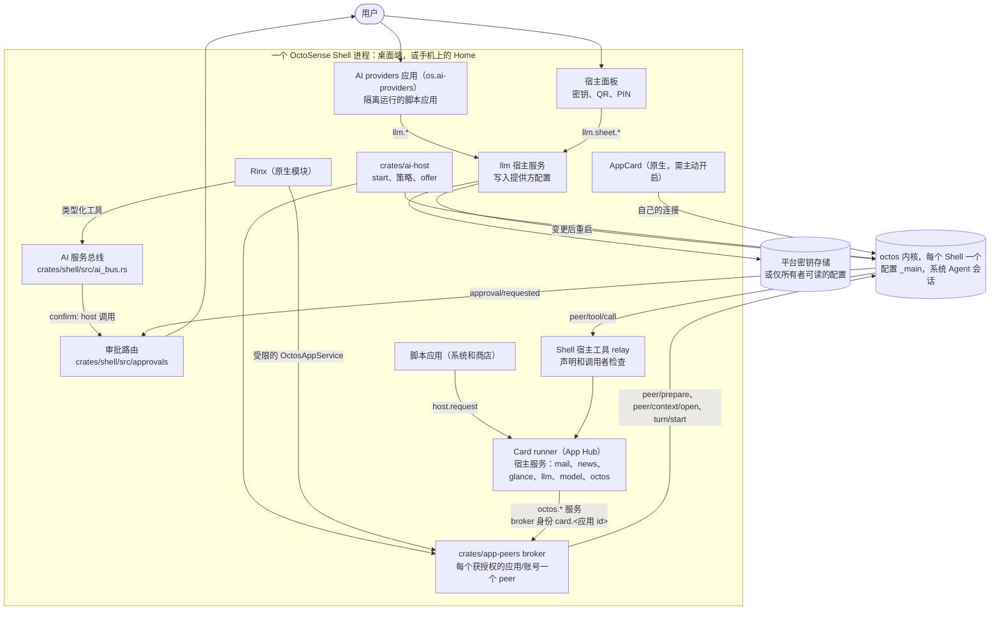

# OctoSense 中的 AI 服务（octos）

[English](ai-services.md) | 简体中文

本文介绍 OctoSense 的 octos 内核、提供方配置、应用 peer 和工具。阅读外部源码时使用 [Cargo.toml](../Cargo.toml) 的依赖锁定版本。调用链与执行模型见[架构导读](architecture-walkthrough.zh-CN.md)。状态说明以当前检出为准。下方带日期的运行信息是历史验证记录。

历史源码评审分别在 2026-09-28（OctoSense `ad0d738`）和 2026-09-29（`baa90bd`）进行；这些日期不代表当前状态表的更新时间。

本文讨论的是 OctoSense *内部*的助手。开发应用不需要任何 AI 服务，也不需要特定的编程 Agent：应用开发工具集 [OctoScript-App-Design-Flow](https://github.com/OctoSense-org/OctoScript-App-Design-Flow) 适用于任何 Agent，也可以不用 Agent。它的 [AI-SERVICES](https://github.com/OctoSense-org/OctoScript-App-Design-Flow/blob/main/docs/AI-SERVICES.zh-CN.md) 页面是本文面向应用开发者的简短版本。

它所处的整个系统（各平台的进程、Agent、协议、工具与授权、审批、存储和信任边界）见 [OctoSense 架构](architecture.zh-CN.md)。本文不重复那些内容：原生应用清单（`native-apps.json`）、系统 Agent 的工具集、审批路由、首次使用同意和开发者模式都在那里描述，这里只给出链接。

## 目录

- [概览](#概览)
- [架构](#架构)
- [信任模型](#信任模型)
- [各类应用目前能用什么](#各类应用目前能用什么)
- [规划中：事件驱动的应用 Agent（ADR 0002）](#规划中事件驱动的应用-agentadr-0002)
- [本地运行与测试](#本地运行与测试)
- [源码位置](#源码位置)

## 概览

| 组成部分 | 状态 | 位置 |
| --- | --- | --- |
| 每个 Shell 进程一个 octos 内核，首次使用时启动，提供方变更后重启 | 目前可用（有随附 `octos-kernel` 或设置了 `OCTOS_APP_CORE_BIN` 的桌面端、Android、OpenHarmony；iOS 没有） | [`crates/kernel`](../crates/kernel/README.md) |
| AI providers：用户的模型提供方和密钥，密钥只在宿主面板上输入 | 目前可用 | [`apps/ai-providers`](../apps/ai-providers/host-service/README.md) |
| Shell 的 AI 入口（`start`、策略、按实例提供服务、QR 导入） | 目前可用 | [`crates/ai-host`](../crates/ai-host/README.md) |
| 宿主拥有的应用 peer：每个获授权的应用/账号一个 octos peer，归系统 Agent 所有 | 已实现：原生模块（Rinx）及经过按应用同意的隔离脚本应用 | [`crates/app-peers`](../crates/app-peers/README.md)、[Rinx ADR 0007](https://github.com/hagency-org/Rinx/blob/main/docs/adr/0007-host-owned-octos-app-peers.md) |
| 在 Shell 内核上运行的 AppCard（"Ask anything"） | 目前可用，需主动开启（`--features app-appcard`），不随产品发布 | [`apps/appcard`](../apps/appcard) |
| 隔离脚本应用向助手提问 | 已实现：精确声明的 `octos.*` 服务、内核与默认的首次使用同意；宿主工具和内核工具审批都交给 Shell。`OCTOSENSE_CONTAINED_APPS=0` 禁用；`1` 是跳过同意的开发覆盖，不是正常设置步骤 | [见下文](#隔离运行的脚本应用系统应用和商店应用) |
| 供隔离应用使用的一次性模型调用（`model`，`model.complete`） | 目前可用（[#95](https://github.com/OctoSense-org/OctoSense/pull/95)）：由 `crates/ai-host` 与 `llm` 服务一同注册，供获得 `model` 权限的应用使用（[App-Hub#24](https://github.com/OctoSense-org/OctoSense-App-Hub/pull/24)，已在 Shell 锁定的 App Hub 中） | [见下文](#隔离运行的脚本应用系统应用和商店应用) |
| News 数据服务（`news`，不使用模型） | 已合入（[#69](https://github.com/OctoSense-org/OctoSense/pull/69)）；只响应 `os.*` 应用 | [`apps/news/host-service`](../apps/news/host-service/README.md) |
| `glance.publish`：L0/L1 source 卡片或 Splash script 卡片 | 已合入（[#72](https://github.com/OctoSense-org/OctoSense/pull/72)）；获得 `glance` 权限的隔离应用可以发布（[#86](https://github.com/OctoSense-org/OctoSense/pull/86)）。`sys.digest` 有单独的运行时/宿主要求；[#87](https://github.com/OctoSense-org/OctoSense/pull/87) 是历史跟踪链接，不表示当前 PR 状态 | [`crates/shell/src/glance.rs`](../crates/shell/src/glance.rs) |
| 审批、首次使用同意、开发者模式 | 已实现：Shell 审批路由、常设规则及面板接收 AI 服务总线和内核工具审批；首次运行先征求同意，开发者模式由用户开启 | [架构 § 审批](architecture.zh-CN.md#5-审批) |
| 系统 Agent 的工具集 | 已强制：不提供 octos 内置 shell；精确设置系统会话内核工具列表。用户开启命令执行后通过 `terminal.run`，每次命令实时确认；Terminal 可用时模块和进程托管均支持 | [架构 § 工具与授权](architecture.zh-CN.md#4-工具与授权) |
| 原生应用只声明一次（`native-apps.json`），按目标平台决定托管方式；Terminal 作为系统应用在桌面端以独立进程运行 | 目前可用（[#113](https://github.com/OctoSense-org/OctoSense/pull/113)） | [架构 § 原生应用](architecture.zh-CN.md#原生应用进程内还是独立进程) |
| 应用自己的 Agent：声明与执行 | News/Mail/Calendar/Photos/Maps/Camera/YouTube 的 `tools.json`、通用工具授权、peer 和宿主服务执行器已实现。`AGENT.md` 提示词加载、包内 skills/模型选择和自动触发器仍有缺口 | [见下文](#规划中事件驱动的应用-agentadr-0002) |
| 独立进程中的原生应用访问自己的 Agent（peer link） | Makepad 客户端与 Shell `crates/shell/src/peer_link/` 均已实现。当前没有进程应用申请自己的 Agent；Terminal 声明了工具但未申请 peer | [架构 § 应用与它自己的 Agent](architecture.zh-CN.md#应用与它自己的-agent) |

## 架构



### octos 内核：每个 Shell 一个

内核是一个 **Shell 服务**（[`crates/kernel`](../crates/kernel/README.md)，包名 `octosense-kernel`），不是应用。Shell 在启动时配置一次；在第一个使用者调用 `octosense_kernel::connect()` 之前什么都不运行，之后的使用者共享同一个进程。octos 对它的数据目录持有单写者锁，所以每个 core 目录只有一个内核。普通模式下最后一个连接关闭时内核停止；Talk to Octos 开启期间会保持共享内核存活；`shutdown()` 随 Shell 一起停止它（最多 5 秒）。

各平台的运行方式（`crates/kernel/src/launch.rs`，`crates/ai-host` 中的 `KernelSource::platform()`）：

| 平台 | 内核 | Core 目录（octos home） |
| --- | --- | --- |
| 桌面端（macOS；Windows 和 Linux 未测试） | `<内核> serve --stdio --data-dir <core 目录>`（存在 `<core 目录>/config.json` 时再加 `--config`），内核为显式指定的内核程序（`Options::program`），否则为 `$OCTOS_APP_CORE_BIN`，再否则为 Shell 旁随附的 `octos-kernel`；后者只有在收据中的版本与固定的 octos 版本一致且 SHA-256 相符时才运行（[desktop/README.zh-CN.md，构建与运行](../desktop/README.zh-CN.md#构建与运行)）。**三者都没有时没有桌面内核**，开发者自己运行的 `octos serve` 永远不会被动到。 | `$OCTOS_APP_CORE_DIR`，否则为 `<OctoSense 状态目录>/octos-home/.octos`（`~/.octosense/octos-home/.octos`）：OctoSense 自己的目录，不再是用户的 `~/octos-home/.octos`（只从中复制一次提供商设置） |
| Android（Home） | APK 中的 `liboctos.so serve --stdio`，由 [`tools/kernel-artifact.py`](../tools/kernel-artifact.py) 按根 `Cargo.toml` 锁定的 octos 版本构建 | `<应用数据目录>/octos-home/.octos` |
| OpenHarmony | 进程内运行（`octos_cli::embedded::serve_io`），因为 HAP 不能 exec | `<应用数据目录>/octos-home/.octos` |
| iOS | **没有。** 提供方仍会保存；没有应用能获得助手 | – |

开启 Talk to Octos 后，内核使用宿主管理的回环 WebSocket 代替 stdio。使用者通过 `Connection` 使用 octos UI Protocol（JSON-RPC 帧，与 `octos serve --stdio` 相同）。每个使用者只收到自己请求的回复和自己会话的通知。提供方变更时内核重启，所有连接以 `CloseReason::Restarted` 结束；使用者重新连接并重新打开会话（AppCard 的传输层是参考实现）。

### AI providers 与 `llm` 宿主服务

**AI providers**（`os.ai-providers`，[`apps/ai-providers/bundle`](../apps/ai-providers/bundle)）是用户选择助手所用模型的地方：一个主模型和若干备用模型，都来自 octos 的模型目录，可以测试连接，并可通过有 PIN 保护的 `OCTOS1E` QR 码在设备之间迁移。桌面端从 **Start → Settings → AI providers** 打开，手机上从 **OctoSense Settings → Accounts → AI providers** 打开。

它和其他应用一样是隔离运行的脚本应用；有特权的一半是 **`llm` 宿主服务**（[`apps/ai-providers/host-service`](../apps/ai-providers/host-service/README.md)）：

- 它写入内核的配置 `<core 目录>/profiles/_main.json`（`config.llm` 和 `config.env_vars` 中的密钥变量），然后重启内核。
- 密钥存入 macOS 登录钥匙串（服务名 `octos`）；Linux 上存入 `<core 目录>/secrets/<ENV>`（0600）；Android 和 iOS 上存入应用私有的配置文件（0600），因为 octos 在那里没有密钥存储。开发时可用 `OCTOSENSE_LLM_VAULT=file` 把密钥留在配置文件中。
- 密钥、PIN 和 QR 码只在服务自己的**宿主面板**上输入、绘制和扫描。只有面板能调用 `llm.sheet.*`；应用只看到掩码后的状态（`"set ••••1234"`、`"missing"`）。
- 它**只服务 `os.*` 应用**（`"llm is for OctoSense's own apps."`）。它管理提供方；没有任何向模型发送提示词的方法。

### `crates/ai-host`：Shell 的统一入口

[`crates/ai-host`](../crates/ai-host/README.md)（`octosense-ai-host`）是两个 Shell 都调用的入口：启动时调用 `start(Host::platform(data_dir))`（配置内核、安装宿主策略、注册带平台 QR 导入能力的 `llm`），每个事件调用 `handle_event`，在原生模块 `create` 前后调用 `offer(module, scope)` / `finish()`，退出时调用 `shutdown()`。

宿主**策略**从 `native-apps.json` 生成的声明读取原生 `octos.*` 精确授权（目前是 Rinx）。

#### 隔离应用的首次使用同意

隔离应用默认需要用户在首次使用时同意。环境变量 `OCTOSENSE_CONTAINED_APPS` 控制这项策略：

| 设置 | 行为 |
| --- | --- |
| 未设置（默认） | 应用首次使用自己的 Agent 前，先询问用户（`ContainedGate::Consent`）。 |
| `1` | 开发者覆盖设置：跳过首次使用同意。已声明服务的限制和每次工具调用的审批规则仍然有效。 |
| `0` | 为隔离应用关闭 `octos` 服务。 |

首次使用时，Shell 会说明应用的 Agent 可以读取和使用什么，以及模型在哪里运行。**设置 → 助手 → 审批**列出每个应用的 Agent，用户可以在此关闭它。

策略由 [`crates/ai-host/src/lib.rs`](../crates/ai-host/src/lib.rs) 中的 `contained_gate_from` 选择。每个应用的同意状态由 [`crates/shell/src/approvals/consent.rs`](../crates/shell/src/approvals/consent.rs) 处理（[#120](https://github.com/OctoSense-org/OctoSense/pull/120)）；详见[架构 § 审批](architecture.zh-CN.md#5-审批)。

### `crates/app-peers`：宿主拥有的应用 peer

[`crates/app-peers`](../crates/app-peers/README.md) 是应用和内核之间的中介（Rinx [ADR 0007](https://github.com/hagency-org/Rinx/blob/main/docs/adr/0007-host-owned-octos-app-peers.md)；内核一侧是 octos UPCR-2026-034）：

- 原生模块声明的 `octos.*` 服务获得策略授权后，该应用会在 Shell 的内核上得到**每个账号一个 octos peer**，通过 `peer/prepare` 创建或恢复。没有获得任何授权的模块不会分配 peer。
- peer 的**所有者**是 Shell 的系统 Agent 会话 `_main:api:octosense#system`。内核为 peer 生成宿主 token；Shell 把它保存在 `<core 目录>/../app-peers`（0600），任何应用都无法访问。
- peer 的**记忆命名空间**是 `app/<app>/acct-<hash>`：按应用和应用账号区分（hash 是账号 id 的非机密标签）。Shell 选择获准的账号工作目录，内核创建并核验。不支持这一约定的内核会被拒绝，绝不会退回到使用配置共享记忆的普通会话。
- 应用永远看不到内核协议。它为正在创建的实例拿到一个受限的 `OctosAppService`，绑定已登录的账号，并为每个客户端实例打开一个**请求上下文**（`peer/context/open`）。请求上下文是同一 peer 下独立的内核 session，不是另一个应用 peer。`open_conversation` 创建带有限共享历史的人类通道，peer session 处理系统委派。切换账号会撤销旧账号的所有上下文；迟到的事件会被丢弃。
- 操作包括 `Open`、`History`、`Turn { text }`、`Interrupt` 和 `Approval { id, approve }`，每个都受对应的精确服务名约束（`octos.session.open`、`octos.session.history`、`octos.turn.start`、`octos.turn.interrupt`；审批需要 `octos.turn.start`）。broker 默认回合超时为 180 秒。

### 系统 Agent

系统 Agent 拥有应用 peer，通过 `peer_send_input` 委派任务，再用 `peer_gather` 获取结果。`agents.list` 发现应用 Agent；`agents.ask` 请求首次同意并准备 peer，本身不发送委派任务。

用户可用 F8 或 Shell 的 Assistant 入口打开系统聊天（`crates/shell/src/system_chat/`），也可通过桌面 “Ask &lt;app&gt;” 面板或卡片 `sys.chat` 直接与应用 Agent 对话；手机尚无打开 Ask-app 面板的触控入口。

系统 Agent 使用受限内核工具列表和审核过的 Shell 工具（例如需开启的 `terminal.run`），不会继承所有应用工具，也不能替用户审批。Talk to Octos 是另一种客户端入口。自动触发调度、学习 overlay 和更丰富的 glance 排序仍在规划中；卡片目前按优先级和时间排序。

### Shell 中的其他助手

- **AppCard**（[`apps/appcard`](../apps/appcard)），即 "Ask anything" 助手，是一个使用自己的内核连接和会话的原生模块。它需要主动开启（`--features app-appcard`），不随产品发布。
- 桌面端的 **AI 面板**承载 Makepad 自己的 `aichat` 应用，它通过窗口管理器的 AI 服务总线（`crates/shell/src/ai_bus.rs`）调用应用的类型化工具。Rinx 的助手工具目前就是这样被调用的（见下文）。它与 octos 应用 peer 是分开的。

## 信任模型

| 规则 | 目前如何保证 |
| --- | --- |
| **密钥留在宿主。** | 只有 `llm` 服务读写密钥；密钥保存在平台密钥存储或内核 core 目录下仅所有者可读的配置中，从不进入应用的 jail。app-peers 约定中不携带任何凭据（`ModelInfo` 中没有）。没有任何 `octos.*` 服务允许应用选择提供方或提交密钥。 |
| **机密归宿主所有。** | 应用不收集密码、PIN、密钥或一次性验证码，即使只是转交也不行。运行时让受管控隔离环境中的密码输入框失效，App Hub 的准入检查拒绝声明了此类输入框的应用包，服务在自己的面板上询问（`<family>.sheet.*` 只接受来自面板的调用）。 |
| **审批属于用户。** | Shell 将 `host_tool` 以及其他内核工具审批交给宿主路由，应用只收到 `approval/handled_by_host`。`confirm: app` 使用明确注册的所属应用面板。系统 Agent 不能代替用户同意；常设规则和开发者模式由用户控制，仍受工具限制，例如 Terminal 命令不能自动批准。见[审批](architecture.zh-CN.md#5-审批)。 |
| **委派和工具执行的权限不同。** | 系统 Agent 委派给应用 peer；relay 检查授权、schema 和策略后以所有者身份执行工具。跨应用工具授权必须明确，不是获得所有 API 或数据库；系统会话另有审核过的 Shell 工具，如 `terminal.run`。 |
| **记忆按应用和账号私有。** | 每个 peer 的记忆命名空间是 `app/<app>/acct-<hash>`；一个账号的上下文从不在另一个账号下恢复。提升到共享记忆还在规划中（ADR 0002 §9）。 |
| **最小权限，按精确名称。** | 应用得到的是 `声明 ∩ 支持 ∩ 宿主策略` 的服务，按精确名称比较：`octos.` 或 `octos.admin` 不授予任何权限。 |

## 各类应用目前能用什么

### 原生模块（Rinx 这类）

原生模块是链接进 Shell 的受信任 Rust 代码。**Rinx**（[hagency-org/Rinx](https://github.com/hagency-org/Rinx)）是参考实现，也是 `Policy::shipped()` 下唯一获得助手授权的模块。

1. 模块在 `capabilities()` 中列出精确的服务名，例如 `octosense_app_peers::OCTOS_SERVICES` 中的全部四个。
2. Shell 在 `module.create` 之前调用 `ai_host::offer(module, &scope)`，之后调用 `offer.finish()`；返回的 `Assistant` 与实例同生命周期，被丢弃时释放。
3. 在 `create` 中，模块领取自己的服务；`None` 表示以无助手的方式托管，模块不得退回到自己启动的内核：

   ```rust
   // Option<Arc<dyn OctosAppService>>；None：此实例没有助手。
   let Some(service) = octosense_app_peers::injection::claim("rinx", &handles.scope.to_string()) else { return };
   service.set_account(Some(&user_id));
   let ctx = service.open_context(ContextSpec { account, instance, services })?;
   ctx.call(ContextOp::Turn { text }, sink)?;   // Data(..)*，然后 Complete(..)
   ctx.close();                                  // 实例关闭
   service.release();                            // 应用关闭
   ```

4. `availability()` 报告 `Unavailable`（没有内核、未授权、未登录）、`Idle`、`Ready` 或 `Failed`；在任何状态下应用的普通界面都照常工作。`settings_entry()` 为 `Host`：应用不提供自己的提供方表单，而是引导用户去 AI providers。

**工具。** Rinx 在 `src/assistant/mod.rs` 定义其 UI 助手工具，通过 AI 服务总线上的 `ServiceExecutor` 执行，读取和发送仍走自己的确认界面。内核宿主注册工具及 Shell relay 已实现，缺口不是等待 octos#2567 合并：当前 Rinx 原生清单未声明这些 peer 工具，也尚未通过 `OctosAppService::set_confirm_sheet` 将发送确认面板交给 Shell。因此不要把总线上能调用的工具当作 Rinx peer 已拥有的工具。

**Rinx 迷你应用。** Rinx 托管经过审核的 OctoScript 迷你应用，并向它们提供同样的四个 `octos.*` 服务，每个运行中的实例使用 Rinx peer 的一个独立请求上下文（[示例](https://github.com/hagency-org/Rinx/tree/main/examples/miniapps/matrix-octos-script)）。这是 Rinx 自己的迷你应用宿主，适用于用户审核后导入 Rinx 的应用包；它不是 App Hub 的安装路径。

### 隔离运行的脚本应用（系统应用和商店应用）

脚本应用在 App Hub 的 Card runner 中运行，只能通过 `host.request("<family>.<method>", args, fn(r){…})` 访问 Shell，而且 family 必须是 manifest 已获授予的权限。Shell 目前注册的服务（`crates/shell/src/apps.rs`、`crates/ai-host`）：

| Family | 谁可以调用 | 是什么 |
| --- | --- | --- |
| `mail` | 获得 `mail` 授权的任何应用 | 用户在宿主面板上登录的邮件账号 |
| `calendar` | Calendar Agent 以 `os.calendar` 身份调用；无公开脚本能力 | Rust 日程存储和固定 glance 卡片工具；脚本窗口目前只是说明，不能通过通用 Calendar 能力调用这个 family。 |
| `llm` | 仅 `os.*` 应用 | 管理助手的提供方（`llm.providers`、`llm.add_provider`、`llm.test`、`llm.import_qr` 等）；**没有提示词或补全方法** |
| `news` | 仅 `os.*` 应用（服务的 `may_call`） | 不使用模型的 News 数据服务。News bundle 已声明 `news`，其 Agent 暴露 `news.list`/`news.read`/`news.notify`；后台抓取计时器尚不会启动 LLM 回合。 |
| `glance` | 获得 `glance` 权限的应用（[#86](https://github.com/OctoSense-org/OctoSense/pull/86)、[App-Hub#22](https://github.com/OctoSense-org/OctoSense-App-Hub/pull/22)） | 以应用自己的 id 向 glance 屏幕发布 L0 卡片（`crates/shell/src/glance.rs`） |
| `model` | 获得 `model` 权限的应用（[App-Hub#24](https://github.com/OctoSense-org/OctoSense-App-Hub/pull/24)） | 一次性的 `model.complete {task, input, schema, class?, allow_urls?}` 和 `model.budget`（[#95](https://github.com/OctoSense-org/OctoSense/pull/95)，`apps/ai-providers/host-service/src/complete/`，在 `crates/ai-host/src/lib.rs` 中注册）：`class` 为 `fast` 或 `strong`；宿主从用户的提供方中挑选模型，按 schema 校验回复，除非请求否则拒绝含 URL 的回复，按应用管理每日预算；没有工具、记忆和历史，应用也看不到任何密钥 |
| `octos` | 声明了确切 `octos.*` 服务名的应用；需要 Shell 托管内核，并遵守[隔离应用的首次使用同意](#隔离应用的首次使用同意)策略 | 应用自己的助手，经由宿主拥有的 peer 访问。broker 用 `card.<应用 id>` 标识应用；`peer/prepare` 返回内核分配的 peer slug（[`contained.rs`](../crates/ai-host/src/contained.rs)，[#106](https://github.com/OctoSense-org/OctoSense/pull/106)）。调用规则见下文。 |

四个 `octos.*` 调用的参数、来源、审批和回复各有规则：

- **参数。** `octos.turn.start` 必须提供非空白、最多 32 KiB 的 `text`，还可以提供 `trigger`（`person`、`app` 或 `incoming`）和 `from`。其余调用只接受 `{}`。
- **来源。** `trigger: "person"` 会得到 `AppSaysPerson` 分类。它只是应用的声明，不是受信任的人类操作，也不能绕过审批。
- **审批。** 宿主工具审批和其他 peer 审批都交给 Shell；工具仍受已有授权与审批规则约束，开发者模式会为它覆盖的应用作答。没有审批路由的宿主会拒绝请求，并在 `denied_approvals` 中列出。详见 [`host_approvals.rs`](../crates/app-peers/src/host_approvals.rs)。
- **回复。** 宿主拒绝超过 2 MiB 的回复。下表列出成功调用及常见错误的返回内容。

脚本自己的助手调用使用已声明的 `octos.*`；Shell 也可以根据 `agent`/`tools.json` 驱动 peer，而不要求脚本声明这些 UI 调用。脚本服务调用的回复：

| 调用 | 返回 |
| --- | --- |
| manifest 未授予的 family | `r.error`：`this app was not granted "<family>", which "<service>" needs`（由隔离环境立即返回） |
| 已获授权的 `octos.turn.start {text}`，内核与提供方已配置 | `r.data`：`{turn_id, text}`，即应用 peer 的回复 |
| 参数超出规则的 `octos.*` | `r.error`：`Unsupported Octos arguments` 或 `Provide text (at most 32 KiB)` |
| 设备为应用关闭了助手时（`OCTOSENSE_CONTAINED_APPS=0`）的 `octos.*` | `r.error`：`The assistant is turned off for apps on this device` |
| 用户尚未允许该应用的 Agent 时的 `octos.*` | `r.error`：`Waiting for the person to allow this app's agent (OctoSense asks the first time)`，同时 Shell 显示首次使用面板（在 `contained.rs` 和 `approvals/mod.rs` 中读到；未在运行的 Shell 中验证，**unverified**） |
| 在既无随附内核又未设置 `OCTOS_APP_CORE_BIN` 的桌面端调用 `octos.*` | `r.error`：`no octos kernel: no packaged octos-kernel beside <目录> and no OCTOS_APP_CORE_BIN override; …`（随附内核版本过旧时：`no octos kernel: refusing the packaged kernel …`） |
| 在不链接内核的构建（iOS）中调用 `octos.*` | `r.error`：`no service answers "octos" on this device`（**未验证**） |
| 获得 `llm` 授权的商店应用调用 `llm.*` | `llm is for OctoSense's own apps.` |
| 在 App Hub 的 `card-host` 中调用任何服务 | `no service answers "<family>" on this device`（`card-host` 不注册任何服务） |

**历史验证。** 第一行、`llm` 一行和 `card-host` 一行已于 2026-09-27 在 `card-host`（App Hub `362d832`）中运行验证。回复、参数不合规的返回和缺少内核的返回已于 2026-09-28 在 macOS 上运行验证：release 版桌面端、隐藏窗口，经启动器打开一个声明了 `octos.session.open` 和 `octos.turn.start` 的系统应用；使用按当时锁定的 octos `7bec0918` 构建的内核和用户自己的提供方时，回复来自 peer `card.<应用 id>`，内核数据中出现了它的记忆命名空间 `app/card.<应用 id>/…`。文本长度和开关关闭的返回由 `cargo test -p octosense-ai-host` 覆盖，走的是同一个分发函数。OctoScript-App-Design-Flow 的 [AI-SERVICES](https://github.com/OctoSense-org/OctoScript-App-Design-Flow/blob/main/docs/AI-SERVICES.zh-CN.md) 给出了示例应用，以及 Rinx 提供的四个 `octos.*` 调用的参数和返回形状。

manifest 的 `agent` 和已准入 `tools.json` 已参与 Shell 的 Agent 发现、工具加载与授权；News/Mail/Calendar/Photos/Maps/Camera/YouTube 已有宿主服务实现。`profile`/模型需求、`AGENT.md` 提示词、包内 skills 和自动触发器尚未完整消费，`implemented_by: "app"` 没有脚本执行器。Mail 当前只声明 `mail.notify`，不包含 UI 的读信/发信方法；Agent 工作目录不会自动暴露宿主数据库。Rinx 小程序准入是另一套约定，不能默认它支持 App Hub 的所有元数据。

## 规划中：事件驱动的应用 Agent（ADR 0002）

[ADR 0002](adr/0002-event-driven-app-agents.md)（状态 **Proposed**）描述事件驱动应用 Agent 的完整计划。应用 peer、工具执行和用户对话已经可用。自动触发器等剩余部分在下表单独列出；ADR 仍处于提案状态，并不表示所有组件都尚未实现。

| 组成部分 | ADR | 状态 |
| --- | --- | --- |
| `tools.json`：名称、输入输出 schema、风险、确认、共享和实现 | §4、§12 | `host_tools/script_apps.rs` 已加载、注册到 peer 并转发到宿主服务执行器；News/Mail/Calendar/Photos/Maps/Camera/YouTube 已声明工具。任意 `implemented_by: "app"` 脚本工具执行仍不可用。 |
| `AGENT.md`、只含数据的 skills、模型需求、`background` 和触发器 | §2、§3 | 已准入的元数据；Shell 尚未实现提示词/skill 加载、按这些需求选模型和触发调度。工具可后台运行不等于会自动启动回合。 |
| 内核：宿主注册工具、风险/列表检查、宿主审批、通用工具白名单和 `peer/input` | §4、§13 | 已实现并在锁定版本中；Shell 注册工具、接收输入、检查 schema/预算并通过 relay 调用执行器。见 `crates/app-peers` 和 `crates/shell/src/host_tools/`。 |
| 工具审批策略 | §4、§12 | 破坏性和对外调用进入 Shell 的审批路由，由它应用常设规则、宿主或已注册的应用确认界面，以及开发者模式。授权、schema 和调用方预算另行检查。详见[审批](architecture.zh-CN.md#5-审批)。 |
| News M1：`news` 数据服务（不使用模型） | 第一个切片 | 已合入（[#69](https://github.com/OctoSense-org/OctoSense/pull/69)）；issue [#60](https://github.com/OctoSense-org/OctoSense/issues/60)。 |
| News M2：`os.news` peer 及工具 | 第一个切片 | 已实现：manifest `agent`、`news.list`/`news.read`/`news.notify`、Shell peer 准备与 relay。 |
| News M3：触发器和无人值守运行 | 第一个切片 | 规划中：[#62](https://github.com/OctoSense-org/OctoSense/issues/62)。 |
| News M4：glance 卡片（`glance.publish`、glance 页面和桌面面板） | §7、§8 | `glance.publish`（[#72](https://github.com/OctoSense-org/OctoSense/pull/72)）和供隔离应用使用的 `glance` 权限（[#86](https://github.com/OctoSense-org/OctoSense/pull/86)，配合 [App-Hub#22](https://github.com/OctoSense-org/OctoSense-App-Hub/pull/22)）已合入；`sys.digest` 有单独的运行时/宿主要求；[#87](https://github.com/OctoSense-org/OctoSense/pull/87) 是历史跟踪链接，不表示当前 PR 状态；issue [#63](https://github.com/OctoSense-org/OctoSense/issues/63)。 |
| M5：作为获授权工具的系统工具箱 | §6 | 已在 `toolbox-peers` feature 下实现，见 `crates/ai-host/src/toolbox_peers.rs` 和 Shell 工具箱执行器。Home 默认开启，桌面需显式开启；仍需准入、授权和同意，不是与系统 Agent 的通用对话。 |
| M6：渲染与评审（`card-studio`） | §7 | App Hub 的 `card-studio` crate 已合入（[App-Hub#19](https://github.com/OctoSense-org/OctoSense-App-Hub/pull/19)）；对应 skill 规划中（[#65](https://github.com/OctoSense-org/OctoSense/issues/65)）。 |
| M7：应用对话、问题和记忆 | §9、§10 | 已实现人类/系统通道、Ask-app 面板、`sys.chat`、宿主路由的问题/审批及 peer/context 记忆。见[导读](architecture-walkthrough.zh-CN.md)。 |
| M8：外层循环（叠加在 `AGENT.md` 上的 overlay） | §11 | 规划中：[#67](https://github.com/OctoSense-org/OctoSense/issues/67)。 |

跟踪 issue 是 [#68](https://github.com/OctoSense-org/OctoSense/issues/68)。文件格式见 App Hub 的 [PUBLISHING § The app's agent and tools](https://github.com/OctoSense-org/OctoSense-App-Hub/blob/main/docs/PUBLISHING.md#the-apps-agent-and-tools)。

## 本地运行与测试

以下构建/启动配方 **unverified（未验证）**；依赖版本取自根 Cargo.toml。

### 桌面端：使用临时的内核与配置

1. 在 OctoSense 仓库根目录构建桌面内核。现有脚本读取 `Cargo.lock` 锁定的 octos 版本，并使用独立目录 `target/octos-kernel/`，不会切换其他检出的分支。构建和后续启动步骤均**未验证（unverified）**；本次只检查了 `--plan` 输出。

   ```sh
   python3 tools/kernel-artifact.py --host --plan
   python3 tools/kernel-artifact.py --host
   ```

2. 用独立的状态目录、core 目录和文件密钥库运行桌面端，这样不会动到 `~/.octosense`、`~/octos-home` 和登录钥匙串：

   ```sh
   T=$(mktemp -d)
   OCTOS_APP_CORE_BIN="$PWD/target/octos-kernel/target/release/octos" \
   OCTOS_APP_CORE_DIR=$T/octos-home/.octos \
   OCTOSENSE_HOME=$T/state OCTOSENSE_APP_DATA=$T/apps \
   OCTOSENSE_LLM_VAULT=file OCTOSENSE_MAIL_VAULT=file \
     cargo run --release -p octosense
   ```

   日志中会出现 `octos: kernel service ready (starts on first use), core dir …`。没有 `OCTOS_APP_CORE_BIN` 时使用 Shell 旁随附的 `octos-kernel`（`python3 tools/kernel-artifact.py --host --stage target/release`），两者都没有时日志会说明没有内核，AI providers 仍会保存提供方。

3. 打开 **Start → Settings → AI providers**，添加一个模型（family、模型、路由、密钥、**Test connection**、保存）。配置文件是 `$T/octos-home/.octos/profiles/_main.json`；使用文件密钥库时密钥就在其中，用完后请删除 `$T`。
4. 通过某个使用者来使用助手：Rinx（默认链接并在进程内运行；从启动器打开它；登录 Matrix，在首次使用面板上允许它的 Agent，然后使用它的助手），或 AppCard（`--features app-appcard`）。隔离运行的应用通过 `octos` 宿主服务访问它（[见上文](#隔离运行的脚本应用系统应用和商店应用)）；保持 `OCTOSENSE_CONTAINED_APPS` 未设置，并在 Shell 询问时同意。F8 也可打开系统聊天；`agents.ask` 用于同意/准备，`peer_send_input` 才委派任务。

**隐藏窗口。** 加上 `MAKEPAD_HIDE_WINDOWS=1 MAKEPAD_REMOTE=<port>`，即可通过远程控制桥操作 Shell 而不占用屏幕（[桌面端 README § Remote-control bridge](../desktop/README.md#remote-control-bridge)）。`desktop/scripts/ai_providers_remote.sh` 以这种方式端到端运行 AI providers，使用假密钥并禁止出站 HTTPS；`desktop/scripts/glance_remote.sh` 对 glance 面板做同样的事。

**测试**（在仓库根目录）：

```sh
cargo test --locked -p octosense-kernel                              # 使用替身内核
cargo test --locked -p octosense-app-peers --features octos-core,ws  # broker，脚本化内核
cargo test -p octosense-ai-host --features octos-core,llm
cargo test --locked -p octosense-shell --lib approvals              # 路由、规则、审批面板、同意、联系人
# 真实内核（按第 1 步构建）：
OCTOS_CORE_TEST_KERNEL=/path/to/octos cargo test -p octosense-kernel --test real_kernel -- --nocapture
OCTOS_APP_PEERS_TEST_KERNEL=/path/to/octos cargo test -p octosense-app-peers --features octos-core --test real_kernel -- --nocapture
```

### 手机

- **Android（Home）：** Home APK 把内核打包为 `liboctos.so`；配置好参数的 `rom/scripts/build-home.py` 流水线构建 APK 对（见 [phone/README.md](../phone/README.md)），其中使用 [`tools/kernel-artifact.py`](../tools/kernel-artifact.py) 按锁定的 octos 版本构建内核。内核在首次使用时启动。
- 在 **OctoSense Settings → Accounts → AI providers** 中配置提供方，或者从桌面端迁移：在桌面端点 **Show QR for phone**，然后在手机上通过相机、图片或粘贴代码导入，并输入 PIN。
- **OpenHarmony** 在进程内运行内核。**iOS** 没有内核：提供方会被保存，但没有应用能获得助手。

## 源码位置

| 内容 | 位置 |
| --- | --- |
| 内核服务 | [`crates/kernel`](../crates/kernel/README.md)（`src/launch.rs`、`src/lib.rs`） |
| Shell 入口、策略、offer | [`crates/ai-host/src/lib.rs`](../crates/ai-host/src/lib.rs) |
| 应用 peer：约定、broker、Shell 一侧 | [`crates/app-peers/src`](../crates/app-peers/src)（`contract.rs`、`broker.rs`、`hosted.rs`） |
| `llm` 服务、密钥库、面板 | [`apps/ai-providers/host-service/src`](../apps/ai-providers/host-service/src) |
| 隔离应用的 `octos` 服务 | [`crates/ai-host/src/contained.rs`](../crates/ai-host/src/contained.rs) |
| `model` 服务 | [`apps/ai-providers/host-service/src/complete`](../apps/ai-providers/host-service/src/complete) |
| Shell 注册的宿主服务 | `crates/shell/src/apps.rs`（`register_host_services`）、[`crates/shell/src/glance.rs`](../crates/shell/src/glance.rs) |
| 审批、同意、联系人、设置页面；开发者模式 | [`crates/shell/src/approvals/`](../crates/shell/src/approvals/mod.rs)、[`crates/shell/src/dev_mode.rs`](../crates/shell/src/dev_mode.rs) |
| 系统 Agent 的工具集 | [`crates/kernel/src/system_tools.rs`](../crates/kernel/src/system_tools.rs) |
| 其他（原生应用清单、托管、存储、协议） | [架构 § 源码位置](architecture.zh-CN.md#源码位置) |
| 权限、`tools.json`、agent 字段 | OctoSense-App-Hub [`crates/app-policy/src`](https://github.com/OctoSense-org/OctoSense-App-Hub/tree/main/crates/app-policy/src)（`manifest.rs`、`services.rs`、`agent.rs`） |
| Rinx 的助手和迷你应用适配器 | hagency-org/Rinx `src/assistant/`、`src/host/octos.rs` |
