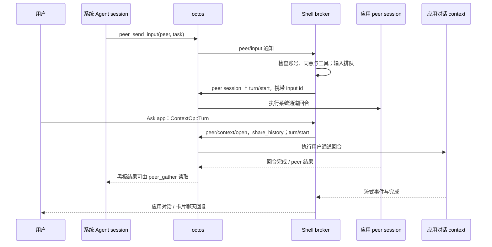
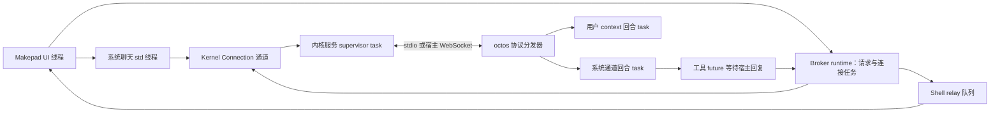

# 代码导读：从应用窗口到 Agent 回合

[English](architecture-walkthrough.md) | 简体中文

本文沿着一条消息，阅读应用窗口、Shell、Agent 内核与工具执行器之间的调用。如果你了解 Rust，但刚接触 OctoSense 或 Agent，可以从这里开始。[架构参考](architecture.zh-CN.md)介绍整体设计，本文跟踪实现中的调用与所有权。依赖版本以 [Cargo.toml](../Cargo.toml) 和 [native-runtime.lock.json](../native-runtime.lock.json) 为准。ADR 记录设计决策，尚待实现的部分列在第 11 节。

全文使用同一个问题：**“我今天有哪些日程？”** 桌面用户可以让系统助手委派给 Calendar，也可以直接通过 “Ask Calendar” 提问。两条路线都可能调用 `calendar.events`，但答案返回不同的对话。这是说明调用关系的例子：需要已配置的内核/提供方和用户同意，是否调用工具由模型决定。

## 1. 先分清这些名称

| 名称 | 本文中的含义 |
| --- | --- |
| OctoSense | 桌面/Home Shell、应用及其宿主服务。ROM 把 Home 与 Android 平台组件一起打包。 |
| Makepad | Rust UI、事件与渲染框架；事件循环更新控件树。 |
| Splash / Makepad Script | 隔离运行 `main.splash` 应用的脚本 VM 与 UI 语言；与 Octoscript L0 解析器分别实现。 |
| Octoscript / Octoscript-Makepad | L0 卡片语言、检查器、lowering 及 Makepad 集成，还提供应用运行时支持。`.card` 与 `main.splash` 有各自的加载路径。 |
| octos | Agent 内核，负责模型调用、回合、工具、对话记录、记忆与 peer 协作；这里的“内核”指 Agent 运行时。 |
| Agent | 读取消息、选择工具、消费结果并回答的模型工作单元。实际操作由工具执行器完成。 |
| Session / turn | Session 保存一次对话的身份与状态；turn 是响应一次输入的执行过程，可包含多次模型请求与工具调用。 |
| Peer / request context | Peer 是持久的协作 Agent 身份；context 是属于该 peer 的另一个 session，有独立记录、工作目录，以及 peer 记忆命名空间下的独立存储区域。 |
| Tool / host service | Tool 是模型可选择的操作；host service 是应用或执行器调用的 Rust 服务。分别检查它们的授权与入口。 |
| `AGENTS.md` / `AGENT.md` | 前者指导仓库贡献者；后者是应用包的 Agent 指令文件。App Hub 会准入后者，但 Shell 尚未把它加载进 peer 提示词。 |

相关仓库的导读：[Design Flow](https://github.com/OctoSense-org/OctoScript-App-Design-Flow/blob/218b25d2460d64f843932f67d419467618464fb9/docs/CODE-WALKTHROUGH.md)、[App Hub](https://github.com/OctoSense-org/OctoSense-App-Hub/blob/19bb52d402e80e89e085dea989615e3ec612d359/docs/CODE-WALKTHROUGH.md)、[Octoscript-Makepad](https://github.com/OctoSense-org/OctoScript-Makepad/blob/fb29b6b1cb6e16f38d99a8aef60431a9565dfd59/docs/architecture-walkthrough.md)、[octos](https://github.com/octos-org/octos/blob/82900bf149d3a53016c1c1492ffc075d2d4fb0ed/docs/octosense-integration-walkthrough.md)。这些链接指向已发布的文档版本；运行时版本仍由使用方的依赖锁定文件控制。

## 2. 从可执行入口读到应用宿主

先打开 [desktop/src/main.rs](../desktop/src/main.rs)、[phone/src/main.rs](../phone/src/main.rs)，再读 [crates/shell/src/lib.rs](../crates/shell/src/lib.rs)。Desktop 和 Home 链接同一个 Shell；Home 还提供 Settings 与平台集成。ROM 打包 Home 和特权 Android 服务，沿用同一套 Rust Agent 架构。

应用启动方式来自 [native-apps.json](../native-apps.json)、[apps.rs 的 AppRegistry](../crates/shell/src/apps.rs) 与各产品的 `system-apps.json`：

| 启动对象 | 代码路径 | 实际运行方式 |
| --- | --- | --- |
| 原生 Rust 模块，如 Reference、Rinx | [module_host.rs](../crates/shell/src/module_host.rs)：创建模块，注入作用域句柄、助手和存储接口 | Rust 代码与 UI 在 Shell 进程内运行；每实例有脚本 isolate，Rust 内存仍在同一进程。 |
| 原生进程应用，如受支持桌面上的 Terminal | [clients.rs](../crates/shell/src/clients.rs)、[hub.rs](../crates/shell/src/hub.rs)、[process-apps](../crates/process-apps/src/lib.rs) | 子进程经认证的 Makepad hub socket 交换帧、输入与 AI bus 消息。同一 socket 的 `octos_peer` 封装还支持助手连接（第 5 节）；当前随产品提供的进程应用未请求 `agent.octos` 服务。 |
| 隔离脚本应用 | `apps.rs` 进入 App Hub 的 `CARD_MODULE` | Card runner 准入应用包，创建受限的嵌套 Splash VM；capability 限制宿主服务和平台 API。每个包无需编译 Rust 可执行文件。 |
| Glance 卡片 | [glance.rs](../crates/shell/src/glance.rs)、[glance_chat.rs](../crates/shell/src/glance_chat.rs) | L0/L1 `source` 卡片经检查并结合宿主数据 lower 到运行时；Splash `script` 卡片在发布者策略下运行交互逻辑。`notify` 增加通知，UI 用 `glance::dismiss` 移除，应用用 `glance.withdraw` 撤回。聊天通向发布者的 peer。 |

各产品运行细节见[桌面](../desktop/README.zh-CN.md)、[Home](../phone/README.zh-CN.md)、[ROM](../rom/README.zh-CN.md)和[系统应用](../apps/README.zh-CN.md)。以下构建/启动配方 **unverified（未验证）**，平台前置条件见产品 README。在仓库根目录运行：

```sh
python3 tools/setup.py --hub /path/to/existing-clones
python3 tools/setup.py --check --cargo
cargo run --release -p octosense
# 可选的进程内 Rust 示例：
MAKEPAD_WM_TEST_APP=reference cargo run --release -p octosense --features app-reference -- --module reference
# 启用内核集成；二进制应来自 Cargo.toml 锁定的 octos 版本：
OCTOS_APP_CORE_BIN=/path/to/pinned/octos \
  cargo run --release -p octosense --features octos-core
```

真实对话还需要在 AI providers 的宿主确认面板配置提供方、模型与凭据。`OCTOS_APP_CORE_BIN` 指定一个文件；此启动器不会搜索 `PATH`。自动 UI 工作使用产品 README 中的隐藏窗口方式。

脚本应用使用 Design Flow 的 Python CLI `tools/octo`，它封装 App Hub 的 `card-host` 与 `hub`。在 Design Flow 检出目录运行 `tools/octo run /path/to/bundle`（启动配方未验证）。独立 runner 检查隔离 UI 与策略；Mail、Calendar、提供方与 peer 服务由 Shell 注册，因此集成测试需要 Shell。`hub check` 通过说明包满足准入约定。

## 3. 找到内核的所有者

依次阅读 [ai-host/src/lib.rs](../crates/ai-host/src/lib.rs)、[kernel/src/lib.rs](../crates/kernel/src/lib.rs)、[launch.rs](../crates/kernel/src/launch.rs)、[kernel.rs](../crates/kernel/src/kernel.rs) 和 [router.rs](../crates/kernel/src/router.rs)。

1. Shell 调用 `ai_host::start` 注册服务、配置内核来源。`model.complete` 是一次提供方请求；peer 与工具循环走另一条路径。
2. 首个获授权的使用方调用 `Core::connect`，得到逻辑 `Connection`；后续使用方共享同一内核代际。
3. `launch::resolve` 选择桌面子进程（`OCTOS_APP_CORE_BIN` 或显式程序）、Android 打包的 `liboctos.so` 可执行文件，或 OpenHarmony 内嵌服务。iOS 在这里没有内核。
4. `kernel::supervise` 持有运行中的进程/任务和帧循环。`Router` 在一条物理连接上关联使用方请求 ID 与 session 事件。
5. OUP 协议使用 JSON-RPC 与异步通知。普通模式经 stdio 传输逐行 JSON；启用 Talk to Octos 后改用宿主管理的回环 WebSocket，客户端共享该内核。
6. 提供方变化会重启代际，使用方需重连并重新绑定。Peer 记忆的生命周期长于 `Connection`。

ROM 的特权 Android 服务也称“agent”，负责通过 Android bridge 执行允许的平台操作；系统 LLM 对话运行在 octos 中。

## 4. 跟踪一条系统聊天消息

阅读 [system_chat/mod.rs](../crates/shell/src/system_chat/mod.rs)、[session.rs](../crates/shell/src/system_chat/session.rs)、[link.rs](../crates/shell/src/system_chat/link.rs) 和 [system_tools.rs](../crates/kernel/src/system_tools.rs)。

助手面板向工作线程发送 `Command`。`Driver` 打开 `_main:api:octosense#system`、读取历史并启动回合。收到的事件更新聊天模型，`SignalToUI` 唤醒 Makepad 事件循环绘制快照。

系统 Agent 是 `_main` profile 的一个 session。宿主通过 `session/tool_list/set` 限定其内核工具；`SYSTEM_AGENT_TOOLS` 包含 `peer_list`、`peer_send_input`、`peer_gather` 和 `peer_respond`。用户开启命令执行后，它通过 Shell 的 `terminal.run` 与审批 UI 执行命令；octos 内置 `shell` 不在其工具列表中。

[agents.rs](../crates/shell/src/agents.rs) 提供两个宿主工具：`agents.list` 查询应用 Agent 及可用状态；`agents.ask` 打开首次同意面板并等待可用的 peer slug（内核为该 peer 分配的标识符）。成功后系统 Agent 用 `peer_send_input` 提交任务；ask 调用只准备访问。首次同意由用户控制。

## 5. 一个应用 peer，两条对话通道

先读 [app-peers/src/contract.rs](../crates/app-peers/src/contract.rs)，再读较大的 [broker.rs](../crates/app-peers/src/broker.rs)：

- `OctosAppService`：应用拿到的作用域助手句柄。
- `OctosContext`：对话/请求句柄；`call(ContextOp, EventSink)` 启动操作；event sink 是接收进度、回复和完成事件（`ContextEvent`）的回调。
- `ContextSpec`：宿主认证的账号、实例与已授权服务名。
- `Broker`：将应用请求接到内核的 Shell 适配器，通过 `Arc<Inner>` 持有连接、peer、context 与在途请求。

原生模块通过 [hosted.rs](../crates/app-peers/src/hosted.rs) 和 [injection.rs](../crates/app-peers/src/injection.rs) 获得句柄；隔离应用通过 [contained.rs](../crates/ai-host/src/contained.rs) 访问相同 broker。脚本 manifest 声明助手服务或 `agent` 块，或包内包含 `tools.json`，就具备 Agent 资格；运行还需要内核、用户同意及适用的有效账号。

原生进程客户端使用 [peer_link](../crates/shell/src/peer_link/mod.rs)：`OctosPeer` 消息封装为 `octos_peer`，共用已认证的 hub socket。Shell 根据自己启动的客户端确定应用和实例，检查 `native-apps.json` 的确切 `agent.octos` 授权与同意状态，再把 session、history、turn、interrupt 操作交给该应用的 broker。

进程内模块也能打开同一客户端，由 `module_host` 认领暂存的连接；注入的 `OctosAppService` 是另一种适配器。

进程退出会取消在途工作并关闭请求 context，保留持久 peer；结果不确定的写入返回 `outcome_unknown`。

`card.os.news` 是 broker 的应用身份；内核的 peer slug 由 `peer/prepare` 返回，连同 peer session 和宿主凭据一起使用。Peer 按应用与账号区分：无账号应用使用 `device`，Mail 使用宿主报告的登录账号。`ensure_peer` 恢复记录的 peer，核对命名空间并注册工具，然后才运行回合。

在 Calendar 例子中，系统委派走系统通道，“Ask Calendar” 走用户通道。图中的**黑板（blackboard）**是内核保存 peer 工作与结果的共享记录，系统 Agent 用 `peer_gather` 读取它。



应用 peer session 是**系统通道**；`open_conversation` 创建带 `share_history` 的请求 context，作为**用户通道**。两者各有记录和回合状态，有限的另一通道近期文本以只读形式补充。多个用户界面可以创建同一 peer 的多个对话 context。`open_context` 用于无历史共享的客户端工作，例如 Rinx 小程序。每个请求 context 是独立的内核 session，归属于原来的应用 peer。

多个原生实例共享 peer 时，broker 的 `driver_of` / `take_over` 选择一个 broker 驱动系统通道输入队列，避免多个窗口重复执行 `peer/input`。用户 context 的工作可以与当前系统通道回合并发。

## 6. 用户在哪里提问，结果返回哪里

| 入口 | 实现与行为 |
| --- | --- |
| 系统助手面板，F8 | `system_chat` 使用系统 Agent 的 session；系统委派工作产生的问题也在这里显示。 |
| “Ask <app>”，Shift+F8 | [app_chat/mod.rs](../crates/shell/src/app_chat/mod.rs) 经 `agents::conversation` 订阅两条通道并合并历史；发送消息启动用户 context 回合。 |
| 原生应用自己的聊天 | 调用注入的 `OctosAppService::open_conversation`，由应用绘制事件。 |
| 脚本应用自己的聊天 | 经 `host.request` 调用确切获授权的 `octos.session.open`、`octos.session.history`、`octos.turn.start`、`octos.turn.interrupt`。随产品提供的系统应用 Agent 由 Shell 驱动，其脚本无需声明这些调用。 |
| 已发布卡片中的聊天 | `sys.chat` 经 [l0-chat](../crates/l0-chat/src/lib.rs) 与 [glance_chat.rs](../crates/shell/src/glance_chat.rs) 到达发布者的 Agent；宿主核对卡片归属。 |

随产品提供的 `<app>.notify`、`calendar.notify` 与 `calendar.agenda` 模板不含 `sys.chat`，通过 “Ask <app>” 与其 Agent 对话。`OCTOSENSE_GLANCE_DEMO=mail` 演示卡片带有聊天，但由 `glance_chat::HostResponder` 返回预设答案。上表的卡片聊天路线适用于声明了 `sys.chat` 的卡片。

手机触控导航尚无打开 Ask-app 面板的对应控件。应用自己的聊天与卡片聊天仍是独立入口。

不同入口的停止操作影响不同通道：

| 操作 | 中断范围 |
| --- | --- |
| Ask-app 面板的 Stop | 用户通道 |
| “Stop the system agent’s task” | 系统通道 |
| 底层 `ContextOp::Interrupt` | 可以中断两条通道 |

隐藏面板保留 context 和订阅；切换应用或撤销访问会关闭它们。

Shell 将聊天输入动作标为 `TurnTrigger::Person`。脚本调用 `octos.turn.start` 可传 `trigger` / `from`，但 `trigger: "person"` 被记录为 `AppSaysPerson`；脚本标签不能作为可信用户动作来匹配审批规则。

结构化工具结果回到发起它的应用回合。用户 context 的最终事件经其 event sink 回到对应界面；系统委派回合的结果写入 peer 黑板，由系统 Agent 获取并整理回答。

## 7. 从工具声明追到 Rust 执行器

阅读 [host_tools/script_apps.rs](../crates/shell/src/host_tools/script_apps.rs)、[relay.rs](../crates/shell/src/host_tools/relay.rs)、[app-peers/host_tools.rs](../crates/app-peers/src/host_tools.rs)。以 Calendar 的 `calendar.events` 为例：

1. [tools.json](../apps/calendar/bundle/tools.json) 声明 schema、风险、共享与实现方式；App Hub 校验应用包并计算摘要。
2. `script_apps::from_bundle` 加载准入的声明；`install` 加入 relay catalog，并安装 `HostServiceExecutor`。
3. 驱动 peer 的 broker 用 `peer/tools/register` 注册精确工具列表；模型才能请求这些工具。
4. octos 发出 `peer/tool/call`，broker 盖上真实调用方、账号与 context，交给 Shell 的 `ToolHost`。
5. `Relay::handle` 检查授权、同意、账号、输入 schema、大小与调用预算；需要审批的调用进入下述路由器。
6. 执行器以**工具所属应用**的身份调用 Calendar 宿主服务，读取 [Calendar 存储](../apps/calendar/host-service/src/lib.rs)。结果经回复队列返回，检查输出 schema/大小后，`ToolReply` 最多发送一次 `peer/tool/result`。
7. 模型消费 JSON 结果并继续回合，输出回答或请求另一个获授权工具。

`implemented_by: "host-service"` 需要存在可调用的服务；`implemented_by: "app"` 虽可作为元数据准入，但 Card runner 尚无脚本工具执行器，会返回 unavailable。声明文件和准入检查分别描述、验证接口；真正操作需要执行器代码。

[host_tools/mod.rs](../crates/shell/src/host_tools/mod.rs) 将 broker 线程的调用放入 inbox，由 UI 事件循环泵送并排队回复：

| 工具路线 | 执行边界 |
| --- | --- |
| 隔离应用，`implemented_by: "host-service"` | `HostServiceExecutor` 调用准入的所属应用 Rust 服务。 |
| 原生模块 | `OctosAppService::set_tool_executor` 注册的回调。 |
| 原生进程 | `peer_link` 经认证的 hub socket 发送工具请求；仍需注册与授权。 |
| 系统 `terminal.run` | 开启 Command execution 后，Shell 经 AI bus 在可见 Terminal 中输入已批准的命令。 |
| `files.list/read/search` | Unix 上的 Shell 执行器，范围为调用方允许访问的账号工作目录。 |
| `dev.run` | Shell 执行器，仅提供给开发者模式覆盖的 peer。 |
| Toolbox 工具 | 已注册的工具箱执行器/工作流，需要 `toolbox-peers` feature 与应用授权。 |

### 审批顺序

首次 Agent 同意、工具授权和逐次调用审批是三个独立检查。[approvals/router.rs](../crates/shell/src/approvals/router.rs) 按以下顺序处理审批请求：

1. 外部客户端的回合由该客户端处理；Shell 不回答其提示，也不使其过期。
2. 开发者模式自动批准覆盖应用的请求，包括 `auto_approvable: false` 和 `confirm: app`。
3. `confirm: app` 交给工具所属应用注册的确认面板，显示调用方；常设规则不会回答。若应用未在 `app_wait_s` 内注册面板，请求被拒绝。
4. `auto_approvable: false`、结果未知，以及被标为外部连接的调用，要求用户决定。
5. 用户预先设置的常设规则可决定符合条件的请求；由收到的内容触发的运行默认跳过，除非规则明确包含。
6. 其余请求显示 Shell 确认面板；同一系统任务的调用可以合并展示。

决定只交付一次，并记录到仅所有者可读写的审计日志；自动决定还产生通知。Shell 持有的宿主连接待答请求在 `OCTOSENSE_PROMPT_DEADLINE_SECS`（默认十分钟）后以拒绝过期。宿主工具审计保存参数摘要而非原始参数。模型的文本回复或 `peer_respond` 无法批准工具调用。

## 8. “访问应用数据”对应哪些存储

| 数据 | 应用 Agent 的访问路线 |
| --- | --- |
| 应用账号目录 | [app_storage](../crates/shell/src/app_storage/mod.rs) 与 `ToolHost::agent_workspace` 将新 peer 的 cwd 绑定到允许的目录；内核文件工具仍需授权。 |
| 请求 context 中读取账号文本文件 | [files.rs](../crates/shell/src/host_tools/files.rs) 的 `files.list/read/search`，当前限 Unix，要求同意和可用工作目录；限制大小，拒绝符号链接穿越，隐藏同级 context。SQLite 数据需另设服务接口。 |
| 用户对话的父账号目录 | 只有 `storage.agent_workspace: "account"` 允许时才请求 `read_parent`。父目录只读，写入留在 context 自己的目录；普通客户端 context 不自动获得此访问。 |
| 宿主服务数据库或远程账号 | 通过该服务实现的具体工具；工作目录权限不包含所有宿主数据库与远程凭据。 |
| Agent 记录与记忆 | octos session/context 和 `app/<broker-app-id>/acct-<tag>` 命名空间，与应用业务数据分别存放。 |
| 机密 | 宿主机密存储和确认面板；不进入 Agent 工作目录或脚本状态。 |

对 Calendar 问题，执行器通过 `calendar.events` 读取宿主目录中的 `calendar/events.json`。模型收到服务结果，无需自行打开文件。其他应用的工具范围更窄：

| 应用 | 当前数据/工具边界 |
| --- | --- |
| News | `news.list`、`news.read`、`news.notify` |
| Mail | **只有 `mail.notify`**；UI 的读信/发信 API 尚未开放为 Agent 工具 |
| Photos、Maps、Camera、YouTube | 仅各自的 `<app>.notify`，经 [glance_notice.rs](../crates/shell/src/glance_notice.rs) 发布共享通知卡片 |
| AI providers | 没有应用 Agent |

旧 AppCard 个人数据导入器不会自动同步当前 Mail 存储。

账号目录名使用 SHA-256 派生 tag，peer 记忆名称使用 broker 的 FNV 派生 tag；它们是不同的兼容标识。退出登录会暂停访问并保留数据；移除账号/卸载还会请求 `peer/purge`，忙碌时重试。恢复 peer 时，其已保存的工作目录不能悄悄改变。

## 9. 跨应用工作与求助

**委派任务：**系统 Agent 用 `peer_send_input` 请求现有应用 peer 工作，再获取结果。Shell 驱动该应用回合，peer 身份可以跨进程生命周期保留。

**直接调用另一应用的 API 工具：**这条路线直接调用所属应用的执行器，无需经过它的模型。例如，另一应用要调用可共享的 Calendar 工具，必须满足以下条件：

1. 工具已有声明、`shareable: true` 和实际执行器。
2. 调用方有授权。脚本 manifest 在 `agent.tools` 中请求带点的名称，原生应用使用审核过的授权；`may_call` 检查这些规则，显式开发者模式例外另行处理。
3. 对脚本包，App Hub 准入（宿主接受应用包的检查）通过 `HostLimits.offered_tools` 允许该名称。
4. `Catalog::owner_of` 能找到所属应用，relay 才能调用其执行器。

接收方应用的数据访问由执行器控制。当前 owner 解析覆盖原生命名空间、toolbox 和 `os.<namespace>`，尚不支持发现任意已安装商店应用。默认准入未提供 `mail.send` 等任意名称，Mail 当前也未实现这个 Agent 工具；仅有 relay 路线不足以使它可调用。

**提问或使用系统设施：**应用 Agent 可调用获授权的 `ask_user_question`。[questions/mod.rs](../crates/shell/src/questions/mod.rs) 按回合来源路由：系统委派工作在系统聊天中提问，用户/应用回合在应用对话中提问，由用户在 Shell 界面回答。系统设施以明确授权的工具提供，例如 [toolbox](../crates/toolbox/README.md) 工作流。通用的应用到系统 Agent 对话 RPC 尚未实现。`peer_respond` 处理 peer 协作；审批消息使用单独的宿主回答句柄。

## 10. 映射到 Rust 的实际执行模型

Peer 是持久身份与状态。**Tokio task** 是由 runtime 工作线程调度的异步计算；等待 I/O 时，工作线程可以运行其他就绪任务。一个回合会用到多个 task，peer 在它们结束后仍存在。

沿着直接发送给 “Ask Calendar” 的问题，依次跨过这些边界：

1. Makepad UI 将 context 请求交给 Calendar 的 broker。
2. Broker 的 runtime 经共享内核 `Connection` 发送 `turn/start`，由内核服务 supervisor 送入传输连接。
3. octos spawn 回合编排 task；它先在启动屏障等待活跃回合注册成功，再开始 Agent 处理。
4. 若模型调用 `calendar.events`，工具 future 等待 broker 与 Shell relay 将请求交给 Calendar 宿主服务。返回的数据让模型继续；回复事件经用户 context 返回并唤醒 UI。

这些是调度边界；每个 peer 并不各自创建线程或进程。下表列出各部分的所有者：

| 层 | 实际执行模型 | 源码 |
| --- | --- | --- |
| Makepad Shell | UI 事件循环，绘制、事件分发、宿主工具 relay 泵送 | `module_host.rs`、`host_tools/mod.rs` |
| 系统聊天 | 普通 `std::thread`，交换命令与快照；`link::poll_for` 用 waker/unpark 轮询内核接收 | `system_chat/mod.rs`、`link.rs` |
| Shell 内核服务 | 惰性创建 Tokio runtime：**2 个工作线程，8 MiB 栈**；每代一个 supervisor task 持有传输与进程生命周期，另有 I/O task | `kernel/src/lib.rs::Inner::runtime`、`kernel.rs::supervise` |
| 应用 broker | **每次 `Broker::new` 创建 1 个工作线程的 runtime**，运行连接泵送、请求 future、重试和截止任务；多个 broker 可共享一个 peer | `app-peers/src/broker.rs` |
| OpenHarmony 内嵌内核 | 在宿主 runtime 上 spawn `serve_io`，经 `tokio::io::duplex` 通信 | `kernel.rs::start` |
| octos OUP 回合 | 已 spawn 的编排任务先在 `oneshot` 启动屏障等待活跃回合准入；成功后 `run_standalone_turn` 再 spawn Agent 处理与辅助任务 | 锁定 octos 的 `crates/octos-cli/src/api/ui_protocol_transport.rs` |
| octos 传输出口 | WebSocket 使用异步 writer task；内嵌/stdio 使用有界同步队列和普通 writer 线程 | 同一 octos 文件 |
| 宿主服务/文件执行器 | 按服务使用 UI 泵送、回调/回复队列或处理阻塞操作的工作线程 | `host_tools/files.rs`、App Hub `services.rs`、各应用服务 |



`mpsc` 是多发送方邮箱，`oneshot` 交付一次关联回复，`watch` 保存最新的生命周期/就绪状态。Broker 的请求 ID 对应 `oneshot` sender；连接循环用 `tokio::select!` 同时处理进出消息。内核 supervisor 选择控制消息、内核输出与进程退出。`Arc` 共享所有权，`Weak` 避免延长已关闭 broker/context 的生命周期，代际/epoch 检查拒绝旧账号或连接的迟到回复。

Broker 同步 `bind` / `host_request` 会等待通道回复，不应在绘制回调中调用。不同 session 的异步模型 I/O 可重叠，同步文件工作仍走已有的工作线程边界。每应用/账号一个 peer 是身份规则；task 和线程数量由上表的 runtime 与活跃操作决定。

## 11. 测试与尚待实现的部分

[Broker 测试](../crates/app-peers/tests/broker.rs)提供可执行协议示例：`a_persons_message_runs_while_the_system_agents_input_runs`、`a_lane_stop_leaves_the_other_lane_running`、`a_kernel_without_shared_history_is_refused_for_the_conversation`、`removing_an_account_purges_its_recorded_peer_and_drops_the_record`。[Shell relay 场景测试](../crates/shell/src/host_tools/scenario_tests.rs)覆盖调用方、工具与审批边界；修改对话或执行路径时从这些测试开始。

在仓库根目录运行单元测试与脚本化连接器测试：

```sh
cargo test --locked -p octosense-kernel -p octosense-app-peers \
  --features octosense-app-peers/octos-core,octosense-app-peers/ws
```

可选真实内核测试在缺少二进制环境变量时提前返回；将结果当作集成证据前，阅读 [app-peers 测试说明](../crates/app-peers/README.md)。可见 UI、真实提供方对话和设备行为需要分别运行。

尚待实现：应用包 `AGENT.md` 提示词加载、自动 triggers/skills、脚本实现的 Agent 工具分发，以及通用应用到系统 Agent 对话 RPC。围绕这些路径设计流程前，沿声明追到实际执行器。
