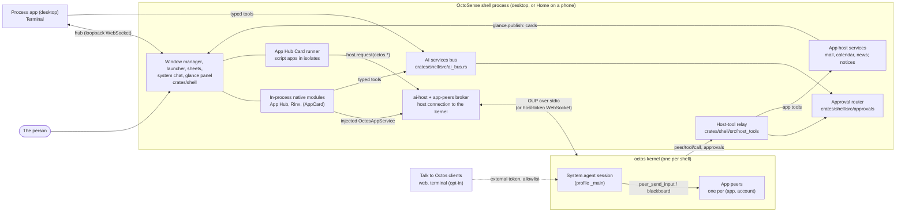
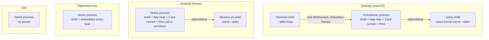
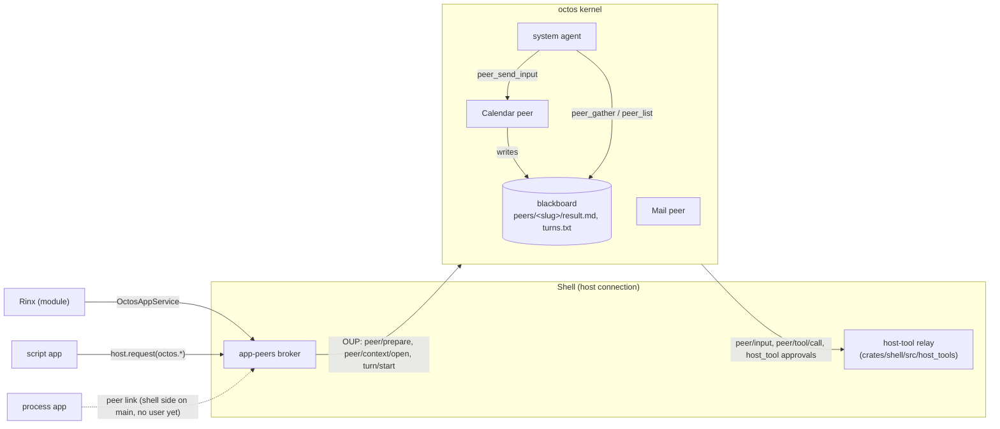
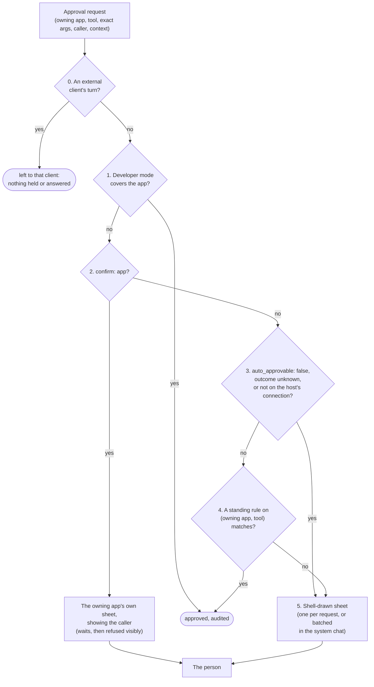

# OctoSense architecture

English | [简体中文](architecture.zh-CN.md)

How OctoSense fits together: processes, agents, tools, approvals, storage and trust boundaries. Follow the [code walkthrough](architecture-walkthrough.md) for calls and ownership. Dependency versions come from [Cargo.toml](../Cargo.toml) and [native-runtime.lock.json](../native-runtime.lock.json); the dated design notes below record earlier decisions.

Every statement carries its status:

- **On main**: merged, read in this repository's code (a path is given).
- **In progress**: an open pull request, linked.
- **Planned**: decided in an ADR (linked, with its plan step) and not built yet.

The decisions behind it are [ADR 0001](adr/0001-one-octosense-repository.md) (one repository), [ADR 0002](adr/0002-event-driven-app-agents.md) (app agents, Proposed, as amended by 0004), [ADR 0003](adr/0003-shared-octos-client-access.md) (Talk to Octos) and [ADR 0004](adr/0004-native-apps-hosting-and-peers.md) (native apps, app agents, cross-app work and approvals, Accepted, and Implemented on 2026-09-29 apart from its follow-ups). The assistant's services, what each kind of app can call today and how to run them locally are in [ai-services.md](ai-services.md); this page does not repeat them.

## Contents

- [The big picture](#the-big-picture)
- [1. Processes per platform](#1-processes-per-platform)
- [2. Agents](#2-agents)
- [3. Communication](#3-communication)
- [4. Tools and grants](#4-tools-and-grants)
- [5. Approvals](#5-approvals)
- [6. Storage and secrets](#6-storage-and-secrets)
- [7. Trust boundaries and isolation](#7-trust-boundaries-and-isolation)
- [8. Worked example: emailing a meeting invite](#8-worked-example-emailing-a-meeting-invite)
- [Where the code and the ADRs disagree](#where-the-code-and-the-adrs-disagree)
- [Source map](#source-map)

## The big picture


*Illustrations (generated). Solid lines are on main; dashed ones are planned or in progress (the peer link for process apps has its shell side on main since [#130](https://github.com/OctoSense-org/OctoSense/pull/130) but no process app uses it yet; `peer/input` and host tools are on main since the octos 665209e5 pin, octos#2567). Where a picture and the text below differ, the text is authoritative: for example, `peer_send_input` puts the message in the peer's inbox, and the peer takes it as its next turn.*



```
+--------------------------- OctoSense shell process ----------------------------+
|  window manager / launcher / sheets        approval router      AI services bus |
|  in-process modules: App Hub (+ Card runner with script apps), Rinx, (AppCard)  |
|  host-tool relay -> app host services (mail, calendar, news, notices)           |
|  ai-host + app-peers broker  == host connection ==+                             |
+---------------------------------------------------|-----------------------------+
        ^ hub: loopback WebSocket                   | OUP: stdio (default) or
        |                                           | WebSocket with the host token
+-------+---------+                  +--------------v--------------------------+
| process apps    |                  | octos kernel (child; in process on OHOS)|
| Terminal, ...   |                  |   system agent session                  |
+-----------------+                  |   app peers: one per (app, account)     |
                                     |   turns and tool dispatch               |
   Talk to Octos clients  ---------> +-----------------------------------------+
   (external token, allowlist, opt-in)
```

## 1. Processes per platform

### The shell

One Makepad process per device: the desktop (`desktop/`, package `octosense`) or Home on a phone (`phone/`, package `octosense-home`), both linking the one shell crate `crates/shell` ([ADR 0001](adr/0001-one-octosense-repository.md)). The shell owns the window manager, the launcher, the host sheets, the approval router, app storage and the kernel's host connection.

### The octos kernel

Each shell runs at most one [octos](https://github.com/octos-org/octos) kernel, a shell service in [`crates/kernel`](../crates/kernel/README.md) (package `octosense-kernel`), reached through [`crates/ai-host`](../crates/ai-host/README.md). **On main.** How it runs (`crates/kernel/src/launch.rs`, `launch::resolve`):

| Platform | Kernel | How it is started |
| --- | --- | --- |
| Desktop (macOS; Windows and Linux untested) | a child process: the embedder's `Options::program`, else the `octos` binary named by `OCTOS_APP_CORE_BIN`, else the packaged `octos-kernel` beside the shell (run only when its receipt names the pinned octos revision) | `serve --stdio --data-dir <core dir>`; without a binary there is no kernel (no `PATH` or working-directory lookup). |
| Android (Home) | a child process: the APK's bundled `liboctos.so`, built by [`tools/kernel-artifact.py`](../tools/kernel-artifact.py) at the pinned octos revision | `serve --stdio`, found next to `libmakepad.so` in the app's native library directory |
| OpenHarmony | in process: `octos_cli::embedded::serve_io` as a task over an in-memory duplex (a HAP may not exec) | same protocol, no child |
| iOS | none | the providers are saved; no app gets an assistant |

Its lifecycle (`crates/kernel/src/lib.rs`, `kernel.rs`):

- **Lazy start, shared.** Nothing runs until the first consumer calls `connect()`; later consumers attach to the same generation. A new generation waits until the previous one has exited, so octos's single-writer lock on its data directory is released first.
- **Restart on provider change.** The `llm` host service rewrites the profile and calls `restart()`: every connection ends with `CloseReason::Restarted` and the consumers reconnect to a fresh kernel.
- **Idle stop.** With Talk to Octos off, the kernel stops when the last connection closes. With it on, it keeps running until the person turns it off or the shell exits.
- **Exit with the shell.** The shell holds the child's stdin for its whole life; when the shell exits, crashes or is killed, the kernel reads EOF and stops. In `--host-managed` mode octos also asks for SIGTERM on parent death on Linux and Android (`bind_to_parent()` in octos `crates/octos-cli/src/api/host_managed.rs`); the child is also spawned `kill_on_drop`.
- **A crash** ends every connection with `CloseReason::Exited` (the last stderr lines); nothing restarts it by itself, and the next `connect()` starts a new generation. See [what a kernel crash means](#what-a-kernel-crash-means).

### Native apps: in process or their own process

Native apps are first-party Rust crates declared only in [`native-apps.json`](../native-apps.json); `tools/native_apps.py` generates `crates/shell/src/native_apps.rs` and the Cargo blocks from it and checks them in CI (ADR 0004 §1, plan step 1). **On main.** The manifest today:

| App | Hosting on macOS / Windows | Linux | Android, iOS, OpenHarmony | Desktop / phone | Assistant |
| --- | --- | --- | --- | --- | --- |
| App Hub (`apphub`: the store and the Card runner) | in process | in process | in process | default / default | – |
| Rinx | in process | in process | in process | default / default | granted the four `octos.*` services |
| Terminal | **own process** | own process with a Vulkan build and a Wayland session, else in process | in process | default / off | – (its `run` tool is `confirm: host`, `auto_approvable: false`) |
| Sheets, Reference | in process | in process | in process | opt-in / `mobile-apps` | – |
| AppCard | in process | in process | in process | opt-in / opt-in | its own kernel connection |

So **only the Terminal is a process app**, and only on the desktop; `tools/native_apps.py` refuses plain `process` on Linux (`process-if-vulkan` only), so Linux without Vulkan and Wayland runs every app in process. App Hub stays in process because it hosts the Card runner every script app runs in. Rinx stays in process: ADR 0004 §2 moves it, by a reviewed change to its `hosting`, once the peer link and the process sandboxes exist. The peer link's shell side and the macOS and Linux sandboxes are on main now, but Rinx at its pin reaches its agent through the injected service ([section 3](#an-app-and-its-own-agent)), not the peer link, and its `hosting` is still `module` everywhere.

How the shell decides at run time (`crates/shell/src/apps.rs`, `AppRegistry::hosting`): if the target cannot run processes (`host::processes_available()` is false on wasm and native mobile), every app is a module; App Hub and Settings are always modules; otherwise a native app follows its manifest entry, and runs as a process only when a process form exists (a checkout to build it from, or a sibling binary); without one it falls back to in-process (`manifest_default`). Desktop release packages are not on main yet ([#257](https://github.com/OctoSense-org/OctoSense/pull/257), in progress, which replaces the closed #94). A per-app override (`~/.makepad/wm/apps.splash`, `--module <id>`) switches an app between module and process.

**Process hosting** is Makepad's window-manager hosting (`crates/shell/src/clients.rs`, `hub.rs`):

- The shell starts the app as a child with `--stdin-loop`, in its own process group, with `STUDIO_HOST=http://127.0.0.1:<hub port>` and its client id. In a checkout it first builds the app's binary from the OctoSense workspace, a release build held to its `Cargo.lock` and run outside any sandbox, then starts that binary itself under the app's sandbox, never through `cargo run` (`clients::launch_plan`, [#225](https://github.com/OctoSense-org/OctoSense/pull/225)); an installed shell starts the sibling binary.
- The child connects back to the shell's **hub**, an HTTP/WebSocket server the shell binds on the first free loopback port in 8765–8784 (`WmHub::start`), and speaks Makepad's studio protocol (`AppToStudio` / `StudioToApp`). The hub admits a socket only with the per-launch secret the shell wrote to that child's stdin, once per launch, and refuses browser origins ([ADR 0004 §5](adr/0004-native-apps-hosting-and-peers.md#5-the-peer-link-for-process-hosted-native-apps)).
- Frames reach the compositor without copies where the OS allows (implemented in Makepad `platform/src/os`): IOSurface on macOS, D3D11 shared handles on Windows, DMA_BUF on Linux with Vulkan and Wayland; a Linux OpenGL build reads every frame back through the CPU.
- A process app that dies takes only itself down: an unexpected death of a window the person has keeps its tile, closed with a Restart, and posts "App stopped" ([#130](https://github.com/OctoSense-org/OctoSense/pull/130); `ClientSlot::stops_in_place` in `clients.rs`). A warm instance, the AI pane, a preview or a client being closed goes away as before.

**In-process hosting** (`crates/shell/src/module_host.rs`): each instance of a module gets its own splash isolate (`alloc_splash_vm_with_network`) and storage namespace. The isolate separates the script heap only; the module's Rust code shares the shell's memory. Every call into a module runs under `catch_unwind` (`contain`, `contain_outside`): a panic marks that module failed, answers its in-flight tool calls "outcome unknown", closes its extra windows and shows a Restart face, while the shell keeps running ([#114](https://github.com/OctoSense-org/OctoSense/pull/114), ADR 0004 step 9). **On main.**

### Script apps

Script apps (the system apps News, Photos, Maps, Mail, AI providers and YouTube, plus Calendar on the desktop and Camera on phones, from `desktop/system-apps.json` and `phone/system-apps.json`, plus store apps) are OctoScript bundles. They all run in process, inside App Hub's **Card runner** (`CARD_MODULE` of `octosense-app-hub-app`): one nested isolate per app instance with `mod.res` and `mod.run` stripped, a jail and a quota. An app reaches the shell only through `host.request("<family>.<method>", …)` for the families its manifest was granted. A script bug fails inside its isolate. **On main.**



## 2. Agents

**One kernel per shell; agents are sessions, not processes.** Inside the one kernel, agent turns run as Tokio tasks, while peers and sessions are durable state. A peer can have multiple context sessions and a turn can create several tasks; there is no one-agent/one-task mapping. See the [thread and task table](architecture-walkthrough.md#10-map-the-architecture-to-rust-execution). Tools such as file edits run in the kernel; octos's command tools would run as short child processes in the session's workspace, but OctoSense offers them to no agent ([section 4](#4-tools-and-grants)).

| Agent | What it is | Status |
| --- | --- | --- |
| **The system agent** | the session `_main:api:octosense#system` on the `_main` profile (`SYSTEM_SESSION` in `crates/kernel/src/network.rs`). It owns every app peer and supervises them. The person reaches it in the shell's **system chat** (`crates/shell/src/system_chat/`, [#132](https://github.com/OctoSense-org/OctoSense/pull/132): Setup → Assistant → Assistant chat, F8, the dock's Assistant icon or the phone home's Assistant tile; on a desktop a medium pane at the left that the person can move and resize, full screen on a phone), or through a paired Talk to Octos client | On main |
| **An app agent** | one host-owned octos **peer** per (app, account), owned by the system agent (octos UPCR-2026-034, Rinx [ADR 0007](https://github.com/hagency-org/Rinx/blob/main/docs/adr/0007-host-owned-octos-app-peers.md)). The person talks to it in the app's own UI, or in the shell's **"Ask <app>" panel** (`crates/shell/src/app_chat/`: the bar's "Ask <app>", Shift+F8; beside the system chat on a desktop, a full-screen sheet on a phone), which shows both lanes with their speakers and a composer: Send while the person's lane is idle (even while the system agent works), Stop for the person's own turn, and "Stop the system agent's task" on the system agent's running row | On main for Rinx (native) and every script app with an agent (today the system apps News, Mail, Photos, Maps, YouTube, Calendar on the desktop and Camera on phones), after first-use consent; see below |

Each app peer has, separately from every other:

- a **workspace**: the folder the peer's session is bound to. A peer created since the octos 665209e5 pin gets its account folder (`apps/<app id>/accounts/<account hash>/`, ADR 0004 §11) as `peer/prepare`'s `cwd` (`host_tools::agent_workspace`), recorded beside its host token so a resume names the same folder; a peer created before keeps the kernel-provisioned one, since octos refuses to resume a peer under another workspace (see [the disagreements](#where-the-code-and-the-adrs-disagree));
- a **memory namespace** `app/<app>/acct-<hash>` (`app_namespace()` in `crates/app-peers/src/broker.rs`); a kernel that does not return it is refused;
- its own **transcript** and **model** lane (the host sets the model with `peer/prepare` / `peer/model/set`);
- its own **tool list**: exactly the kernel tools its manifest grants (`generic_tools`, never octos's `shell`) plus the tools the shell registers (octos [#2567](https://github.com/octos-org/octos/pull/2567), UPCR-2026-035): after every `peer/prepare` and reconnect the broker registers, on the connection that drives the peer's turns, the app's declared tools and the other apps' shareable tools granted to it, each marked with its owning app (`crates/shell/src/host_tools/`), with `generic_tools` set to exactly the kernel tools the app's manifest declares and the person granted (a native app's `native-apps.json` `agent.generic_tools`, a script app's plain names in its manifest's `agent.tools`; an app that names none keeps none). The Terminal declares `terminal.run`, `terminal.read_screen` and `terminal.read_scrollback`. The system apps declare theirs in `apps/<app>/bundle/tools.json`, each run on a host service: News `news.list`, `news.read` and `news.notify` (the `news` service), Mail `mail.notify` (the `mail` service), Calendar `calendar.events`, `calendar.add_event`, `calendar.remove_event`, `calendar.notify` and `calendar.agenda` (the `calendar` service), and Photos, Maps, YouTube and Camera `<app>.notify` (the shell's notice service, `crates/shell/src/glance_notice.rs`, since they have no service of their own). A peer that cannot register runs no turn;
- **request contexts** (`peer/context/open`): one per client instance (a Rinx mini app), each with its own transcript, folder `contexts/<id>/` inside the peer's workspace and child memory namespace. Such a client's context cannot read the files beside it directly; it reads its account's data through the shell's host read tools `files.list`, `files.read` and `files.search` (ADR 0004 §11, `crates/shell/src/host_tools/files.rs`), which never show another context's folder. Besides those per-client contexts (`OctosAppService::open_context`: Rinx's mini apps, a process app's `octos.session.open` with a `client`), each app conversation is one more request context: the person's own conversation with an app agent, from the shell's "Ask <app>" panel, the app's UI or a card's in-card chat, runs in the person's lane, a context opened with `share_history` that runs in parallel with the peer's own session (the system agent's lane) and shows each lane the other's recent turns (ADR 0004 §6, decided 2026-09-29; below). That conversation context is opened with octos's `read_parent` where the manifest says the agent works in the account folder (`storage.agent_workspace: "account"`, octos#2647): it reads the account folder read-only, never another context's folder, and writes only its own.

Who gets a peer today (`crates/ai-host/src/lib.rs`, `Policy::shipped()`; `crates/app-peers/src/hosted.rs`, `effective_services` = declared ∩ supported ∩ policy):

- **Rinx**, the only native app granted the assistant (the four `octos.*` services, from its `native-apps.json` `agent.octos`, generated into `crates/ai-host/src/native_agents.rs`), after first-use consent.
- **Script apps with an agent**: a manifest that declares `octos.*` or an `agent` block, or a bundle that ships `tools.json` (`crates/shell/src/apps.rs`, `agent_apps`). Today that is every system app except AI providers: News, Mail, Photos, Maps, YouTube, Calendar on the desktop and Camera on phones, each with an `agent` block and `tools.json` and none declaring `octos.*`. One peer per app/account with broker identity `card.<app id>`, using `device` for accountless apps or the host-reported active account (Mail requires sign-in) (`crates/ai-host/src/contained.rs`, [#106](https://github.com/OctoSense-org/OctoSense/pull/106)), once the person allowed it at first use (the shipped gate; `OCTOSENSE_CONTAINED_APPS=1` asks nobody, `0` turns it off). The shell prepares it as soon as it is allowed, and at startup (`crates/shell/src/agents.rs`, `contained::prepare`), so the system agent's `peer_list` shows it even when the app never calls `octos`; the app's own `host.request("octos.*")` stays limited to what its manifest declares.
- **AppCard** (opt-in) takes its own kernel connection and sessions, not a peer.
- **Process apps** whose `native-apps.json` entry grants `agent.octos` services reach their peer through the **peer link** (`crates/shell/src/peer_link/`, [#130](https://github.com/OctoSense-org/OctoSense/pull/130)), after first-use consent. None does yet: the Terminal, the only process app, grants none.

Peers are kept, not thrown away: the broker resumes a peer with its host token (stored under `<core dir>/../app-peers`, 0600), and never calls `peer_close` on sign-out, because octos cannot resume a closed peer or create a replacement for its (app, account) (ADR 0004 §11).

### What a kernel crash means

Every agent is in the one kernel, so a kernel crash stops **all** of them at once: the system agent and every app peer, mid-turn. The shell and its apps keep running; `availability()` reports the assistant failed, apps' ordinary UI keeps working, and in-flight turns end with the connection. Nothing is lost that octos had persisted: sessions, blackboards, memory namespaces and peer bindings are in the kernel's data directory, so the next `connect()` starts a new generation and consumers reopen and resume their peers and contexts with the stored host tokens. A tool call whose outcome is unknown is never retried without the person (ADR 0004 §7).

## 3. Communication



### OUP between the kernel and its clients

The kernel speaks the **octos UI protocol** (OUP; `octos-ui/v1alpha1`, JSON-RPC 2.0 frames; octos [`api/OCTOS_UI_PROTOCOL_V1_SPEC_2026-04-24.md`](https://github.com/octos-org/octos/blob/main/api/OCTOS_UI_PROTOCOL_V1_SPEC_2026-04-24.md)). **On main.**

- **Default: stdio.** The shell is the only client, over the child's stdin and stdout (newline-delimited JSON; octos UPCR-2026-016). Inside the shell, `crates/kernel/src/router.rs` multiplexes one frame stream between native consumers: each request gets a kernel-unique id and its reply goes back to that consumer only; notifications go to the consumers that named the session.
- **Talk to Octos: host-managed WebSocket** ([ADR 0003](adr/0003-shared-octos-client-access.md), [#98](https://github.com/OctoSense-org/OctoSense/pull/98); octos [`docs/HOST_MANAGED_SERVE.md`](https://github.com/octos-org/octos/blob/main/docs/HOST_MANAGED_SERVE.md), UPCR-2026-036). When the person turns it on in AI providers (`<core dir>/external-access.json`), the shell restarts the kernel as `octos serve --host-managed --host 127.0.0.1`, on a listener the shell binds once and passes down (`--listen-fd` on Unix). It writes two tokens as the first two lines of the kernel's stdin, never in the environment:

  | Token | Holder | May |
  | --- | --- | --- |
  | **Host token** | the shell process only; minted per shell lifetime, never logged | everything (admin); native consumers connect with it to `/api/ui-protocol/ws` |
  | **External token** | a paired web client (8-character code on the trusted sheet, 5 minutes, one claim) or a terminal client of this user (the 0600 `client-connection.json`) | only `/api/ui-protocol/ws`, as `_main`, and there only an allowlist of methods: open and read the system conversation, start, steer or interrupt its **own** turns, answer its own turns' approvals (once-only) and questions |

  External clients may not: call any `peer/*` method or name an app peer's session (`peer-…`, `peerctx-…`); set `cwd`, `topic` or `sandbox`; touch providers, keys, models, skills, snapshots or `server/shutdown`; use REST or admin routes. Their turns get a fixed tool set (file tools, `web_search`, `web_fetch`, memory reads, `ask_user_question`, media viewing; mirrored in `EXTERNAL_TURN_TOOLS` in `crates/kernel/src/system_tools.rs`): no shell, no peer tools, no host-routed tools (octos [#2601](https://github.com/octos-org/octos/pull/2601)). Not on OpenHarmony or iOS; Android unverified.

### System agent and app agents, inside the kernel

octos's peer mechanism, depth 1 (peers cannot create, steer or close peers). **On main** in octos; the tools are in octos `crates/octos-agent/src/tools/`.

- **System agent → app agent.** `peer_send_input` (originator only, at most 64 KB) delivers text as the peer's next user turn, through the peer's inbox (a durable queue in serve, drained every few seconds, at least once).
- **Which apps' agents the system agent can reach.** `peer_list` lists the prepared peers: the shell prepares every allowed app's agent. For the ones it cannot list (not yet allowed, or off) the shell tells it: a note with the system chat's turn whenever the apps' agents changed, and the host tools `agents.list` and `agents.ask` on the system session (`crates/shell/src/agents.rs`). `agents.ask` shows the first-use sheet, which only the person answers, and waits for them: it is declared `risk: act`, `outward: true`, `confirm: "app"`, so the kernel holds the call as it holds an approval, and the system chat answers it once the person has answered and the app's peer is ready, with the peer's slug, so the system agent goes on with the request in the same turn (after 10 min without an answer it says the person has not answered yet, and the sheet stays up; [#274](https://github.com/OctoSense-org/OctoSense/pull/274)).
- **App agent → system agent: the blackboard.** Each peer turn writes `peers/<slug>/result.md` (plus `result-<n>.md`) and a line in `turns.txt`; the system agent reads them with `peer_gather` and `peer_list` (`awaiting_input` shows a peer waiting on a question). It is the only cross-peer channel.
- **Questions.** A peer asks with `ask_user_question`; the system agent answers with `peer_respond`. `peer_respond` never answers approvals (octos refuses). octos keeps `ask_user_question` on host-driven turns (`generic_tools` is an exact list the host sets, and omitted keeps the whole roster). ADR 0004 §6 (decided 2026-09-29) has the shell route each question to the right conversation: the app's own conversation, or the system chat for system-agent turns, `peer/input` turns included; there is no `host.ask`. **On main**: the system chat answers the system agent's own questions on its session; the broker hands an app peer's `user_question/requested` (its own session, a request context, a `peer/input` turn) to the shell's request model (`crates/shell/src/questions/`) with the turn's origin (reported by octos once it carries it, else derived: the turns the broker started for `peer/input` are the system agent's), and the model routes it by that origin: a person's or the app's turn to the app's conversation (its "Ask <app>" panel while that is open, otherwise the question card in the shell's approvals overlay, `crates/shell/src/approvals/view.rs`: one surface at a time, [#279](https://github.com/OctoSense-org/OctoSense/pull/279)), a system-agent turn to the system chat. Only the person answers, on a shell surface (`user_question/respond` on the broker's link); the app's context hears `user_question/handled_by_host`, and the broker refuses an app's attempt to answer an id the host holds. A question closes when its turn ends.
- **Two parallel lanes per app agent, sharing history read-only.** ADR 0004 §6 (decided 2026-09-29, replacing the same day's single queued conversation of [#166](https://github.com/OctoSense-org/OctoSense/pull/166) and octos [#2626](https://github.com/octos-org/octos/pull/2626)): the system agent talks to the peer's own session (`peer/input`), and the person (the app's UI, its cards, a process app without a `client`) in a request context the broker opens with `share_history` (octos [#2636](https://github.com/octos-org/octos/pull/2636), UPCR-2026-034), a new context id per handle (its history also holds the person's rows of the earlier handles of the same account and instance). The two run in parallel: a person's message waits only for its own context's previous turn, and `peer/input` keeps its own queue on the peer's session. At each turn's start the kernel shows the model the other lane's last user/assistant text rows (20 by default, at most 50, within 16 KiB; tool rows dropped) as a read-only block that is never written into the reader's transcript; there is no shared transcript. Every turn keeps its `origin` (`person`, `system_agent`, `app`; the kernel's `[from …]` marker; the host cannot relabel a system-agent turn), and a person's turn leaves a round on the blackboard (`origin: person`, `context: <id>`) that the system agent reads with `peer_gather` and that fires no fleet synthesis on its own. `OctosAppService::open_conversation` is the person's lane; `open_context(client)` stays a plain request context (Rinx's mini apps). The app's follower (`OctosContext::subscribe`; `conversation` frames on the peer link) gets both lanes' events, each with `lane` and `speaker`; `octos.session.history` is both transcripts merged by `persisted_at`, each row with `lane` and, for a marked user message, `speaker` and `display_text`. Accepted hazards: file edits are not locked across lanes (each lane edits its own folder, a context's is `contexts/<id>`), the unknown-outcome marks are shared, and parallel turns can overshoot the peer's token budget slightly.

### The host-owned path: `peer/input`

For a host-owned peer, a plain `peer_send_input` runs as a kernel continuation without the app's tools or memory. ADR 0004 §6 fixes that: octos delivers the system agent's input to the host's driving connection as **`peer/input {peer, session_id, input_id, turn_id, text}`**, and the shell starts the turn itself (`turn/start` with the kernel's `turn_id`), so it runs with the app's tools, memory and context and its approvals surface in the app. If no host connection holds the peer, octos tells the system agent the app is not connected. **On main**: octos sends it since the 665209e5 pin (octos [#2567](https://github.com/octos-org/octos/pull/2567)); the broker (`crates/app-peers/src/broker.rs`) starts the turn on its own link with the kernel's `turn_id`, drops a repeated `input_id`, and starts nothing for a signed-out account or an app the person has not allowed (`host_tools::ShellToolHost::admit_input`), refusing it with `peer/input/reject` and the reason (octos [#2621](https://github.com/octos-org/octos/pull/2621)); a turn that fails to start is refused the same way. With several instances of one app on the kernel, the oldest live one for the account drives the peer (registers its tools, takes its `peer/input`), and the next takes over when it closes ([#201](https://github.com/OctoSense-org/OctoSense/pull/201)). The kernel admits one turn per session and queues none (`turn_in_progress`), so the broker keeps one queue per peer for the system agent's inputs on the peer's session, one turn at a time (a start refused `turn_in_progress` is retried with the same turn id); when 8 wait, an input is refused `busy`. The person's messages run in their own lane and never wait in it. Nothing holds a lane for long: an approval or question on the peer's session or a context expires after 10 min (`OCTOSENSE_PROMPT_DEADLINE_SECS`; the approval router denies it, the request model declines the question with free text, never approving, and both show "Expired: no answer in 10 min" until dismissed), and a turn still running 30 s later is interrupted by the broker so the next queued turn starts. The person's Stop ends the running turns of both lanes, the person's and the system agent's: `octos.turn.interrupt` on a conversation (apps, cards, the peer link) and "Stop <app>'s agent" on the shell's approval sheet and question card (`approvals::stop_agent`, `broker::interrupt_where`). The "Ask <app>" panel stops one lane at a time (`broker::interrupt_lane_where`): its Stop ends the person's own turn, and "Stop the system agent's task" the system agent's. The shell's kernel consumers share one kernel connection (`crates/kernel/src/router.rs`), so every broker and the system chat are the same host connection to octos; each answers only the calls of its own peer or session.

### An app and its own agent

| Hosting | Channel | Status |
| --- | --- | --- |
| In-process native module, through the peer link | Makepad's `OctosPeer::open` parks a channel pair; the module host claims it for the instance whose code opened it and the shell serves it with the process apps' **peer link** (`peer_link::module_connected`, `octosense_ai_host::module_peer`), so the app does not know how it is hosted | On main ([#142](https://github.com/OctoSense-org/OctoSense/issues/142)); no module uses it yet |
| In-process native module (Rinx) | the **injected service**: `ai_host::offer` before `create`, `octosense_app_peers::injection::claim` inside it, giving a scoped `OctosAppService` (`Open`, `History`, `Turn`, `Interrupt`, `Approval`); the module never sees the protocol | On main |
| Script app | `host.request("octos.session.open" / "octos.session.history" / "octos.turn.start" / "octos.turn.interrupt", …)` to the `octos` host service (`crates/ai-host/src/contained.rs`); gated by the manifest, `Policy::contained_gate` (`ContainedGate::Consent` by default) and first-use consent; tool approvals its peer raises go to the shell's router. None of the system apps calls `octos.*` or draws a chat: the person talks to their agents in the shell's "Ask <app>" panel, on the same peer, and the shell drives them for the system agent | On main ([#106](https://github.com/OctoSense-org/OctoSense/pull/106), consent from [#120](https://github.com/OctoSense-org/OctoSense/pull/120)) |
| Native app in its own process | the **peer link**: its own channel on the app's hub connection (`PeerRequest`, `PeerReply`, `PeerToolCall` with the identity and caller stamped by the shell), never registered with the AI bus; client API in Makepad's `makepad-ai-services` | Shell side on main ([#130](https://github.com/OctoSense-org/OctoSense/pull/130), `crates/shell/src/peer_link/`, frames routed from the hub connection in `lib.rs`); no process app is granted an agent yet |

### Makepad's AI services bus vs OctoSense's app agents

Two models live side by side (ADR 0004, "Two AI models"):

| | Makepad AI services bus | OctoSense app agents |
| --- | --- | --- |
| Where | the window manager's half in `crates/shell/src/ai_bus.rs`; upstream `libs/ai/services` | `crates/ai-host`, `crates/app-peers`, the octos kernel |
| Shape | **one central conversation** (the desktop's AI pane, Makepad's `aichat`) calls typed tools that apps register with a risk level (`Read`, `Act`, `Destructive`) | **one agent per app** with the app's full context (workspace, memory, history, tools), supervised by the system agent |
| Routing | the shell stamps each up-frame with the sender's endpoint, forwards registrations to the pane (replayed on reconnect), routes the pane's calls to the app's socket, and answers the `os` service (list, launch, focus, close, open) itself | the broker talks OUP to the kernel directly |
| Used for | the AI pane on the desktop; Rinx's assistant tools today; the Terminal's `run`. Its `confirm: host` calls go through the shell's approval router ([#120](https://github.com/OctoSense-org/OctoSense/pull/120)) | the apps' own assistants; delegation from the system agent |

**Why app-agent traffic does not use the bus.** The bus is a narrow, one-way API to a central agent that holds all the context; an app agent needs its app's full context and a private, supervised session, and the system agent must address it through the kernel's peer mechanism. The bus also carries no account, request context or caller, so it cannot stamp the identity ADR 0004 §5 requires on every tool call, and its registrations are visible to the pane. So in OctoSense the bus is not the system agent's channel to apps; it stays for upstream Makepad apps (ADR 0004 §6), and the peer link for process apps is deliberately a separate channel. Neither `crates/ai-host` nor `crates/app-peers` uses the bus.

## 4. Tools and grants

**The manifest declares, the person grants at install, the shell enforces on every call** (ADR 0004 §12, ADR 0002 §4). A script app declares capabilities in `manifest.json` and its tools in `tools.json` (admitted and pinned by App Hub); a native app declares them in its reviewed `native-apps.json` entry (`agent.octos`, `agent.tools`, `agent.tool_policy`).

Where an agent's tools come from:

| Source | Example | Runs | Status |
| --- | --- | --- | --- |
| The app's own tools (`tools.json`: name `<app>.<tool>`, schemas, `risk`, `confirm: host` or `app`, `shareable`) | `news.list`, `terminal.read_screen`, `mail.notify`, `calendar.add_event` | the app's host service, module or process (or the shell's notice service), called by the shell | On main (`crates/shell/src/host_tools/`): declared from `native-apps.json` `agent.tools` (native) or the admitted bundle's `tools.json` (script, `host_tools/script_apps.rs`, with App Hub's loader), authorized by (owning app, tool) and caller, arguments and results checked against the declared schemas, budgeted, stamped with account, context and client, and routed to a process app's peer link, an in-process module's executor (`OctosAppService::set_tool_executor`), a script app's host service (`HostServiceExecutor`: the service of the tool's namespace, which the app's manifest must be granted unless it is a system app's own, as `calendar` is Calendar's) or the Terminal's AI bus service. News offers `news.list`, `news.read` and `news.notify`; Mail `mail.notify`; Calendar `calendar.events`, `calendar.add_event`, `calendar.remove_event` (destructive, `confirm: host`), `calendar.notify` and `calendar.agenda`; Photos, Maps, YouTube and Camera `<app>.notify`, which the shell's notice service answers; the Terminal `terminal.run` and its read tools |
| The system toolbox, by capability (`research`, `crawl`) | `toolbox.search`, `toolbox.web_read`, `toolbox.deep_crawl`, `workflow.run` | host (`crates/toolbox`) | On main behind the feature `toolbox-peers` ([#151](https://github.com/OctoSense-org/OctoSense/pull/151); in the phone build by default, off on the desktop; `crates/ai-host/src/toolbox_peers.rs`): `research` gives `workflow.run`, `workflow.fork`, `toolbox.search` and `toolbox.web_read`, `crawl` gives `toolbox.deep_crawl`, offered only after consent. Until App Hub checks these capabilities, a script app's declaration counts only for a system app, and no app declares either yet |
| octos's generic tools | file reads fenced to the workspace, memory, `web_search`, `deep_search` | octos | On main per app: each peer is registered with exactly its granted `generic_tools` (Rinx: its workspace files, `ask_user_question`, memory, the web); an app granted none keeps none; octos's `shell` is never among them (the generator, the catalog and the script loader drop it), and the `_main` profile's `tool_policy` denies it too |
| Other apps' shareable tools, routed by the shell | Calendar's agent calling Mail's `mail.send` (planned: Mail declares no such tool yet) | the owning app, via the shell | On main (`relay::Catalog`): granted by (owning app, tool), from `native-apps.json` `agent.grants` (native) or the dotted names in a script app's `agent.tools` (at install), registered marked with the owner, checked on every call. News's `news.list` and `news.read` are shareable, but no app asks for another app's tool yet |
| Command execution | `terminal.run` (the Terminal's shareable tool: `confirm: host`, `auto_approvable: false`) | host tool, in a terminal the person sees | On main for the system agent: registered on its session while Setup › Assistant › Command execution is on and the Terminal runs as its own sandboxed process (its newest launch ran inside its OS sandbox: macOS, and Linux with Vulkan and Wayland; not Windows, whose sandbox is not built), each call approved live through the router as a command, typed into the running Terminal. The in-process Terminal offers its reads only and, by ADR 0004 §10 (decided 2026-09-29), stays read-only. Granting it to app agents is step 11 |

**What an agent puts on the glance screen** ([#267](https://github.com/OctoSense-org/OctoSense/pull/267), [#273](https://github.com/OctoSense-org/OctoSense/pull/273), [#274](https://github.com/OctoSense-org/OctoSense/pull/274)). **On main.** Every `<app>.notify` fills the shell's one notice card (`crates/shell/resources/glance/notice.card`, `crates/shell/src/glance_notice.rs`): the app's icon and name come from the shell, the title and text from the call, and the same `card_id` replaces the app's earlier notice. Mail's and News's host services hand `notify` to it; the shell's notice service answers the apps without a service of their own. `calendar.notify` and `calendar.agenda` fill Calendar's own `event.card` and `agenda.card` (`apps/calendar/host-service/resources/`). The model writes text, never card code. Each card is published through the glance service (`crates/shell/src/glance.rs`) as the calling app, only when its manifest was granted `glance` (`glance::publish_for`), and posts a notification. On a desktop that is a toast, which opens the card in its own card window (`glance_sheet.rs`); every new card also opens the glance panel (`glance_panel.rs`, the bar's bell, F9) unless a card window is up, and the toasts stack left of the open panel (`crates/shell/src/shell/notifications.rs`, `keep_clear_of`). The hovered card shows a dismiss button (`glance::dismiss`), and a dismissal can be undone ([#290](https://github.com/OctoSense-org/OctoSense/pull/290)). On a phone it is a shade notification that opens the glance page. None of these cards declares an in-card chat (`sys.chat`); the only shipped card with one is the `OCTOSENSE_GLANCE_DEMO=mail` demo card (`crates/shell/resources/glance/mail-request.card`), whose chat answers with a canned reply.

**The system agent's tool set** (`crates/kernel/src/system_tools.rs`, [#117](https://github.com/OctoSense-org/OctoSense/pull/117)). **On main**, enforced:

- Its default list, `SYSTEM_AGENT_TOOLS`: supervision (`peer_send_input`, `peer_gather`, `peer_list`, `peer_respond`; not `peer_handoff`, and not `peer_close`, which the `_main` profile's `tool_policy` denies to every agent), its workspace's file tools, `ask_user_question` and media viewing, memory, `web_search` / `web_fetch`, `tool_search`. Grants add to it (`SystemAgentTools`: toolbox tools, other apps' shareable tools, command execution); only command execution has a switch today.
- **octos's own shell is never offered.** Before every kernel start `enforce` writes the `_main` profile's `tool_policy`, denying `group:runtime` (`shell`, `bash`, `exec_command`, `write_stdin`). It replaces only a policy OctoSense wrote and refuses the person's own octos home.
- **Exactly its list.** Every kernel start sets the system session's kernel tools to `SystemAgentTools::kernel_tools` with octos's durable, host-only `session/tool_list/set` (octos#2648), on the host's own connection before any consumer's frame; a grant change sets it again. Every turn on the session is narrowed to it, whoever starts it; host tools (`terminal.run`) are registered beside it and the `spawn` family is never on it. Real-kernel test: `a_system_agent_turn_is_offered_exactly_the_system_agent_tools`.
- **Command execution from Settings** (off by default, each command approved live): Setup › Assistant › Command execution sets the grant; while it is on, the system chat registers `terminal.run` on the system session over its own connection (`peer/tools/register` without `peer`), and withdraws it the moment it is turned off. The chat's connection is the host's own, so octos needs no credential for it (octos#2657, [#146](https://github.com/OctoSense-org/OctoSense/issues/146)): the tool is offered at once, before any app's agent has started. The grant takes effect only where the Terminal runs as its own process and its newest launch ran inside its OS sandbox (ADR 0004 §10 and §12, decided 2026-09-29; `system_chat::grants::terminal_target`): on Linux without Vulkan, on Windows (no sandbox yet) and on phones `terminal.run` is not registered, and Setup says it needs the Terminal as a sandboxed process.

**External clients** get only octos's fixed allowlist ([section 3](#oup-between-the-kernel-and-its-clients)); host-routed tools, developer grants and `dev.run` never reach them.

## 5. Approvals

**A grant is not an approval.** A grant says an agent may *have* a tool; an approval says *this* call, with these exact arguments, may run. Read and in-app act tools run once granted; an outward or destructive call (send, post, share, buy, delete, run a command) needs the person, live or by a standing rule. Only the person approves; the system agent never does, and an agent's own text is never an approval surface (ADR 0004 §8).

**Agent tool calls, not the person's own actions.** The router and the shell's sheets govern agent tool calls (`peer/tool/call`). What the person does in an app's own UI, its cards on the glance screen and behind notifications included, is the app's own action, run under the app's policy through the Card runner's service gate and each host service's own checks, with no extra shell approval (ADR 0004 §4 and §8, decided 2026-09-29; hardening of card actions deferred). An app can draw a look-alike approval card, but only the shell's host connection answers `approval/respond`. **On main** since [#153](https://github.com/OctoSense-org/OctoSense/pull/153): every glance tile runs in its own isolate under the publishing app's resolved policy and takes input (`crates/shell/src/glance_card.rs`), and its `host.request` calls leave through the Card runner's gate as that app. A script card's handlers run wherever it is drawn. An L0 card's taps and field edits run in the desktop's card window (`glance_sheet.rs`, opened from the card's toast) and in the glance panel, one path for both (`glance_card.rs` `LiveCards`, [#278](https://github.com/OctoSense-org/OctoSense/pull/278)); on the phone's glance page they stay inert.

**The approval router** (`crates/shell/src/approvals/router.rs`, [#120](https://github.com/OctoSense-org/OctoSense/pull/120)) is the shell's one place that answers approval requests, on their exact arguments. **On main.** For each request, in order:



0. **External clients' turns** are not the shell's (octos#2624): the router holds and answers nothing (`Route::LeftToClient`) and posts a notice; the Talk to Octos client that started the turn answers it.
1. **Developer mode** (`dev_hooks.rs`, `crates/shell/src/dev_mode.rs`, [#118](https://github.com/OctoSense-org/OctoSense/pull/118)) approves everything of the apps it covers, `auto_approvable: false` and `confirm: app` included, never for an external client. Only the person turns it on: a development build with `OCTOSENSE_DEV_MODE=all` (or a list of apps), a release build only with `--dev-grant-all`, Settings with a typed phrase on the desktop (Setup › Developer options) or on a phone Turn on in Home's Settings › About phone › Developer options, which seven taps on Build number reveal, for the apps chosen under Developer options › Apps it covers (kept per home in `assistant/developer-apps.json`); store builds never. It shows a banner, audits every call, and ends after 8 hours or at restart outside a developer profile. `dev.run` is registered on a covered app's peer as its own host tool and run by the shell (`crates/shell/src/host_tools/dev_run.rs`), never on the system agent's session.
2. **`confirm: app`** tools go to the owning app's own sheet (an `AppConfirm` the app registers with `register_app_confirm`), with the caller; no rule answers them. An app that has not registered one gets 120 s (`app_wait_s`), then the call is refused visibly. An in-process app registers its sheet through its service (`OctosAppService::set_confirm_sheet`, bridged by `host_tools::SheetBridge`), a process app's is registered when its peer link opens; Rinx at its pinned tag does not yet, so its send sheet still answers inside Rinx. The one `confirm: app` tool on main is the shell's own `agents.ask` ([section 3](#system-agent-and-app-agents-inside-the-kernel)), which the system chat holds itself.
3. **`auto_approvable: false`**, **outcome unknown** and calls that did not come on the host's own connection always go to the person.
4. **Standing rules** (`rules.rs`), keyed on **(owning app, tool)** whoever calls, with conditions on the exact arguments (recipients in contacts or in the thread, no attachments, triggered by the person, count or amount limits; a condition fails when the call lacks the fact), a daily cap (20 by default for a tool rule), a time box of at most 60 minutes for the broadest rule ("everything this app asks for the next hour"; there is no "everything, forever"), and one "all rules off". Contacts come from Mail's host service data (the person's own accounts and the addresses they sent mail to; `contacts.rs`), and only after the person turns on "Use my contacts in approval rules" in Settings (off by default); until then "recipients in contacts" never matches. OS address books are a follow-up. Runs started by incoming content are skipped unless a rule opts in. The person creates rules in Settings → Assistant → Approvals (`settings_page.rs`) or from a sheet; the system agent may only suggest one.
5. Otherwise a **shell-drawn sheet** (`sheet.rs`, `view.rs`): each line shows the owning app, the tool, the exact arguments and, for a cross-app call, the calling app; the system agent's `confirm: host` approvals of one request may be batched into one sheet in its chat.

Every decision reaches the relay once and the **audit** (`audit.rs`: one JSON line per decision in `<octosense home>/logs/approvals-audit.jsonl`, owner-only, with a digest of the arguments rather than the arguments; developer mode keeps its own full audit in `logs/dev-audit.jsonl`); every automatic one is also a notification. Rules are in `approvals/rules.json`, consent in `approvals/consent.json`, under the OctoSense home.

**First-use consent** (`consent.rs`): the first time an app asks for its agent, the shell shows what the agent may read and use and where the model runs; Settings lists every app's agent with an off switch (ADR 0004 §4). **On main** for native modules (`consent_for_module`, before the offer in `module_host.rs`) and script apps (`consent_for_contained`).

**What feeds the router.** The AI services bus: the pane's calls to `confirm: host` tools listed in `native-apps.json` (today the Terminal's `run`) are held (`bus:<endpoint>:<call id>`) until the router answers. And octos, through the host-tool relay (`host_tools::init` installs it with `set_relay` at startup): every `host_tool` approval (a gated `confirm: host` app tool, raised only to the host connection) with the owning app, the exact arguments and the caller, and every `confirm: app` call, acknowledged first and handed to the owning app's sheet; the system chat hands its session's approvals over the same way. Every other approval octos raises on an app's peer session or one of its contexts (octos's own tools, a `peer/input` turn's included) goes to the same router as the app agent's call on its own app ([#155](https://github.com/OctoSense-org/OctoSense/pull/155)); the app's context hears only `approval/handled_by_host`. Only a host without a router leaves them to the app: then developer mode answers the covered apps' (`crates/app-peers/src/host_approvals.rs`, audited) and a script app's context declines them (`contained.rs`).

## 6. Storage and secrets

One host-owned layout for every app, declared by its manifest (`storage` block) and computed only by the shell (`crates/shell/src/app_storage/`, [#115](https://github.com/OctoSense-org/OctoSense/pull/115), ADR 0004 §11). **On main** as an API native modules are offered at `create` (`octosense_app_peers::storage`, like the assistant service):

```
<octosense home>/apps/<app id>/            the app's jail (App Hub's jail root; a native app's sandbox root)
    accounts/<account hash>/               one per account ("device" when the app has none):
                                            the account's data = that account's agent workspace
    common/                                app data not tied to an account
    cache/                                 evictable, not backed up
<octosense home>/secrets/<app id>/         host-owned: tokens, keys, passwords, encryption stores
```

- **The OctoSense home** is the platform's app data directory on a phone, else `~/.octosense` (`OCTOSENSE_HOME` overrides; `crates/shell/src/octosense/paths.rs`). The apps root may be moved with `OCTOSENSE_APP_DATA`; the secrets root is always `<home>/secrets`, and the two never overlap. Directories are 0700 and symlinked components are refused.
- **The account hash** is 128 bits of a domain-separated SHA-256 of the normalized account id (`account_hash`).
- **The agent workspace is the account folder**, by the ADR. A peer created since the octos 665209e5 pin gets it as `peer/prepare`'s `cwd` (`host_tools::agent_workspace`, recorded beside its host token); a peer created before keeps the kernel-provisioned workspace, because octos resumes a peer only under the workspace it was made with. The folder name and the memory namespace tag are still two different hashes of one account ([#139](https://github.com/OctoSense-org/OctoSense/issues/139)).
- **Secrets** (`secrets.rs`, `AppStorage::secrets`): the keychain on macOS and iOS (one item per profile, app and key), elsewhere one owner-only (0600) plaintext file per key in `secrets/<app id>/`; the file store also for tests, headless runs and `OCTOSENSE_SECRETS=file`. The Windows, Linux and Android vaults are a TODO. Secrets are never under `apps/`.
- **The startup check** (`check.rs`): no agent workspace may contain or reach `secrets/` (a symlinked workspace or jail, a symlink or hard link into the secrets, the secrets root inside it). A flagged workspace is refused (`agent_workspace` answers `Refused`, for one account or all) until a later start finds it clean; startup continues and nothing is deleted.
- **The manifests reach the host** (`app_storage/lifecycle.rs`): every `native-apps.json` `storage` block at startup (the generated `NativeApp::storage`), and a script app's `manifest.json` block at install and at every launch (an installed app's `<apps>/<id>/bundle/`, a system app's newest `.system/<id>/<build>/`), parsed with `StorageSpec` and recorded with `Storage::set_spec`; `Storage::open` lays out the jail, account folders, `common/`, `cache/` and `secrets/<id>/` from it for the module handoff (`module_host.rs`), a process app's sandbox (`clients::sandbox_policy`) and a Card launch. App Hub's manifest schema at its pin accepts `storage.max_bytes`, `accounts`, `agent_workspace` and `cache_max_bytes` (no `external`, which is for reviewed native apps). Mail declares `accounts: true`, so its agent acts for its active account (the one the person signed in to last, from Mail's host service; `app_storage::lifecycle::contained_account_in`); every other script app acts for the device.
- **Quotas**: when a native app opens, a background thread measures its jail and `cache/` (never following symlinks) and logs a warning over `storage.max_bytes` / `cache_max_bytes`; a script app's isolate enforces its own.
- **Accounts** come from the places that have them: an app's assistant service (`OctosAppService::set_account`: Rinx's Matrix login and logout) reports every change through `app_peers::storage::account_changed`, and Mail's host service reports `mail.add_account` / `mail.remove_account` (`octosense_mail_service::AccountEvent`). Signing in opens the account's folder and lifts its suspension, before the broker resumes the peer. **Sign-out** (`Some(a)` → `None`) suspends the agent and never closes it: the broker closes the account's request contexts, `Storage::sign_out` makes the workspace answer `SignedOut`, tool calls are answered `signed_out`, no `peer/input` turn starts, and a suspended account's peer is not prepared. An account switch (`Some(a)` → `Some(b)`) signs `b` in and leaves `a` alone. An app without accounts acts for the device, which never signs out.
- **Removing an account** (Mail) deletes its folder; **uninstalling** (App Hub removes the jail; the shell sees the jail gone in `installed_app_changed`) deletes `secrets/<id>/` and its vault items. Both then erase the agent: the shell asks octos to `peer/purge` each (app, account) peer it recorded (octos#2649; in the background, `peer_purge_busy` retried), which erases its transcripts, memory and blackboard and frees the binding, and drops the record (`<ns>.peer`). The account stays suspended, recorded in the host's `secrets/.host/suspended.json` (0600, account ids hashed) so a restart keeps it, until it is added again; then it gets a new agent (the record is gone). Once the purge has succeeded, Settings → Approvals → App agents stops saying the agent's memory remains; when it fails, the record is kept for a later purge and Settings keeps saying so. A record from before records carried the peer's name is purged under the names the shell can derive (the app's label and id); a `peer_not_found` there is a failure, never success. **Signing out** only suspends: signing in again resumes the same agent. App Hub has no uninstall button at its current pin; when it gains one it must report the removal to the shell (as `take_completed_installs` does for an install).
- **Rinx** declares `accounts: true`, and the shell offers its module that storage (the `storage` capability), but Rinx does not claim it yet: its data stays where it is (below). What Rinx needs to take its per-account folders (the move goes through hagency-org/Rinx#37's rule that OctoSense pins only Rinx release tags; the pin is `v1.1.0`): in `RinxModule::create`, `octosense_app_peers::storage::claim("rinx", &handles.scope.to_string())` and keep the handle; after login, write what its agent should read (exported threads, shared attachments) into `storage.account_folder(Some(<Matrix user id>))`; keep the Matrix store and tokens through `storage.secrets()` or under `secrets/rinx/`, never in the account folder; keep `app_data_dir()` for existing data until the migration. No shell API changes are needed.
- **The kernel's own data** is separate: the core dir `<data dir>/octos-home/.octos` (desktop `~/.octosense/octos-home/.octos`, `OCTOS_APP_CORE_DIR` overrides; `crates/kernel/src/dirs.rs`), holding the `_main` profile, sessions, blackboards and memory namespaces. Provider keys are the `llm` service's (macOS keychain, else owner-only files; see [ai-services.md](ai-services.md#ai-providers-and-the-llm-host-service)). Peer host tokens are in `<core dir>/../app-peers` (0600).
- **Script apps** keep App Hub's jail and quota; their secrets live behind host services and host sheets ("Secrets are the host's", AGENTS.md rule 3). Rinx keeps its own data folder until its data moves under this layout (ADR 0004 §11, through [hagency-org/Rinx#37](https://github.com/hagency-org/Rinx/issues/37)'s release-tag rule); under an explicit `OCTOSENSE_HOME` the shell points it at `<home>/apps/rinx/data` (`RINX_DATA_DIR`, set in `crates/shell/src/octosense/paths.rs`; an explicit `RINX_DATA_DIR` wins).

## 7. Trust boundaries and isolation

```
 person ── host sheets (keys, PINs, approvals) ──┐
                                                 v
 +------------------------ shell process (trusted) -------------------------+
 |  holds: host token, peer host tokens, provider keys (via llm), secrets   |
 |  checks every call: grants, consent, approvals, audit                    |
 |   +------------------+   +------------------------------------------+   |
 |   | native modules   |   | Card runner: script apps in isolates     |   |
 |   | reviewed, same   |   | (jail, quota, host.request by grant)     |   |
 |   | memory: trusted  |   +------------------------------------------+   |
 |   +------------------+                                                  |
 +-------|------------------------------------------|-----------------------+
         | hub (loopback)                           | OUP, host token
 +-------v----------+                      +--------v--------------------+
 | process apps     |                      | octos kernel                |
 | (OS sandbox:     |                      |  workspace fence per peer   |
 |  macOS, Linux)   |                      |  external clients: allowlist|
 +------------------+                      +-----------------------------+
```

| Boundary | What holds it | Status |
| --- | --- | --- |
| Script app ↔ shell | App Hub's nested isolate: no `mod.res` / `mod.run`, a jail and quota, only `host.request` for granted families; password fields inert; secrets on host sheets | On main |
| Native module ↔ shell | none in memory: reviewed first-party code only (`native-apps.json`); **panic containment** at the module boundary (`catch_unwind`, [#114](https://github.com/OctoSense-org/OctoSense/pull/114)); limits: a panic while unwinding, `panic = "abort"`, FFI | On main |
| Process app ↔ shell | its own address space; an **OS sandbox** from the manifest's `sandbox` and `storage` (macOS sandbox profile, Linux Landlock and seccomp, Windows AppContainer) | macOS on main (`crates/shell/src/sandbox/macos.rs`, a Seatbelt profile, built and tested; [#130](https://github.com/OctoSense-org/OctoSense/pull/130)); Linux Landlock and seccomp on main (`crates/shell/src/sandbox/linux.rs`), validated on a real kernel on 2026-09-30 ([#138](https://github.com/OctoSense-org/OctoSense/issues/138), fixes [#199](https://github.com/OctoSense-org/OctoSense/pull/199), [#200](https://github.com/OctoSense-org/OctoSense/pull/200), [#202](https://github.com/OctoSense-org/OctoSense/pull/202)); their tests run in local CI's Linux-host job `linux-host / sandbox` ([local-ci.md](local-ci.md)), not in GitHub CI; Windows planned ([#137](https://github.com/OctoSense-org/OctoSense/issues/137)): a process app there runs with the user's rights |
| App ↔ kernel | apps never speak the kernel protocol and **never see the host token**: modules get a scoped `OctosAppService`, script apps a host service, process apps the peer link | On main |
| Peer ↔ peer | octos: separate workspace (overlapping workspaces refused), memory namespace, transcript; request contexts fenced to `contexts/<id>/` | On main (octos UPCR-2026-034) |
| Agent ↔ secrets | secrets outside every jail and workspace; startup check | On main |
| External client ↔ kernel | external token, method and tool allowlists, `Host` and origin checks, no peer access | On main ([ADR 0003](adr/0003-shared-octos-client-access.md)) |

**What the shell checks on every call** (ADR 0004 §3): grants and consent; budgets, rate limits and background policy; each tool call's name and arguments against the declared `tools.json`; each result against its schema and size; its own audit; crash cleanup. On main today: consent, the `octos.*` service grants by exact name (declared ∩ supported ∩ policy), argument rules and size caps for script apps (text at most 32 KiB, replies at most 2 MiB), the approval router and audit for bus calls. For app tool calls (`crates/shell/src/host_tools/`): the grant by (owning app, tool) and caller, consent, a signed-out account, each call's arguments against the tool's declared `input_schema` (and 64 KiB), each result against its `output_schema` and 256 KiB, each calling agent's budget (calls per turn and per day, `native-apps.json` `agent.budget` or 32 and 1000), the confirmation, once per occurrence, nothing after a cancel. Rate limits beyond the budgets and background policy are still to come. The actions a person takes in an app's cards do not pass through this relay: they take the app's own path (ADR 0004 §4), so these checks never cover them.

**What nobody can check**: what a native app's code does inside its own tool, or why it starts a turn. Review and, for process apps, the sandbox are the controls.

## 8. Worked example: emailing a meeting invite

This ADR 0004 example combines an implemented Calendar action with a **planned Mail send tool**. Calendar (desktop only) ships `calendar.add_event`; Mail currently exposes only `mail.notify` to its agent. Completing this workflow requires a declared/shareable `mail.send`, admission and caller grants, and its executor. The broker, relay and approval mechanisms below already exist.

```mermaid
sequenceDiagram
  actor P as Person
  participant S as System agent
  participant SH as Shell (host connection)
  participant C as Calendar agent (peer)
  participant R as Approval router
  participant M as Mail (host service)
  P->>S: "Invite Ana, Bo and Edward to Tuesday 3 pm"
  S->>C: peer_send_input (brief)
  Note over S,SH: octos delivers peer/input to the host
  SH->>C: turn/start (app's tools, memory, context)
  C->>SH: peer/tool/call calendar.add_event
  SH-->>C: result
  C->>SH: peer/tool/call mail.send x3 (caller: Calendar)
  SH->>SH: grant check: Calendar granted mail.send?
  SH->>R: approval (Mail, mail.send, exact args, caller Calendar)
  alt standing rule on (Mail, mail.send) matches
    R-->>SH: approved (notified, audited)
  else no rule
    R->>P: one batched sheet with the three invitations
    P-->>R: approve
  end
  SH->>M: execute mail.send x3
  M-->>SH: results
  SH-->>C: peer/tool/result
  C->>C: octos writes peers/(slug)/result.md
  S->>S: peer_gather reads the result
  S->>P: "Booked Tue 3 pm; invitations sent to 3"
```

| Step | What happens | Status |
| --- | --- | --- |
| 1 | The person asks the system agent, in the system conversation `_main:api:octosense#system`. | On main: the shell's system chat ([#132](https://github.com/OctoSense-org/OctoSense/pull/132)), or a paired Talk to Octos client (the system assistant pane is separate from an app's Makepad `aichat` bus interface) |
| 2 | The system agent plans. Ambiguity is asked, not guessed ("two Edwards?"); for a bounded read it may call a granted tool directly. Work that needs Calendar's judgement goes to Calendar's agent with `peer_send_input`; if the person has not allowed Calendar's agent yet, `agents.ask` shows them the first-use sheet and waits for the answer. | `peer_send_input`, `agents.list` and `agents.ask` on main, and relay grants implemented; the system agent's only host-tool grant today is `terminal.run`, and this example's Mail tool and grant are still planned |
| 3 | octos delivers the input to the shell as `peer/input`; the shell starts the turn on Calendar's peer with `turn/start`, so it has Calendar's tools, memory and account context. If Calendar's peer has no host connection, the system agent is told the app is not connected. | On main ([octos#2567](https://github.com/octos-org/octos/pull/2567) in the pin; the broker starts the turn) |
| 4 | Calendar's agent calls `calendar.add_event` (its own tool, `act`: it runs without a sheet) and Mail's shareable `mail.send` once per invitee. Each call reaches the shell as `peer/tool/call`; the shell stamps the caller (Calendar's agent), account and context. | Calendar action (desktop only; the `calendar` host service keeps the events in `<host_dir>/calendar/events.json`) and relay implemented; `mail.send` planned |
| 5 | The shell checks that Calendar's manifest was granted `mail.send` (at install for a script app); no second, agent-level consent. | Relay and App Hub admission checks implemented; this specific grant/tool is absent |
| 6 | `mail.send` is outward and `confirm: host`, so the approval router takes it: developer mode off; not `confirm: app`; not `auto_approvable: false`; a standing rule on (Mail, `mail.send`) such as "send to my contacts" approves it (notified and audited; the contacts condition holds only once the person turned on "Use my contacts in approval rules"), else one batched shell sheet shows each invitation: owning app Mail, tool `mail.send`, calling app Calendar, the exact arguments. | Router, rules, sheets and audit on main ([#120](https://github.com/OctoSense-org/OctoSense/pull/120)); fed by kernel `host_tool` approvals through the relay, the path Calendar's destructive `calendar.remove_event` takes today; `mail.send` planned |
| 7 | On approval the shell hands each call to Mail's host service, which sends with the account the person signed in to on Mail's host sheet (the password never reaches the agent), and returns the result to the kernel as `peer/tool/result`. | Mail host service implemented (its `mail.send` method serves Mail's own UI); its agent has `mail.notify`, while `mail.send` as an agent tool remains planned |
| 8 | Calendar's turn ends and octos writes `peers/<slug>/result.md` and `turns.txt`; the system agent reads it with `peer_gather`. A failed invitation is named, and one with an unknown outcome is never retried without the person. | Blackboard on main (octos) |
| 9 | The system agent announces "Booked Tue 3 pm; invitations sent to 3". Calendar's and Mail's own UIs show the change because their data changed. | Planned: Calendar's own window cannot list events yet (it needs an App Hub `calendar` capability); `calendar.notify` can put the event on the glance screen today |

## Where the code and the ADRs disagree

Found while writing this page (2026-09-28), rechecked against `main` on 2026-09-29 (the ADR 0004 gap review) and again on 2026-10-02; items marked fixed were fixed in code or in the ADR text since.

1. **Process apps beyond the Terminal.** Fixed: the opt-in Sheets and Reference are `module` on every target, and the generator refuses plain `process` on Linux (ADR 0004 §2).
2. **Restart of a dead process app.** Fixed ([#130](https://github.com/OctoSense-org/OctoSense/pull/130)): an unexpected death keeps the tile, closed with a Restart (`ClientSlot::stops_in_place`; test `an_unexpected_death_keeps_the_tile_closed_with_restart`).
3. **Agent workspace = account folder.** Partly fixed: a peer created since the octos 665209e5 pin gets its account folder as the `peer/prepare` `cwd`; a peer created before keeps the kernel-provisioned workspace, because octos resumes a peer only under the workspace it was made with (moving it needs a migration octos does not offer). The account folder name (`account_hash`, SHA-256) and the memory namespace tag (FNV-1a in `broker.rs`) are still different hashes of the account; changing the tag would re-key every app's memory ([#139](https://github.com/OctoSense-org/OctoSense/issues/139)).
4. **ADR 0003 "What the profile runs"** says OctoSense configures neither the tool set nor the sandbox. Since [#117](https://github.com/OctoSense-org/OctoSense/pull/117) the shell writes a `tool_policy` denying `group:runtime` into the `_main` profile before every start, so the host's own turns have no octos shell either. Fixed in the text: ADR 0003 carries a dated amendment (2026-09-29), as do ADR 0002 §12 and its amendment. (Fixed, G13: when `enforce` refuses a foreign policy or the person's own octos home, or the policy does not read back, the kernel does not start and every consumer is told why; and each app peer keeps exactly its granted `generic_tools`, never the shell.)
5. **Stale context lines.** Fixed: ADR 0004's context table and the README layout tables no longer list the native News, Maps and Photos modules ADR 0004 step 1 deleted (#113), and [ai-services.md](ai-services.md) now describes `main` on 2026-09-28 (the Card runner's `octos` service from #106, consent from #120; the current `Policy::contained_gate` defaults to `ContainedGate::Consent`, not globally off).
6. **Command execution "turned on in Settings".** Fixed: Setup › Assistant › Command execution sets it (#132), and the system chat registers `terminal.run` on the system session while it is on.
7. **`host::processes_available()`'s test.** Fixed: `the_desk_knows_where_it_runs` checks the phone targets as well as `wasm32`.
8. **Approvals, ADR 0004 §8.** Every app tool call reaches the shell through `peer/tool/call` and every gated one the router (above). No app registers its own `confirm: app` sheet yet (Rinx needs to hand its send sheet over through `OctosAppService::set_confirm_sheet`; a process app's is registered when its peer link opens, and none uses one), so such a call would wait and be refused. The one `confirm: app` tool on main is the shell's own `agents.ask`, which the system chat holds itself. The audit keeps a digest of the arguments, not the arguments. The send queue and undo window are not built.
9. **Storage, ADR 0004 §11.** Secrets use the OS keychain only on macOS and iOS (plaintext 0600 files elsewhere). The startup check refuses workspaces that reach the secrets through links or containment rather than looking for a `secrets/` path, and does not stop startup. (Fixed: `storage.accounts` defaults to `false` in both app storage and the consent sheet, which now reads `StorageSpec`.)
10. **Developer mode, ADR 0004 §13.** Fixed: `dev.run` is registered on covered apps' peers and run by the shell. Fixed: Settings chooses the apps it covers (the desktop's Setup › Developer options, a phone's About phone › Developer options), and a phone reveals Developer options with seven taps on Build number, then turns it on there with a confirmation. Open: in-process modules still show their own confirmation sheets.
11. **Questions, ADR 0004 §6 (decided 2026-09-29).** Agents ask with octos's `ask_user_question` and the shell routes each question to the app's conversation or the system chat; `host.ask` is dropped. Fixed: the broker forwards an app peer's `user_question/requested` to the shell's request model (`crates/shell/src/questions/`), which routes it by the turn's origin to the app's conversation or the system chat; only the person answers, on a shell surface (cards never answer). An agent asks only when its `generic_tools` list `ask_user_question`.
12. **Process sandboxes, ADR 0004 §3.** Fixed for Linux: Landlock and seccomp were validated on a real kernel on 2026-09-30 (#138, with the fixes #199, #200 and #202), and their tests run in local CI's `linux-host / sandbox` job, not in GitHub CI. Open: Windows is not built (#137).
13. **App-agent follow-ups from the 2026-09-29 review, rechecked 2026-10-01.** The old blanket claims that approvals are dropped, every app uses `device`, and failed input starts are only logged no longer describe the implementation. `broker.rs::on_user_question`/approval routing hand prompts to the host; `contained.rs::account_of` consults the host account source; input-start failures use `peer/input/reject`; `driver_of`/`take_over` coordinate multiple brokers for one peer. The `broker` tests exercise these paths. The contained `host.request` adapter still returns a collected turn reply rather than a script-visible streaming subscription; native contexts and the shell's chat surfaces have event subscriptions. `implemented_by: "app"` script tool dispatch, bundle `AGENT.md` prompt loading and automatic skills/triggers remain unimplemented. Read the [walkthrough](architecture-walkthrough.md) for the exact current boundaries.

## Source map

| What | Where |
| --- | --- |
| Native app manifest, generator, generated table | [`native-apps.json`](../native-apps.json), [`tools/native_apps.py`](../tools/native_apps.py), [`crates/shell/src/native_apps.rs`](../crates/shell/src/native_apps.rs) |
| Hosting decision, host services | [`crates/shell/src/apps.rs`](../crates/shell/src/apps.rs) (`AppRegistry::hosting`, `register_host_services`) |
| Process apps, hub | [`crates/shell/src/clients.rs`](../crates/shell/src/clients.rs), [`crates/shell/src/hub.rs`](../crates/shell/src/hub.rs), [`crates/shell/src/host.rs`](../crates/shell/src/host.rs) |
| In-process modules, panic containment | [`crates/shell/src/module_host.rs`](../crates/shell/src/module_host.rs), [`crates/shell/src/module_panic_tests.rs`](../crates/shell/src/module_panic_tests.rs) |
| AI services bus (shell half) | [`crates/shell/src/ai_bus.rs`](../crates/shell/src/ai_bus.rs) |
| Approvals, consent, audit, Settings page | [`crates/shell/src/approvals/`](../crates/shell/src/approvals/mod.rs) |
| Developer mode | [`crates/shell/src/dev_mode.rs`](../crates/shell/src/dev_mode.rs) |
| App storage, secrets, startup check | [`crates/shell/src/app_storage/`](../crates/shell/src/app_storage/mod.rs) |
| Kernel service: launch, dirs, Talk to Octos, frame router, system agent tools | [`crates/kernel/src/`](../crates/kernel/README.md) (`launch.rs`, `dirs.rs`, `network.rs`, `router.rs`, `system_tools.rs`) |
| Shell AI entry point, policy, offer; script apps' `octos` service | [`crates/ai-host/src/lib.rs`](../crates/ai-host/src/lib.rs), [`crates/ai-host/src/contained.rs`](../crates/ai-host/src/contained.rs) |
| App peers: broker, hosted launch, storage contract, injection | [`crates/app-peers/src/`](../crates/app-peers/README.md) (`broker.rs`, `hosted.rs`, `storage.rs`, `injection.rs`, `host_approvals.rs`) |
| Script system apps per shell | [`desktop/system-apps.json`](../desktop/system-apps.json), [`phone/system-apps.json`](../phone/system-apps.json) |
| Which apps have an agent; the system agent's `agents.list` and `agents.ask` | [`crates/shell/src/apps.rs`](../crates/shell/src/apps.rs) (`agent_apps`), [`crates/shell/src/agents.rs`](../crates/shell/src/agents.rs) |
| The system chat and the "Ask <app>" panel | [`crates/shell/src/system_chat/`](../crates/shell/src/system_chat/mod.rs), [`crates/shell/src/app_chat/`](../crates/shell/src/app_chat/mod.rs) |
| Host-tool relay: app tools, script apps' executor, host read tools, toolbox | [`crates/shell/src/host_tools/`](../crates/shell/src/host_tools/mod.rs) (`relay.rs`, `script_apps.rs`, `files.rs`, `toolbox.rs`), [`crates/ai-host/src/toolbox_peers.rs`](../crates/ai-host/src/toolbox_peers.rs), [`crates/toolbox`](../crates/toolbox/README.md) |
| Agents' questions | [`crates/shell/src/questions/`](../crates/shell/src/questions/mod.rs) |
| Glance cards: the service, notices, tiles, panel, card window, in-card chat, toasts | [`crates/shell/src/glance.rs`](../crates/shell/src/glance.rs), [`glance_notice.rs`](../crates/shell/src/glance_notice.rs), [`glance_card.rs`](../crates/shell/src/glance_card.rs), [`glance_panel.rs`](../crates/shell/src/glance_panel.rs), [`glance_sheet.rs`](../crates/shell/src/glance_sheet.rs), [`glance_chat.rs`](../crates/shell/src/glance_chat.rs), [`shell/notifications.rs`](../crates/shell/src/shell/notifications.rs); [`crates/l0-chat`](../crates/l0-chat/README.md) |
| System apps' agent tools and host services | `apps/<app>/bundle/tools.json`; [`apps/mail/host-service`](../apps/mail/host-service/src/lib.rs), [`apps/calendar/host-service`](../apps/calendar/host-service/src/lib.rs), [`apps/news/host-service`](../apps/news/host-service/README.md) |
| Process sandboxes | [`crates/shell/src/sandbox/`](../crates/shell/src/sandbox/mod.rs) (`macos.rs`, `linux.rs`) |
| octos: host-managed serve, UPCRs, peer tools | [`docs/HOST_MANAGED_SERVE.md`](https://github.com/octos-org/octos/blob/main/docs/HOST_MANAGED_SERVE.md), [UPCR-2026-034](https://github.com/octos-org/octos/blob/main/docs/OCTOS_UI_PROTOCOL_CHANGE_REQUEST_UPCR_2026_034_HOST_APP_PEERS.md), [UPCR-2026-035](https://github.com/octos-org/octos/blob/main/docs/OCTOS_UI_PROTOCOL_CHANGE_REQUEST_UPCR_2026_035_PEER_HOST_TOOLS.md) ([octos#2567](https://github.com/octos-org/octos/pull/2567)), [UPCR-2026-036](https://github.com/octos-org/octos/blob/main/docs/OCTOS_UI_PROTOCOL_CHANGE_REQUEST_UPCR_2026_036_HOST_MANAGED_SERVE.md), [`crates/octos-agent/src/tools/`](https://github.com/octos-org/octos/tree/main/crates/octos-agent/src/tools) |
