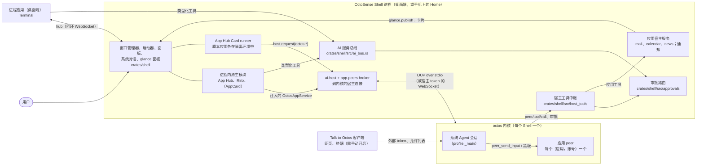
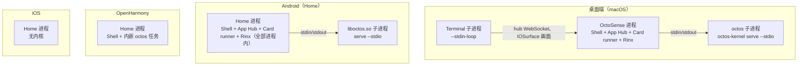
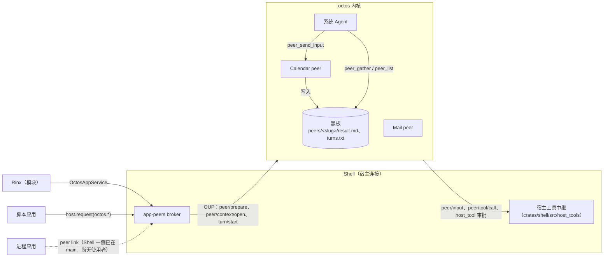
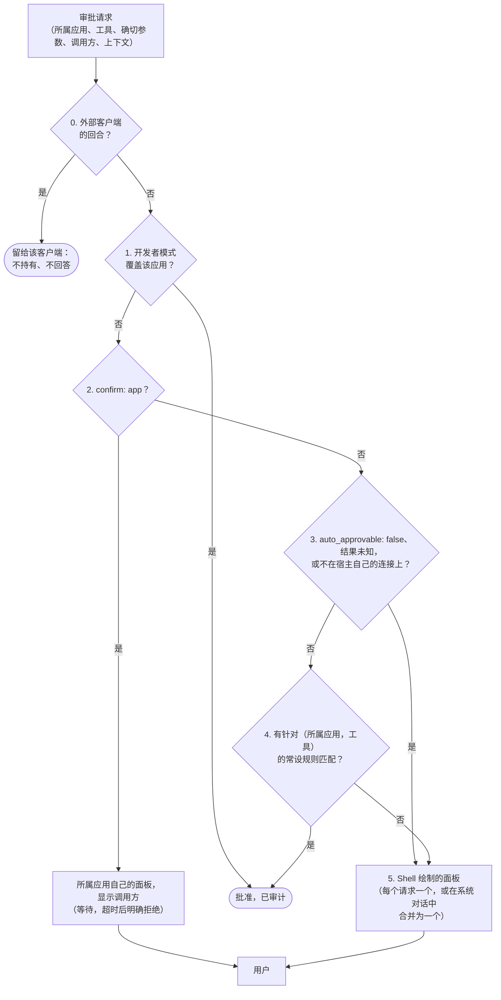
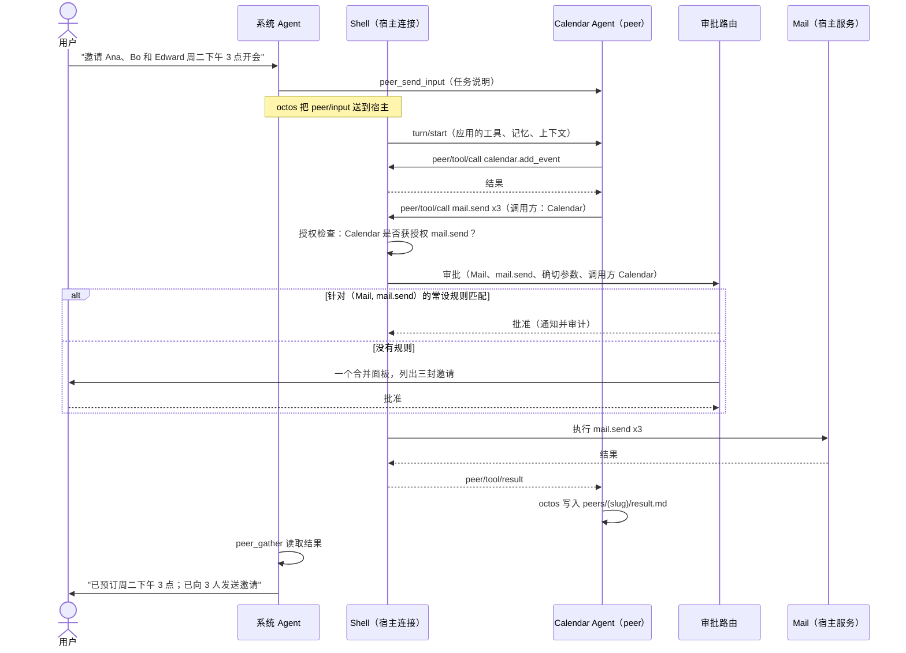

# OctoSense 架构

[English](architecture.md) | 简体中文

OctoSense 的进程、Agent、工具、审批、存储与信任边界。具体调用和所有权见[代码导读](architecture-walkthrough.zh-CN.md)。依赖版本以 [Cargo.toml](../Cargo.toml) 和 [native-runtime.lock.json](../native-runtime.lock.json) 为准；下方带日期的设计记录保留早期决策。

每条陈述都标明状态：

- **已在 main**：已合入，在本仓库代码中读过（给出路径）。
- **进行中**：有未合并的 pull request，附链接。
- **规划中**：已在 ADR 中决定（附链接和计划步骤），尚未实现。

背后的决策是 [ADR 0001](adr/0001-one-octosense-repository.md)（英文，一个仓库）、[ADR 0002](adr/0002-event-driven-app-agents.md)（英文，应用 Agent，Proposed，经 0004 修订）、[ADR 0003](adr/0003-shared-octos-client-access.md)（英文，Talk to Octos）和 [ADR 0004](adr/0004-native-apps-hosting-and-peers.md)（英文，原生应用、应用 Agent、跨应用协作与审批，已接受，并已于 2026-09-29 实现，后续事项除外）。助手的各项服务、各类应用目前能调用什么、如何在本地运行，见 [ai-services.zh-CN.md](ai-services.zh-CN.md)；本文不再重复。

## 目录

- [全局](#全局)
- [1. 各平台的进程](#1-各平台的进程)
- [2. Agent](#2-agent)
- [3. 通信](#3-通信)
- [4. 工具与授权](#4-工具与授权)
- [5. 审批](#5-审批)
- [6. 存储与机密](#6-存储与机密)
- [7. 信任边界与隔离](#7-信任边界与隔离)
- [8. 完整示例：用邮件发送会议邀请](#8-完整示例用邮件发送会议邀请)
- [代码与 ADR 不一致之处](#代码与-adr-不一致之处)
- [源码位置](#源码位置)

## 全局


*示意图（生成）。实线表示已在 main 上；虚线表示计划中或进行中（进程应用的 peer link 自 [#130](https://github.com/OctoSense-org/OctoSense/pull/130) 起 Shell 一侧已在 main 上，但还没有进程应用使用它；`peer/input` 和宿主工具自锁定 octos 665209e5 起已在 main，octos#2567）。图与下文不一致时以文字为准：例如 `peer_send_input` 把消息放入 peer 的收件箱，peer 在下一轮处理它。*



```
+--------------------------- OctoSense Shell 进程 -------------------------------+
|  窗口管理器 / 启动器 / 面板               审批路由            AI 服务总线       |
|  进程内模块：App Hub（+ 运行脚本应用的 Card runner）、Rinx、（AppCard）         |
|  宿主工具中继 -> 应用宿主服务（mail、calendar、news、通知）                     |
|  ai-host + app-peers broker  == 宿主连接 ==+                                    |
+--------------------------------------------|-----------------------------------+
        ^ hub：回环 WebSocket                | OUP：stdio（默认）或
        |                                    | 带宿主 token 的 WebSocket
+-------+---------+           +--------------v--------------------------+
| 进程应用        |           | octos 内核（子进程；OHOS 上在进程内）   |
| Terminal 等     |           |   系统 Agent 会话                       |
+-----------------+           |   应用 peer：每个（应用，账号）一个     |
                              |   回合执行与工具分发                    |
   Talk to Octos 客户端 ----> +-----------------------------------------+
   （外部 token、允许列表、需手动开启）
```

## 1. 各平台的进程

### Shell

每台设备一个 Makepad 进程：桌面端（`desktop/`，包 `octosense`）或手机上的 Home（`phone/`，包 `octosense-home`），两者都链接同一个 Shell crate `crates/shell`（[ADR 0001](adr/0001-one-octosense-repository.md)）。Shell 拥有窗口管理器、启动器、宿主面板、审批路由、应用存储以及内核的宿主连接。

### octos 内核

每个 Shell 最多运行一个 [octos](https://github.com/octos-org/octos) 内核，它是 [`crates/kernel`](../crates/kernel/README.zh-CN.md)（包 `octosense-kernel`）中的一项 Shell 服务，通过 [`crates/ai-host`](../crates/ai-host/README.md) 访问。**已在 main。** 运行方式（`crates/kernel/src/launch.rs`，`launch::resolve`）：

| 平台 | 内核 | 如何启动 |
| --- | --- | --- |
| 桌面端（macOS；Windows 和 Linux 未经测试） | 子进程：嵌入方的 `Options::program`，否则为 `OCTOS_APP_CORE_BIN` 指定的 `octos` 二进制，否则为 Shell 旁随附的 `octos-kernel`（只有收据中的版本与固定的 octos 版本一致时才运行） | `serve --stdio --data-dir <core 目录>`；没有二进制就没有内核（不在 `PATH` 或工作目录中查找）。 |
| Android（Home） | 子进程：APK 中打包的 `liboctos.so`，由 [`tools/kernel-artifact.py`](../tools/kernel-artifact.py) 按锁定的 octos 版本构建 | `serve --stdio`，在应用的原生库目录中、`libmakepad.so` 旁边找到 |
| OpenHarmony | 进程内：`octos_cli::embedded::serve_io` 作为一个任务运行在内存中的双工流上（HAP 不允许 exec） | 同样的协议，没有子进程 |
| iOS | 无 | 提供方配置会保存；没有应用能用上助手 |

生命周期（`crates/kernel/src/lib.rs`、`kernel.rs`）：

- **按需启动，共享使用。** 第一个使用方调用 `connect()` 之前什么都不运行；之后的使用方连接到同一代内核。新一代内核会等上一代退出后再启动，从而先释放 octos 对数据目录的单写者锁。
- **提供方变化时重启。** `llm` 宿主服务重写配置后调用 `restart()`：所有连接以 `CloseReason::Restarted` 结束，使用方重新连接到新的内核。
- **空闲停止。** Talk to Octos 关闭时，最后一个连接关闭后内核即停止。开启时，内核一直运行，直到用户关闭它或 Shell 退出。
- **随 Shell 退出。** Shell 在子进程整个生命周期内持有其 stdin；Shell 退出、崩溃或被杀死时，内核读到 EOF 并停止。在 `--host-managed` 模式下，octos 在 Linux 和 Android 上还会请求在父进程死亡时收到 SIGTERM（octos `crates/octos-cli/src/api/host_managed.rs` 中的 `bind_to_parent()`）；子进程也以 `kill_on_drop` 方式创建。
- **崩溃**会以 `CloseReason::Exited`（附最后几行 stderr）结束所有连接；不会自动重启，下一次 `connect()` 启动新一代。见[内核崩溃意味着什么](#内核崩溃意味着什么)。

### 原生应用：进程内还是独立进程

原生应用是第一方 Rust crate，只在 [`native-apps.json`](../native-apps.json) 中声明；`tools/native_apps.py` 据此生成 `crates/shell/src/native_apps.rs` 和各处 Cargo 配置块，并在 CI 中检查（ADR 0004 §1，计划步骤 1）。**已在 main。** 目前的清单：

| 应用 | macOS / Windows 上的托管 | Linux | Android、iOS、OpenHarmony | 桌面端 / 手机 | 助手 |
| --- | --- | --- | --- | --- | --- |
| App Hub（`apphub`：商店和 Card runner） | 进程内 | 进程内 | 进程内 | 默认 / 默认 | – |
| Rinx | 进程内 | 进程内 | 进程内 | 默认 / 默认 | 获授权四个 `octos.*` 服务 |
| Terminal | **独立进程** | Vulkan 构建且在 Wayland 会话中时为独立进程，否则进程内 | 进程内 | 默认 / 关闭 | –（其 `run` 工具为 `confirm: host`、`auto_approvable: false`） |
| Sheets、Reference | 进程内 | 进程内 | 进程内 | 可选 / `mobile-apps` | – |
| AppCard | 进程内 | 进程内 | 进程内 | 可选 / 可选 | 自己的内核连接 |

因此**只有 Terminal 是进程应用**，而且只在桌面端；`tools/native_apps.py` 拒绝 Linux 上的普通 `process`（只允许 `process-if-vulkan`），所以没有 Vulkan 和 Wayland 的 Linux 上所有应用都在进程内运行。App Hub 留在进程内，因为它承载所有脚本应用运行所在的 Card runner。Rinx 留在进程内：ADR 0004 §2 规定，等 peer link 和进程沙箱就绪后，再通过一次经评审的 `hosting` 改动把它移出。如今 peer link 的 Shell 一侧以及 macOS 和 Linux 的沙箱已在 main 上，但所锁定版本的 Rinx 通过注入的服务（[第 3 节](#应用与它自己的-agent)）而不是 peer link 访问它的 Agent，它的 `hosting` 在所有平台上仍是 `module`。

Shell 在运行时如何决定（`crates/shell/src/apps.rs`，`AppRegistry::hosting`）：如果目标平台不能运行进程（在 wasm 和原生移动平台上 `host::processes_available()` 为 false），所有应用都作为模块；App Hub 和 Settings 始终是模块；其他情况下原生应用按清单条目托管，并且只有存在进程形态（可以从中构建它的源码检出，或同目录下的二进制）时才作为进程运行；没有进程形态时回退到进程内（`manifest_default`）。桌面端发布包尚未在 main 上（[#257](https://github.com/OctoSense-org/OctoSense/pull/257)，进行中，它取代已关闭的 #94）。按应用的覆盖设置（`~/.makepad/wm/apps.splash`、`--module <id>`）可以在模块和进程之间切换一个应用。

**进程托管**使用 Makepad 窗口管理器的托管机制（`crates/shell/src/clients.rs`、`hub.rs`）：

- Shell 以 `--stdin-loop` 启动应用子进程，放在独立的进程组中，并设置 `STUDIO_HOST=http://127.0.0.1:<hub 端口>` 和其客户端 id。在源码检出中，它先从 OctoSense 工作区构建应用的二进制（release 构建，受 `Cargo.lock` 约束，在任何沙箱之外运行），再在应用的沙箱中直接启动这个二进制，从不经过 `cargo run`（`clients::launch_plan`，[#225](https://github.com/OctoSense-org/OctoSense/pull/225)）；安装版的 Shell 启动同目录下的二进制。
- 子进程回连 Shell 的 **hub**：Shell 在回环地址 8765–8784 中第一个空闲端口上绑定的 HTTP/WebSocket 服务（`WmHub::start`），使用 Makepad 的 studio 协议（`AppToStudio` / `StudioToApp`）。hub 只接受出示了 Shell 写入该子进程 stdin 的本次启动密钥的连接，每次启动只接受一次，并拒绝浏览器来源（[ADR 0004 §5](adr/0004-native-apps-hosting-and-peers.md#5-the-peer-link-for-process-hosted-native-apps)）。
- 在操作系统允许时，画面以零拷贝方式到达合成器（在 Makepad `platform/src/os` 中实现）：macOS 上用 IOSurface，Windows 上用 D3D11 共享句柄，Linux 在 Vulkan 加 Wayland 下用 DMA_BUF；Linux 的 OpenGL 构建则每帧经 CPU 回读。
- 进程应用崩溃只影响它自己：用户打开的窗口意外退出时，其磁贴保留，显示为已关闭并提供 Restart，同时发出 “App stopped”（[#130](https://github.com/OctoSense-org/OctoSense/pull/130)；`clients.rs` 中的 `ClientSlot::stops_in_place`）。预热实例、AI 面板、预览或正在关闭的客户端照旧消失。

**进程内托管**（`crates/shell/src/module_host.rs`）：模块的每个实例都有自己的 splash 隔离环境（`alloc_splash_vm_with_network`）和存储命名空间。隔离环境只隔离脚本堆；模块的 Rust 代码与 Shell 共享内存。每次调用模块都在 `catch_unwind` 下进行（`contain`、`contain_outside`）：panic 会把该模块标记为失败，把它进行中的工具调用答复为“结果未知”，关闭它的额外窗口并显示 Restart 界面，而 Shell 继续运行（[#114](https://github.com/OctoSense-org/OctoSense/pull/114)，ADR 0004 步骤 9）。**已在 main。**

### 脚本应用

脚本应用（系统应用 News、Photos、Maps、Mail、AI providers 和 YouTube，加上仅桌面端的 Calendar 和仅手机上的 Camera，来自 `desktop/system-apps.json` 和 `phone/system-apps.json`，以及商店应用）是 OctoScript 应用包。它们都在进程内、在 App Hub 的 **Card runner**（`octosense-app-hub-app` 的 `CARD_MODULE`）中运行：每个应用实例一个嵌套隔离环境，去掉了 `mod.res` 和 `mod.run`，有 jail 和配额。应用只能通过 `host.request("<family>.<method>", …)` 调用其清单获授权的服务族来访问 Shell。脚本的错误只会在它自己的隔离环境中失败。**已在 main。**



## 2. Agent

**每个 Shell 一个内核；Agent 是会话，不是进程。** 在这一个内核中，Agent 回合由 Tokio 任务执行，peer 与 session 是持久状态。一个 peer 可包含多个 context session，一个回合也可创建多个任务，不存在一个 Agent 对应一个任务的关系。实际线程与任务对应关系见[导读](architecture-walkthrough.zh-CN.md#10-映射到-rust-的实际执行模型)。文件编辑之类的工具在内核中运行；octos 的命令类工具会在会话的工作区中以短时子进程运行，但 OctoSense 不把它们提供给任何 Agent（见[第 4 节](#4-工具与授权)）。

| Agent | 是什么 | 状态 |
| --- | --- | --- |
| **系统 Agent** | `_main` profile 上的会话 `_main:api:octosense#system`（`crates/kernel/src/network.rs` 中的 `SYSTEM_SESSION`）。它拥有并监督所有应用 peer。用户在 Shell 的**系统对话**中与它对话（`crates/shell/src/system_chat/`，[#132](https://github.com/OctoSense-org/OctoSense/pull/132)：Setup → Assistant → Assistant chat、F8、桌面 Dock 上的 Assistant 图标或手机主屏的 Assistant 磁贴；桌面上是左侧一个中等大小、用户可以移动和调整大小的面板，手机上为全屏），或通过已配对的 Talk to Octos 客户端 | 已在 main |
| **应用 Agent** | 每个（应用，账号）一个由宿主拥有的 octos **peer**，归系统 Agent 所有（octos UPCR-2026-034，Rinx [ADR 0007](https://github.com/hagency-org/Rinx/blob/main/docs/adr/0007-host-owned-octos-app-peers.md)）。用户可在应用自己的界面中，或在 Shell 的 **“Ask <app>” 面板**（`crates/shell/src/app_chat/`：顶栏的 “Ask <app>”、Shift+F8；桌面上位于系统对话旁边，手机上为全屏面板）与它对话。面板显示两条通道及其发言者，以及一个输入框：用户的通道空闲时可以发送（即使系统 Agent 正在工作），用户自己的回合运行时可以停止，系统 Agent 正在运行的那一行上有 “Stop the system agent's task” | Rinx（原生）和每个带 Agent 的脚本应用（目前是系统应用 News、Mail、Photos、Maps、YouTube、仅桌面端的 Calendar 和仅手机上的 Camera）已在 main，需首次使用同意；见下文 |

每个应用 peer 都独立拥有：

- **工作区**：peer 会话所绑定的目录。自锁定 octos 665209e5 起新建的 peer 以账号目录（`apps/<app id>/accounts/<account hash>/`，ADR 0004 §11）作为 `peer/prepare` 的 `cwd`（`host_tools::agent_workspace`），并记录在其宿主令牌旁边，恢复时使用同一目录；之前创建的 peer 保留内核分配的目录，因为 octos 不允许在另一个工作区下恢复 peer（见[不一致之处](#代码与-adr-不一致之处)）；
- **记忆命名空间** `app/<app>/acct-<hash>`（`crates/app-peers/src/broker.rs` 中的 `app_namespace()`）；不返回它的内核会被拒绝；
- 自己的**对话记录**和**模型**通道（宿主通过 `peer/prepare` / `peer/model/set` 设置模型）；
- 自己的**工具列表**：内核工具恰好是其清单授予的那些（`generic_tools`，从不包括 octos 的 `shell`），加上 Shell 注册的工具（octos [#2567](https://github.com/octos-org/octos/pull/2567)，UPCR-2026-035）：每次 `peer/prepare` 和重连之后，broker 在驱动该 peer 回合的连接上注册应用声明的工具，以及授予它的其他应用可共享工具，每个都标明所属应用（`crates/shell/src/host_tools/`），并把 `generic_tools` 设为恰好是应用清单声明且用户授予的内核工具（原生应用为 `native-apps.json` 的 `agent.generic_tools`，脚本应用为其清单 `agent.tools` 中不带点的名称；一个也没写的应用就一个也没有）。Terminal 声明 `terminal.run`、`terminal.read_screen` 和 `terminal.read_scrollback`。系统应用在 `apps/<app>/bundle/tools.json` 中声明自己的工具，各自在一个宿主服务上运行：News 的 `news.list`、`news.read` 和 `news.notify`（`news` 服务），Mail 的 `mail.notify`（`mail` 服务），Calendar 的 `calendar.events`、`calendar.add_event`、`calendar.remove_event`、`calendar.notify` 和 `calendar.agenda`（`calendar` 服务），以及 Photos、Maps、YouTube 和 Camera 的 `<app>.notify`（Shell 的通知服务，`crates/shell/src/glance_notice.rs`，因为它们没有自己的服务）。注册失败的 peer 不运行任何回合；
- **请求上下文**（`peer/context/open`）：每个客户端实例一个（一个 Rinx 小程序），各有自己的对话记录、peer 工作区内的目录 `contexts/<id>/` 和子记忆命名空间。这类客户端上下文不能直接读旁边的文件；它通过 Shell 的宿主读取工具 `files.list`、`files.read` 和 `files.search`（ADR 0004 §11，`crates/shell/src/host_tools/files.rs`）读取账户数据，这些工具从不显示其他上下文的目录。除了这些按客户端划分的上下文（`OctosAppService::open_context`：Rinx 小程序，以及带 `client` 的进程应用 `octos.session.open`），每个应用对话也是一个请求上下文：用户与应用 Agent 的对话（来自 Shell 的 “Ask <app>” 面板、应用界面或卡片的卡内对话）在用户通道中运行，这是一个以 `share_history` 打开的上下文，与 peer 自己的会话（系统 Agent 的通道）并行，并让每条通道看到另一条通道最近的回合（ADR 0004 §6，2026-09-29 决定；见下文）。在清单声明 Agent 工作在账号文件夹中时（`storage.agent_workspace: "account"`，octos#2647），该对话上下文以 octos 的 `read_parent` 打开：它只读地读取账号文件夹，从不读取其他上下文的文件夹，且只写入自己的文件夹。

目前谁有 peer（`crates/ai-host/src/lib.rs`，`Policy::shipped()`；`crates/app-peers/src/hosted.rs`，`effective_services` = 声明 ∩ 支持 ∩ 策略）：

- **Rinx**，唯一获授权使用助手的原生应用（四个 `octos.*` 服务，来自它在 `native-apps.json` 中的 `agent.octos`，生成到 `crates/ai-host/src/native_agents.rs`），需首次使用时的同意。
- **带 Agent 的脚本应用**：清单声明了 `octos.*` 或 `agent` 块，或应用包带有 `tools.json`（`crates/shell/src/apps.rs`，`agent_apps`）。目前就是除 AI providers 之外的每个系统应用：News、Mail、Photos、Maps、YouTube、仅桌面端的 Calendar 和仅手机上的 Camera，每个都有 `agent` 块和 `tools.json`，都没有声明 `octos.*`。每个应用/账号一个 peer，broker 身份为 `card.<app id>`；无账号的应用使用 `device`，否则使用宿主报告的当前账号（Mail 需要先登录）（`crates/ai-host/src/contained.rs`，[#106](https://github.com/OctoSense-org/OctoSense/pull/106)），在用户首次使用同意后可用（发布时的闸门；`OCTOSENSE_CONTAINED_APPS=1` 不询问任何人，`0` 关闭）。用户一旦同意，以及每次启动时，Shell 就会准备其 peer（`crates/shell/src/agents.rs`，`contained::prepare`），因此即使应用从不调用 `octos`，系统 Agent 的 `peer_list` 也能看到它；应用自己的 `host.request("octos.*")` 仍限于其清单声明的服务。
- **AppCard**（可选）使用自己的内核连接和会话，而不是 peer。
- 其 `native-apps.json` 条目授予了 `agent.octos` 服务的**进程应用**，经 **peer link**（`crates/shell/src/peer_link/`，[#130](https://github.com/OctoSense-org/OctoSense/pull/130)）访问自己的 peer，需首次使用同意。目前还没有这样的应用：唯一的进程应用 Terminal 没有授予任何服务。

peer 会被保留而不是丢弃：broker 用其宿主 token（存放在 `<core 目录>/../app-peers`，0600）恢复 peer，登出时也从不调用 `peer_close`，因为 octos 无法恢复已关闭的 peer，也无法为同一个（应用，账号）创建替代者（ADR 0004 §11）。

### 内核崩溃意味着什么

所有 Agent 都在同一个内核中，因此内核崩溃会同时停止**全部** Agent：系统 Agent 和每个应用 peer，包括正在进行的回合。Shell 和应用继续运行；`availability()` 报告助手失败，应用的常规界面照常工作，进行中的回合随连接一起结束。octos 已持久化的内容不会丢失：会话、黑板、记忆命名空间和 peer 绑定都在内核的数据目录中，因此下一次 `connect()` 启动新一代内核，使用方用保存的宿主 token 重新打开并恢复各自的 peer 和上下文。结果未知的工具调用未经用户同意绝不重试（ADR 0004 §7）。

## 3. 通信



### 内核与客户端之间的 OUP

内核使用 **octos UI 协议**（OUP；`octos-ui/v1alpha1`，JSON-RPC 2.0 帧；octos [`api/OCTOS_UI_PROTOCOL_V1_SPEC_2026-04-24.md`](https://github.com/octos-org/octos/blob/main/api/OCTOS_UI_PROTOCOL_V1_SPEC_2026-04-24.md)）。**已在 main。**

- **默认：stdio。** Shell 是唯一的客户端，经子进程的 stdin 和 stdout 通信（按行分隔的 JSON；octos UPCR-2026-016）。在 Shell 内部，`crates/kernel/src/router.rs` 在各原生使用方之间复用同一个帧流：每个请求获得内核范围内唯一的 id，其回复只发回该使用方；通知发给声明了该会话的使用方。
- **Talk to Octos：宿主管理的 WebSocket**（[ADR 0003](adr/0003-shared-octos-client-access.md)，[#98](https://github.com/OctoSense-org/OctoSense/pull/98)；octos [`docs/HOST_MANAGED_SERVE.md`](https://github.com/octos-org/octos/blob/main/docs/HOST_MANAGED_SERVE.md)，UPCR-2026-036）。用户在 AI providers 中开启后（`<core 目录>/external-access.json`），Shell 以 `octos serve --host-managed --host 127.0.0.1` 重启内核，使用 Shell 只绑定一次并传下去的监听套接字（Unix 上为 `--listen-fd`）。两个 token 写在内核 stdin 的前两行，从不放入环境变量：

  | Token | 持有者 | 可以做什么 |
  | --- | --- | --- |
  | **宿主 token** | 只有 Shell 进程；每个 Shell 生命周期生成一次，从不记录日志 | 一切（管理员）；原生使用方用它连接 `/api/ui-protocol/ws` |
  | **外部 token** | 已配对的网页客户端（可信面板上的 8 位配对码，5 分钟有效，只能领取一次）或本用户的终端客户端（0600 的 `client-connection.json`） | 只能访问 `/api/ui-protocol/ws`，身份为 `_main`，且只能调用允许列表中的方法：打开并读取系统对话，启动、引导或中断**自己的**回合，回答自己回合的审批（一次性）和问题 |

  外部客户端不能：调用任何 `peer/*` 方法或指定应用 peer 的会话（`peer-…`、`peerctx-…`）；设置 `cwd`、`topic` 或 `sandbox`；触及提供方、密钥、模型、skills、快照或 `server/shutdown`；使用 REST 或管理路由。它们的回合只有固定的工具集（文件工具、`web_search`、`web_fetch`、记忆读取、`ask_user_question`、查看媒体；`crates/kernel/src/system_tools.rs` 中的 `EXTERNAL_TURN_TOOLS` 与之对应）：没有 shell、没有 peer 工具、没有宿主路由的工具（octos [#2601](https://github.com/octos-org/octos/pull/2601)）。OpenHarmony 和 iOS 上没有；Android 未验证。

### 内核中的系统 Agent 与应用 Agent

使用 octos 的 peer 机制，深度为 1（peer 不能创建、引导或关闭 peer）。octos 中**已在 main**；这些工具位于 octos `crates/octos-agent/src/tools/`。

- **系统 Agent → 应用 Agent。** `peer_send_input`（只有发起者可用，最多 64 KB）经 peer 的收件箱把文字作为 peer 的下一个用户回合送达（在 serve 中是持久队列，每隔几秒处理一次，至少送达一次）。
- **系统 Agent 能联系到哪些应用的 Agent。** `peer_list` 列出已准备好的 peer：Shell 会准备每个已允许应用的 Agent。对它列不出来的（尚未允许或已关闭），Shell 会告诉它：应用的 Agent 有变化时，在系统对话的回合中附上一条说明；以及系统会话上的宿主工具 `agents.list` 和 `agents.ask`（`crates/shell/src/agents.rs`）。`agents.ask` 显示首次使用面板，只有用户能回答，并且它会等用户作答：它被声明为 `risk: act`、`outward: true`、`confirm: "app"`，所以内核像持有审批一样持有这次调用；用户作答且该应用的 peer 就绪后，系统对话带着 peer 的 slug 回答它，系统 Agent 就能在同一个回合里继续处理请求（10 分钟仍无回答时，它回答用户还没有作答，面板保持显示；[#274](https://github.com/OctoSense-org/OctoSense/pull/274)）。
- **应用 Agent → 系统 Agent：黑板。** peer 的每个回合写入 `peers/<slug>/result.md`（以及 `result-<n>.md`），并在 `turns.txt` 中追加一行；系统 Agent 用 `peer_gather` 和 `peer_list` 读取（`awaiting_input` 表示 peer 正在等待回答问题）。这是 peer 之间唯一的通道。
- **提问。** peer 用 `ask_user_question` 提问；系统 Agent 用 `peer_respond` 回答。`peer_respond` 从不回答审批（octos 会拒绝）。octos 在宿主驱动的回合中保留 `ask_user_question`（`generic_tools` 是宿主设定的精确列表，省略时保留全部工具）。ADR 0004 §6（2026-09-29 决定）由 Shell 把每个问题转到正确的对话：应用自己的对话，或者对系统 Agent 的回合（包括 `peer/input` 回合）转到系统对话；没有 `host.ask`。**已在 main**：系统对话回答系统 Agent 自己会话上的问题；broker 把应用 peer 的 `user_question/requested`（其自身会话、请求上下文或 `peer/input` 回合）连同回合的发起者（octos 报告时用它，否则推断：broker 为 `peer/input` 发起的回合属于系统 Agent）交给 Shell 的请求模型（`crates/shell/src/questions/`），请求模型按发起者路由：用户或应用的回合转到应用的对话（该应用的 “Ask <app>” 面板打开时在面板中，否则在 Shell 审批浮层的问题卡片中，`crates/shell/src/approvals/view.rs`：同一时间只有一个界面，[#279](https://github.com/OctoSense-org/OctoSense/pull/279)），系统 Agent 的回合转到系统对话。只有用户能在 Shell 界面上回答（在 broker 的连接上发送 `user_question/respond`）；应用的上下文只收到 `user_question/handled_by_host`，broker 拒绝应用回答宿主持有的 id。回合结束时问题关闭。
- **每个应用 Agent 两条并行通道，只读共享历史。** ADR 0004 §6（2026-09-29 决定，取代同日 [#166](https://github.com/OctoSense-org/OctoSense/pull/166) 与 octos [#2626](https://github.com/octos-org/octos/pull/2626) 的单一排队对话）：系统 Agent 与 peer 自己的会话对话（`peer/input`），用户（应用界面、其卡片、不带 `client` 的进程应用）在 broker 以 `share_history` 打开的请求上下文中对话（octos [#2636](https://github.com/octos-org/octos/pull/2636)，UPCR-2026-034），每个句柄一个新的上下文 id（其历史也包含同一账号、同一实例之前各个句柄中用户的消息）。两条通道并行运行：用户的消息只等自己上下文的上一轮，`peer/input` 在 peer 会话上保留自己的队列。每一轮开始时，内核把另一条通道最近的用户/助手文本（默认 20 条，最多 50 条，16 KiB 以内；去掉工具行）作为只读块给模型看，这个块从不写入读取方的对话记录；没有共享的对话记录。每一轮都保留 `origin`（`person`、`system_agent`、`app`；内核的 `[from …]` 标记；宿主不能改写系统 Agent 回合的标记），用户的回合在黑板上留下一轮结果（`origin: person`、`context: <id>`），系统 Agent 用 `peer_gather` 读取，它本身不会触发 fleet 汇总。`OctosAppService::open_conversation` 是用户的通道；`open_context(client)` 仍是普通请求上下文（Rinx 小程序）。应用的跟随者（`OctosContext::subscribe`；peer link 上的 `conversation` 帧）收到两条通道的事件，每个都带 `lane` 与 `speaker`；`octos.session.history` 按 `persisted_at` 合并两份对话记录，每行带 `lane`，带标记的用户消息另附 `speaker` 与 `display_text`。接受的风险：跨通道的文件编辑不加锁（每条通道编辑自己的文件夹，上下文的是 `contexts/<id>`），未知结果标记是共享的，并行回合可能略微超出 peer 的 token 预算。

### 宿主拥有的路径：`peer/input`

对宿主拥有的 peer，普通的 `peer_send_input` 会作为内核续跑执行，没有应用的工具或记忆。ADR 0004 §6 解决了这个问题：octos 把系统 Agent 的输入以 **`peer/input {peer, session_id, input_id, turn_id, text}`** 的形式送到宿主的驱动连接，由 Shell 自己启动回合（用内核的 `turn_id` 调用 `turn/start`），这样回合就带有应用的工具、记忆和上下文，其审批也出现在应用中。如果没有宿主连接持有该 peer，octos 会告诉系统 Agent 该应用未连接。**已在 main**：自锁定 665209e5 起 octos 会发送它（octos [#2567](https://github.com/octos-org/octos/pull/2567)）；broker（`crates/app-peers/src/broker.rs`）用内核的 `turn_id` 在自己的连接上启动回合，丢弃重复的 `input_id`，对已登出的账号或用户未允许的应用不启动任何回合（`host_tools::ShellToolHost::admit_input`），而是用 `peer/input/reject` 连同原因拒绝它（octos [#2621](https://github.com/octos-org/octos/pull/2621)）；启动失败的回合也以同样方式拒绝。同一个应用在内核上有多个实例时，该账号最早仍在运行的实例驱动这个 peer（注册其工具、接收其 `peer/input`），它关闭时由下一个实例接管（[#201](https://github.com/OctoSense-org/OctoSense/pull/201)）。内核每个会话只接受一个回合，且不排队（`turn_in_progress`），所以 broker 为系统 Agent 在 peer 会话上的输入每个 peer 维护一个队列，一次一个回合（被以 `turn_in_progress` 拒绝的启动会用同一个回合 id 重试）；已有 8 个在等待时，新的输入以 `busy` 被拒绝。用户的消息在自己的通道里运行，从不在这个队列里等待。任何通道都不会被长时间占住：peer 会话或上下文上的审批或问题 10 分钟后过期（`OCTOSENSE_PROMPT_DEADLINE_SECS`；审批路由拒绝该审批，请求模型以自由文本婉拒该问题，从不批准，两者都显示 “Expired: no answer in 10 min”，直到被关闭），30 秒后仍在运行的回合会被 broker 中断，以便队列中的下一个回合开始。用户的 Stop 结束两条通道上正在运行的回合，用户的和系统 Agent 的：对话上的 `octos.turn.interrupt`（应用、卡片、peer link），以及 Shell 审批面板和问题卡片上的 “Stop <app>'s agent”（`approvals::stop_agent`、`broker::interrupt_where`）。“Ask <app>” 面板一次只停一条通道（`broker::interrupt_lane_where`）：它的 Stop 结束用户自己的回合，“Stop the system agent's task” 结束系统 Agent 的回合。Shell 的各个内核使用方共用一个内核连接（`crates/kernel/src/router.rs`），因此每个 broker 和系统对话对 octos 来说是同一个宿主连接；各自只回答自己的 peer 或会话的调用。

### 应用与它自己的 Agent

| 托管方式 | 通道 | 状态 |
| --- | --- | --- |
| 进程内原生模块，经 peer link | Makepad 的 `OctosPeer::open` 暂存一对通道；模块宿主把它归给打开它的实例，Shell 用进程应用同一套 **peer link** 服务它（`peer_link::module_connected`、`octosense_ai_host::module_peer`），应用无需知道自己如何被承载 | 已在 main（[#142](https://github.com/OctoSense-org/OctoSense/issues/142)）；尚无模块使用 |
| 进程内原生模块（Rinx） | **注入的服务**：`create` 之前调用 `ai_host::offer`，在其中调用 `octosense_app_peers::injection::claim`，得到受限的 `OctosAppService`（`Open`、`History`、`Turn`、`Interrupt`、`Approval`）；模块永远看不到协议 | 已在 main |
| 脚本应用 | 向 `octos` 宿主服务（`crates/ai-host/src/contained.rs`）调用 `host.request("octos.session.open" / "octos.session.history" / "octos.turn.start" / "octos.turn.interrupt", …)`；受清单、`Policy::contained_gate`（默认 `ContainedGate::Consent`）和首次使用同意约束；其 peer 发起的工具审批交给 Shell 的审批路由。系统应用都不调用 `octos.*`，也都不绘制对话界面：用户在 Shell 的 “Ask <app>” 面板中与它们的 Agent 对话，用的是同一个 peer，Shell 也为系统 Agent 驱动它们 | 已在 main（[#106](https://github.com/OctoSense-org/OctoSense/pull/106)，同意机制来自 [#120](https://github.com/OctoSense-org/OctoSense/pull/120)） |
| 独立进程的原生应用 | **peer link**：应用 hub 连接上的独立通道（`PeerRequest`、`PeerReply`，以及由 Shell 盖上身份和调用方的 `PeerToolCall`），从不注册到 AI 总线；客户端 API 在 Makepad 的 `makepad-ai-services` 中 | Shell 一侧已在 main（[#130](https://github.com/OctoSense-org/OctoSense/pull/130)，`crates/shell/src/peer_link/`，帧由 `lib.rs` 从 hub 连接转发）；尚无进程应用被授予 Agent |

### Makepad 的 AI 服务总线与 OctoSense 的应用 Agent

两种模型并存（ADR 0004，“Two AI models”）：

| | Makepad AI 服务总线 | OctoSense 应用 Agent |
| --- | --- | --- |
| 位置 | 窗口管理器一侧在 `crates/shell/src/ai_bus.rs`；上游 `libs/ai/services` | `crates/ai-host`、`crates/app-peers`、octos 内核 |
| 形态 | **一个中心对话**（桌面端的 AI 面板，即 Makepad 的 `aichat`）调用应用以风险等级（`Read`、`Act`、`Destructive`）注册的类型化工具 | **每个应用一个 Agent**，拥有应用的完整上下文（工作区、记忆、历史、工具），由系统 Agent 监督 |
| 路由 | Shell 给每个上行帧盖上发送方的端点，把注册转给面板（面板重连时重放），把面板的调用路由到应用的套接字，并自己回答 `os` 服务（list、launch、focus、close、open） | broker 直接用 OUP 与内核通信 |
| 用途 | 桌面端的 AI 面板；目前 Rinx 的助手工具；Terminal 的 `run`。其 `confirm: host` 调用经过 Shell 的审批路由（[#120](https://github.com/OctoSense-org/OctoSense/pull/120)） | 应用自己的助手；系统 Agent 的委派 |

**为什么应用 Agent 的流量不走总线。** 总线是通向一个掌握全部上下文的中心 Agent 的窄而单向的 API；应用 Agent 需要应用的完整上下文和一个私有、受监督的会话，而系统 Agent 必须通过内核的 peer 机制与它通信。总线也不携带账号、请求上下文或调用方，无法按 ADR 0004 §5 的要求在每次工具调用上盖上身份，而且其注册对面板可见。因此在 OctoSense 中，总线不是系统 Agent 通向应用的通道；它留给上游 Makepad 应用（ADR 0004 §6），进程应用的 peer link 也有意设计为独立通道。`crates/ai-host` 和 `crates/app-peers` 都不使用总线。

## 4. 工具与授权

**清单声明，用户在安装时授权，Shell 在每次调用时执行检查**（ADR 0004 §12，ADR 0002 §4）。脚本应用在 `manifest.json` 中声明能力，在 `tools.json` 中声明工具（由 App Hub 准入并锁定）；原生应用在经过评审的 `native-apps.json` 条目中声明（`agent.octos`、`agent.tools`、`agent.tool_policy`）。

Agent 的工具来源：

| 来源 | 示例 | 在哪里运行 | 状态 |
| --- | --- | --- | --- |
| 应用自己的工具（`tools.json`：名称 `<app>.<tool>`、schema、`risk`、`confirm: host` 或 `app`、`shareable`） | `news.list`、`terminal.read_screen`、`mail.notify`、`calendar.add_event` | 应用的宿主服务、模块或进程（或 Shell 的通知服务），由 Shell 调用 | 已在 main（`crates/shell/src/host_tools/`）：原生应用从 `native-apps.json` 的 `agent.tools` 声明，脚本应用从准入后应用包的 `tools.json` 声明（`host_tools/script_apps.rs`，使用 App Hub 的加载器）；按（所属应用，工具）和调用方授权，参数和结果按声明的 schema 检查，计入预算，盖上账号、上下文和客户端，并路由到进程应用的 peer link、进程内模块的执行器（`OctosAppService::set_tool_executor`）、脚本应用的宿主服务（`HostServiceExecutor`：工具命名空间对应的服务，应用的清单必须获授权该服务，系统应用自己的命名空间除外，例如 Calendar 的 `calendar`）或 Terminal 的 AI 总线服务。News 提供 `news.list`、`news.read` 和 `news.notify`；Mail 提供 `mail.notify`；Calendar 提供 `calendar.events`、`calendar.add_event`、`calendar.remove_event`（破坏性，`confirm: host`）、`calendar.notify` 和 `calendar.agenda`；Photos、Maps、YouTube 和 Camera 提供 `<app>.notify`，由 Shell 的通知服务执行；Terminal 提供 `terminal.run` 及其读取工具 |
| 系统工具箱，按能力授予（`research`、`crawl`） | `toolbox.search`、`toolbox.web_read`、`toolbox.deep_crawl`、`workflow.run` | 宿主（`crates/toolbox`） | 已在 main，位于 `toolbox-peers` 特性之后（[#151](https://github.com/OctoSense-org/OctoSense/pull/151)；手机构建默认开启，桌面端默认关闭；`crates/ai-host/src/toolbox_peers.rs`）：`research` 提供 `workflow.run`、`workflow.fork`、`toolbox.search` 和 `toolbox.web_read`，`crawl` 提供 `toolbox.deep_crawl`，只在用户同意后提供。在 App Hub 检查这些能力之前，脚本应用的声明只对系统应用有效，目前还没有应用声明其中任何一个 |
| octos 的通用工具 | 限定在工作区内的文件读取、记忆、`web_search`、`deep_search` | octos | 已在 main 上按应用设置：每个 peer 注册时带着它被授予的精确 `generic_tools`（Rinx：工作区文件、`ask_user_question`、记忆、网页）；没有授予的应用一个也没有；octos 的 `shell` 从不在其中（生成器、目录和脚本加载器都会去掉它），`_main` profile 的 `tool_policy` 也拒绝它 |
| 其他应用可共享的工具，由 Shell 路由 | Calendar 的 Agent 调用 Mail 的 `mail.send`（规划中：Mail 还没有声明这个工具） | 所属应用，经 Shell | 已在 main（`relay::Catalog`）：按（所属应用，工具）授予，原生应用来自 `native-apps.json` 的 `agent.grants`，脚本应用来自其 `agent.tools` 中带点的名称（安装时）；注册时标明所属应用，每次调用都检查。News 的 `news.list` 和 `news.read` 是可共享的，但还没有应用申请其他应用的工具 |
| 命令执行 | `terminal.run`（Terminal 的可共享工具：`confirm: host`、`auto_approvable: false`） | 宿主工具，在用户可见的终端中 | 系统 Agent 已在 main：Setup › Assistant › Command execution 开启、且 Terminal 作为自己的沙箱进程运行时（它最近一次启动在其操作系统沙箱中运行：macOS，以及有 Vulkan 和 Wayland 的 Linux；Windows 不行，它的沙箱尚未实现），注册在其会话上，每次调用经路由作为命令实时批准，输入到正在运行的 Terminal。进程内 Terminal 只提供读取工具，并按 ADR 0004 §10（2026-09-29 决定）保持只读。授予应用 Agent 属于步骤 11 |

**Agent 放到 glance 屏幕上的内容**（[#267](https://github.com/OctoSense-org/OctoSense/pull/267)、[#273](https://github.com/OctoSense-org/OctoSense/pull/273)、[#274](https://github.com/OctoSense-org/OctoSense/pull/274)）。**已在 main。** 每个 `<app>.notify` 都填充 Shell 的同一张通知卡片（`crates/shell/resources/glance/notice.card`、`crates/shell/src/glance_notice.rs`）：应用的图标和名称由 Shell 填入，标题和正文来自调用，同一个 `card_id` 会替换该应用之前的通知。Mail 和 News 的宿主服务把 `notify` 交给它；没有自己服务的应用由 Shell 的通知服务应答。`calendar.notify` 和 `calendar.agenda` 填充 Calendar 自己的 `event.card` 和 `agenda.card`（`apps/calendar/host-service/resources/`）。模型只写文字，从不编写卡片代码。每张卡片都经 glance 服务（`crates/shell/src/glance.rs`）以调用方应用的身份发布，前提是它的清单获准使用 `glance`（`glance::publish_for`），并发出一条通知。在桌面端，通知是一个 toast，点击它会在单独的卡片窗口中打开这张卡片（`glance_sheet.rs`）；每来一张新卡片，glance 面板（`glance_panel.rs`，顶栏的铃铛、F9）也会打开，除非卡片窗口已经打开，而 toast 叠放在打开的面板左侧（`crates/shell/src/shell/notifications.rs`，`keep_clear_of`）。鼠标悬停的卡片会显示一个移除按钮（`glance::dismiss`），移除可以撤销（[#290](https://github.com/OctoSense-org/OctoSense/pull/290)）。在手机上，通知是通知栏中的一条通知，点击它会打开 glance 页面。这些卡片都没有声明卡内对话（`sys.chat`）；唯一带对话的内置卡片是 `OCTOSENSE_GLANCE_DEMO=mail` 的演示卡片（`crates/shell/resources/glance/mail-request.card`），它的对话用固定的演示回复作答。

**系统 Agent 的工具集**（`crates/kernel/src/system_tools.rs`，[#117](https://github.com/OctoSense-org/OctoSense/pull/117)）。**已在 main**，已生效：

- 默认列表 `SYSTEM_AGENT_TOOLS`：监督（`peer_send_input`、`peer_gather`、`peer_list`、`peer_respond`；不含 `peer_handoff`，也不含 `peer_close`，`_main` 配置文件的 `tool_policy` 对所有智能体禁用它）、其工作区的文件工具、`ask_user_question` 和查看媒体、记忆、`web_search` / `web_fetch`、`tool_search`。授权在此基础上增加（`SystemAgentTools`：工具箱工具、其他应用的可共享工具、命令执行）；目前只有命令执行有开关。
- **从不提供 octos 自己的 shell。** 每次启动内核前，`enforce` 写入 `_main` profile 的 `tool_policy`，拒绝 `group:runtime`（`shell`、`bash`、`exec_command`、`write_stdin`）。它只替换 OctoSense 自己写的策略，并拒绝用户自己的 octos 主目录。
- **恰好是它的列表。** 每次内核启动时，在宿主自己的连接上、在任何使用方的帧之前，用 octos 持久的宿主专用 `session/tool_list/set`（octos#2648）把系统会话的内核工具设为 `SystemAgentTools::kernel_tools`；授权变化时再设一次。该会话上的每个回合（无论由谁发起）都被收窄到它；宿主工具（`terminal.run`）在它之外注册，`spawn` 系列工具从不在其中。真实内核测试：`a_system_agent_turn_is_offered_exactly_the_system_agent_tools`。
- **从 Settings 开启命令执行**（默认关闭，每条命令实时批准）：Setup › Assistant › Command execution 设置授权；开启期间，系统对话在自己的连接上把 `terminal.run` 注册到系统会话（不带 `peer` 的 `peer/tools/register`），关闭时立即撤回。对话的连接就是宿主自己的连接，octos 对它不需要凭据（octos#2657，[#146](https://github.com/OctoSense-org/OctoSense/issues/146)）：在任何应用的 Agent 启动之前就会立即提供该工具。只有在 Terminal 作为自己的进程运行、且它最近一次启动在其操作系统沙箱中运行时，这项授权才生效（ADR 0004 §10 和 §12，2026-09-29 决定；`system_chat::grants::terminal_target`）：在没有 Vulkan 的 Linux、Windows（尚无沙箱）和手机上，`terminal.run` 不会注册，Setup 会说明它需要作为沙箱进程运行的 Terminal。

**外部客户端**只有 octos 的固定允许列表（[第 3 节](#内核与客户端之间的-oup)）；宿主路由的工具、开发者授权和 `dev.run` 永远到不了它们。

## 5. 审批

**授权不等于审批。** 授权表示 Agent 可以*拥有*某个工具；审批表示*这一次*调用、带着这些确切参数，可以执行。只读和应用内操作类工具授权后即可运行；对外或破坏性的调用（发送、发布、分享、购买、删除、运行命令）需要用户实时批准或由常设规则批准。只有用户能批准；系统 Agent 从不批准，Agent 自己输出的文字也从不作为审批界面（ADR 0004 §8）。

**Agent 的工具调用，而不是用户自己的操作。** 审批路由和 Shell 的面板管的是 Agent 的工具调用（`peer/tool/call`）。用户在应用自己的界面中所做的操作，包括它在 glance 屏幕上和通知背后的卡片，都是应用自己的操作：在应用的策略下，经 Card runner 的服务关口和各宿主服务自己的检查运行，Shell 不再另加审批（ADR 0004 §4 和 §8，2026-09-29 决定；卡片操作的安全加固推迟）。应用可以画出貌似审批卡片的界面，但只有 Shell 的宿主连接能回答 `approval/respond`。自 [#153](https://github.com/OctoSense-org/OctoSense/pull/153) 起**已在 main**：每个 glance 磁贴都在自己的隔离环境中、按发布应用解析后的策略运行，并接受输入（`crates/shell/src/glance_card.rs`），它的 `host.request` 调用以该应用的身份经过 Card runner 的关口。脚本卡片的处理函数在它被绘制的任何地方都会运行。L0 卡片的点按和字段编辑在桌面端的卡片窗口（`glance_sheet.rs`，从卡片的 toast 打开）和 glance 面板中运行，两者走同一条路径（`glance_card.rs` 的 `LiveCards`，[#278](https://github.com/OctoSense-org/OctoSense/pull/278)）；在手机的 glance 页面上，它们不起作用。

**审批路由**（`crates/shell/src/approvals/router.rs`，[#120](https://github.com/OctoSense-org/OctoSense/pull/120)）是 Shell 中唯一回答审批请求的地方，依据的是确切参数。**已在 main。** 对每个请求依次：



0. **外部客户端的回合**不归 Shell 处理（octos#2624）：路由不持有、不回答任何东西（`Route::LeftToClient`），只发出一条提示；由发起该回合的 Talk to Octos 客户端回答。
1. **开发者模式**（`dev_hooks.rs`、`crates/shell/src/dev_mode.rs`，[#118](https://github.com/OctoSense-org/OctoSense/pull/118)）批准它所覆盖应用的一切，包括 `auto_approvable: false` 和 `confirm: app`，但从不替外部客户端批准。只有用户能开启它：开发构建中用 `OCTOSENSE_DEV_MODE=all`（或应用列表），发布构建只能用 `--dev-grant-all`，或在 Settings 中开启：桌面端在 Setup › Developer options 中输入确认短语，手机上在 Home 的 Settings › About phone 中连续点按 Build number 七次显示 Developer options，再在那里确认开启；开启范围是 Developer options › Apps it covers 中选定的应用（每个 home 保存在 `assistant/developer-apps.json`）；商店构建永远不能。开启时显示横幅，审计每次调用，不在开发者 profile 中时 8 小时后或重启时自动结束。`dev.run` 作为被覆盖应用自己的宿主工具注册在它的 peer 上，由 shell 执行（`crates/shell/src/host_tools/dev_run.rs`），从不注册在系统智能体的会话上。
2. **`confirm: app`** 工具交给所属应用自己的面板（应用通过 `register_app_confirm` 注册的 `AppConfirm`），并附上调用方；规则不回答它们。未注册面板的应用有 120 秒（`app_wait_s`），之后调用被明确拒绝。进程内应用通过自己的服务注册面板（`OctosAppService::set_confirm_sheet`，由 `host_tools::SheetBridge` 接入），进程应用的面板在其 peer link 打开时注册；所锁定标签的 Rinx 还没有这样做，因此它的发送面板仍在 Rinx 内部作答。main 上唯一的 `confirm: app` 工具是 Shell 自己的 `agents.ask`（[第 3 节](#内核中的系统-agent-与应用-agent)），由系统对话自己持有。
3. **`auto_approvable: false`**、**结果未知**以及不是经宿主自己的连接到来的调用，总是交给用户。
4. **常设规则**（`rules.rs`），以**（所属应用，工具）**为键，不论谁调用；可以对确切参数设条件（收件人在联系人中或在该会话中、无附件、由用户触发、次数或金额上限；调用缺少所需信息时条件不成立），有每日上限（工具规则默认 20 次），范围最宽的规则（“这个应用接下来一小时的所有请求”）最多 60 分钟（没有“一切、永久”的规则），还有一个“关闭所有规则”。联系人来自 Mail 宿主服务的数据（用户自己的账户，以及用户发过邮件的地址；`contacts.rs`），并且只有在用户于设置中打开“在审批规则中使用我的联系人”（默认关闭）之后才会使用；在此之前“收件人在联系人中”从不匹配。系统通讯录是后续工作。由收到的内容触发的运行会被跳过，除非规则明确包含。用户在 Settings → Assistant → Approvals（`settings_page.rs`）中或从面板上创建规则；系统 Agent 只能建议。
5. 否则显示 **Shell 绘制的面板**（`sheet.rs`、`view.rs`）：每一行显示所属应用、工具、确切参数，跨应用调用时还显示调用方应用；系统 Agent 同一请求的 `confirm: host` 审批可以合并到它对话中的一个面板。

每个决定都只向中继发送一次，并写入**审计**（`audit.rs`：`<octosense home>/logs/approvals-audit.jsonl` 中每个决定一行 JSON，仅所有者可读，记录参数的摘要而不是参数本身；开发者模式在 `logs/dev-audit.jsonl` 中另有完整审计）；每个自动决定也会作为通知告知用户。规则存放在 `approvals/rules.json`，同意记录在 `approvals/consent.json`，都在 OctoSense 主目录下。

**首次使用同意**（`consent.rs`）：应用第一次请求它的 Agent 时，Shell 显示该 Agent 可以读取和使用什么，以及模型在哪里运行；Settings 列出每个应用的 Agent 并提供关闭开关（ADR 0004 §4）。原生模块（`module_host.rs` 中在提供服务之前调用 `consent_for_module`）和脚本应用（`consent_for_contained`）**已在 main**。

**谁在向路由提交请求。** AI 服务总线：面板对 `native-apps.json` 中列出的 `confirm: host` 工具（目前是 Terminal 的 `run`）的调用会被挂起（`bus:<endpoint>:<call id>`），直到路由作答。以及 octos，经宿主工具中继（`host_tools::init` 在启动时用 `set_relay` 安装它）：每个 `host_tool` 审批（有门控的 `confirm: host` 应用工具，只发给宿主连接），附所属应用、确切参数和调用方；以及每个 `confirm: app` 调用，先确认收到，再交给所属应用的面板；系统对话也以同样方式把其会话的审批交给路由。octos 在应用的 peer 会话或其某个上下文上发起的其他每个审批（octos 自己的工具，包括 `peer/input` 回合的），也作为该应用 Agent 对自己应用的调用交给同一个路由（[#155](https://github.com/OctoSense-org/OctoSense/pull/155)）；应用的上下文只收到 `approval/handled_by_host`。只有没有路由的宿主才把它们留给应用：那时开发者模式为其覆盖的应用作答（`crates/app-peers/src/host_approvals.rs`，有审计），脚本应用的上下文则拒绝它们（`contained.rs`）。

## 6. 存储与机密

所有应用使用同一种由宿主拥有的布局，由其清单（`storage` 块）声明，且只由 Shell 计算（`crates/shell/src/app_storage/`，[#115](https://github.com/OctoSense-org/OctoSense/pull/115)，ADR 0004 §11）。作为原生模块在 `create` 时获得的 API **已在 main**（`octosense_app_peers::storage`，与助手服务的提供方式相同）：

```
<octosense home>/apps/<app id>/            应用的 jail（App Hub 的 jail 根目录；原生应用的沙箱根目录）
    accounts/<account hash>/               每个账号一个（应用没有账号时为 "device"）：
                                            该账号的数据 = 该账号 Agent 的工作区
    common/                                与账号无关的应用数据
    cache/                                 可清除，不备份
<octosense home>/secrets/<app id>/         宿主拥有：token、密钥、密码、加密存储
```

- **OctoSense 主目录**在手机上是平台的应用数据目录，否则为 `~/.octosense`（`OCTOSENSE_HOME` 可覆盖；`crates/shell/src/octosense/paths.rs`）。应用根目录可用 `OCTOSENSE_APP_DATA` 移动；机密根目录始终是 `<home>/secrets`，两者从不重叠。目录权限为 0700，拒绝路径中的符号链接。
- **账号 hash** 是对规范化账号 id 做带域分隔的 SHA-256 后取 128 位（`account_hash`）。
- **按 ADR，Agent 的工作区就是账号目录。** 自锁定 octos 665209e5 起新建的 peer 以它作为 `peer/prepare` 的 `cwd`（`host_tools::agent_workspace`，记录在其宿主 token 旁边）；之前创建的 peer 保留内核分配的工作区，因为 octos 只在 peer 创建时的工作区下恢复它。目录名和记忆命名空间标签仍是同一账号的两种不同 hash（[#139](https://github.com/OctoSense-org/OctoSense/issues/139)）。
- **机密**（`secrets.rs`，`AppStorage::secrets`）：macOS 和 iOS 上用钥匙串（每个 profile、应用和键一项），其他平台是 `secrets/<app id>/` 中每个键一个仅所有者可读（0600）的明文文件；测试、无界面运行和 `OCTOSENSE_SECRETS=file` 也使用文件存储。Windows、Linux 和 Android 的系统密钥库是待办项。机密从不放在 `apps/` 下。
- **启动检查**（`check.rs`）：任何 Agent 工作区都不能包含或通向 `secrets/`（工作区或 jail 本身是符号链接、指向机密的符号链接或硬链接、机密根目录位于其中）。被标记的工作区会被拒绝（`agent_workspace` 对该账号或所有账号返回 `Refused`），直到之后某次启动时检查通过；启动照常进行，不删除任何内容。
- **清单到达宿主**（`app_storage/lifecycle.rs`）：启动时读取 `native-apps.json` 的每个 `storage` 块（生成的 `NativeApp::storage`），脚本应用在安装和每次启动时读取其 `manifest.json` 的块（已安装应用的 `<apps>/<id>/bundle/`，系统应用最新的 `.system/<id>/<build>/`），用 `StorageSpec` 解析并以 `Storage::set_spec` 记录；`Storage::open` 据此为模块交接（`module_host.rs`）、进程应用的沙箱（`clients::sandbox_policy`）和 Card 启动布置 jail、账号文件夹、`common/`、`cache/` 和 `secrets/<id>/`。App Hub 所锁定版本的清单 schema 接受 `storage.max_bytes`、`accounts`、`agent_workspace` 和 `cache_max_bytes`（不接受 `external`，它只给经过评审的原生应用）。Mail 声明了 `accounts: true`，因此它的 Agent 代表其当前账号运行（用户最近一次登录的账号，来自 Mail 的宿主服务；`app_storage::lifecycle::contained_account_in`）；其他脚本应用都按设备运行。
- **配额**：原生应用打开时，后台线程测量其 jail 和 `cache/`（不跟随符号链接），超过 `storage.max_bytes` / `cache_max_bytes` 时记录警告；脚本应用的隔离环境自行执行配额。
- **账号**来自真正拥有账号的地方：应用的助手服务（`OctosAppService::set_account`：Rinx 的 Matrix 登录和登出）通过 `app_peers::storage::account_changed` 报告每次变化，Mail 的宿主服务报告 `mail.add_account` / `mail.remove_account`（`octosense_mail_service::AccountEvent`）。登录会打开账号文件夹并解除暂停，然后 broker 才恢复 peer。**登出**（`Some(a)` → `None`）会暂停 Agent 而不是关闭它：broker 关闭该账号的请求上下文，`Storage::sign_out` 让工作区返回 `SignedOut`，工具调用返回 `signed_out`，不启动 `peer/input` 回合，已暂停账号的 peer 不会被准备。切换账号（`Some(a)` → `Some(b)`）会登录 `b`，不改变 `a`。没有账号的应用按设备运行，设备不会登出。
- **移除账号**（Mail）会删除其文件夹；**卸载**（App Hub 删除 jail；Shell 在 `installed_app_changed` 中发现 jail 已不存在）会删除 `secrets/<id>/` 及其密钥库条目。随后两者都会抹除该 Agent：Shell 请 octos 对它记录的每个（应用，账号）peer 执行 `peer/purge`（octos#2649；在后台进行，`peer_purge_busy` 会重试），抹除其对话记录、记忆和黑板并释放绑定，并删除记录（`<ns>.peer`）。该账号保持暂停，并记录在宿主的 `secrets/.host/suspended.json`（0600，账号 id 已哈希）中，重启后依然有效，直到再次添加；那时它会得到一个新的 Agent（记录已删除）。清除成功后，设置 → 审批 → 应用 Agent 不再说明其记忆仍在；清除失败时保留记录以便之后再清除，设置会继续说明。对于记录尚未保存 peer 名称的旧记录，按 Shell 能推导出的名称（应用的标签和 id）清除；此时的 `peer_not_found` 视为失败，绝不视为成功。**退出登录**只会暂停：重新登录会恢复同一个 Agent。App Hub 当前固定的版本没有卸载按钮；加入后，它必须像 `take_completed_installs` 报告安装那样向 Shell 报告移除。
- **Rinx** 声明 `accounts: true`，Shell 也向其模块提供该存储（`storage` 能力），但 Rinx 尚未领取：其数据保持原位（见下）。Rinx 使用按账号文件夹需要做的事（迁移要经过 hagency-org/Rinx#37 的规则：OctoSense 只锁定 Rinx 的发布标签，目前是 `v1.1.0`）：在 `RinxModule::create` 中调用 `octosense_app_peers::storage::claim("rinx", &handles.scope.to_string())` 并保留该句柄；登录后，把其 Agent 需要读取的内容（导出的会话、共享的附件）写入 `storage.account_folder(Some(<Matrix 用户 id>))`；Matrix 存储和令牌通过 `storage.secrets()` 或放在 `secrets/rinx/` 下，绝不放在账号文件夹中；在迁移之前，现有数据继续使用 `app_data_dir()`。Shell 的 API 无需改动。
- **内核自己的数据**是分开的：core 目录 `<数据目录>/octos-home/.octos`（桌面端为 `~/.octosense/octos-home/.octos`，`OCTOS_APP_CORE_DIR` 可覆盖；`crates/kernel/src/dirs.rs`），存放 `_main` profile、会话、黑板和记忆命名空间。提供方密钥归 `llm` 服务管理（macOS 钥匙串，其他平台为仅所有者可读的文件；见 [ai-services.zh-CN.md](ai-services.zh-CN.md#ai-providers-与-llm-宿主服务)）。peer 的宿主 token 在 `<core 目录>/../app-peers`（0600）。
- **脚本应用**保留 App Hub 的 jail 和配额；它们的机密由宿主服务和宿主面板保管（“机密归宿主所有”，AGENTS.md 规则 3）。在数据迁入这一布局之前，Rinx 仍使用自己的数据目录（ADR 0004 §11，迁移经过 [hagency-org/Rinx#37](https://github.com/hagency-org/Rinx/issues/37) 的发布标签规则）；显式设置了 `OCTOSENSE_HOME` 时，Shell 把它指向 `<home>/apps/rinx/data`（`RINX_DATA_DIR`，在 `crates/shell/src/octosense/paths.rs` 中设置；显式设置的 `RINX_DATA_DIR` 优先）。

## 7. 信任边界与隔离

```
 用户 ── 宿主面板（密钥、PIN、审批）──┐
                                      v
 +------------------------ Shell 进程（可信）-----------------------------+
 |  持有：宿主 token、peer 宿主 token、提供方密钥（经 llm）、机密          |
 |  每次调用都检查：授权、同意、审批、审计                                 |
 |   +------------------+   +------------------------------------------+  |
 |   | 原生模块         |   | Card runner：脚本应用各在隔离环境中      |  |
 |   | 经评审，共享     |   | （jail、配额、按授权 host.request）      |  |
 |   | 内存：受信任     |   +------------------------------------------+  |
 |   +------------------+                                                 |
 +-------|------------------------------------------|---------------------+
         | hub（回环）                              | OUP，宿主 token
 +-------v----------+                      +--------v--------------------+
 | 进程应用         |                      | octos 内核                  |
 | （操作系统沙箱： |                      |  每个 peer 的工作区围栏     |
 |  macOS、Linux）  |                      |  外部客户端：允许列表       |
 +------------------+                      +-----------------------------+
```

| 边界 | 由什么保证 | 状态 |
| --- | --- | --- |
| 脚本应用 ↔ Shell | App Hub 的嵌套隔离环境：没有 `mod.res` / `mod.run`，有 jail 和配额，只能对获授权的服务族使用 `host.request`；密码输入框失效；机密在宿主面板上输入 | 已在 main |
| 原生模块 ↔ Shell | 内存上没有边界：只接受经评审的第一方代码（`native-apps.json`）；模块边界上的 **panic 隔离**（`catch_unwind`，[#114](https://github.com/OctoSense-org/OctoSense/pull/114)）；局限：展开过程中再次 panic、`panic = "abort"`、FFI | 已在 main |
| 进程应用 ↔ Shell | 独立的地址空间；依据清单的 `sandbox` 和 `storage` 生成的**操作系统沙箱**（macOS 沙箱配置、Linux Landlock 和 seccomp、Windows AppContainer） | macOS 已在 main（`crates/shell/src/sandbox/macos.rs`，Seatbelt 配置，已构建并测试；[#130](https://github.com/OctoSense-org/OctoSense/pull/130)）；Linux 的 Landlock 和 seccomp 已在 main（`crates/shell/src/sandbox/linux.rs`），2026-09-30 已在真实内核上验证（[#138](https://github.com/OctoSense-org/OctoSense/issues/138)，修复见 [#199](https://github.com/OctoSense-org/OctoSense/pull/199)、[#200](https://github.com/OctoSense-org/OctoSense/pull/200)、[#202](https://github.com/OctoSense-org/OctoSense/pull/202)）；它们的测试在本地 CI 的 Linux 主机作业 `linux-host / sandbox` 中运行（[local-ci.md](local-ci.md)，英文），不在 GitHub CI 中；Windows 规划中（[#137](https://github.com/OctoSense-org/OctoSense/issues/137)）：那里的进程应用以用户权限运行 |
| 应用 ↔ 内核 | 应用从不使用内核协议，**永远看不到宿主 token**：模块得到受限的 `OctosAppService`，脚本应用得到宿主服务，进程应用使用 peer link | 已在 main |
| peer ↔ peer | octos：独立的工作区（拒绝重叠的工作区）、记忆命名空间、对话记录；请求上下文被限定在 `contexts/<id>/` 内 | 已在 main（octos UPCR-2026-034） |
| Agent ↔ 机密 | 机密位于所有 jail 和工作区之外；启动检查 | 已在 main |
| 外部客户端 ↔ 内核 | 外部 token、方法和工具允许列表、`Host` 和 origin 检查、无法访问 peer | 已在 main（[ADR 0003](adr/0003-shared-octos-client-access.md)） |

**Shell 在每次调用时检查什么**（ADR 0004 §3）：授权和同意；预算、速率限制和后台策略；每次工具调用的名称和参数是否符合声明的 `tools.json`；每个结果是否符合其 schema 和大小；自己的审计；崩溃清理。目前 main 上已有：同意；按精确名称授予 `octos.*` 服务（声明 ∩ 支持 ∩ 策略）；脚本应用的参数规则和大小上限（文字最多 32 KiB，回复最多 2 MiB）；总线调用的审批路由和审计。对应用工具调用（`crates/shell/src/host_tools/`）：按（所属应用，工具）和调用方的授权、同意、已登出的账号、每次调用的参数是否符合工具声明的 `input_schema`（以及 64 KiB 上限）、每个结果是否符合其 `output_schema` 和 256 KiB 上限、每个调用方 Agent 的预算（每回合和每天的调用次数，来自 `native-apps.json` 的 `agent.budget`，默认 32 和 1000）、确认、每次出现只执行一次、取消后不再执行。预算之外的速率限制和后台策略尚未实现。用户在应用卡片中的操作不经过这个中继：它们走应用自己的路径（ADR 0004 §4），因此这些检查从不覆盖它们。

**谁都无法检查的**：原生应用的代码在它自己的工具里做了什么，或它为什么发起一个回合。控制手段是评审，以及进程应用的沙箱。

## 8. 完整示例：用邮件发送会议邀请

此 ADR 0004 示例组合了已实现的 Calendar 操作与**规划中的 Mail 发信工具**。Calendar（仅桌面端）已提供 `calendar.add_event`；Mail 当前只向 Agent 暴露 `mail.notify`。完成流程还需要声明可共享的 `mail.send`、准入与调用方授权，以及执行器。下方的 broker、relay 与审批机制已经实现。



| 步骤 | 发生什么 | 状态 |
| --- | --- | --- |
| 1 | 用户在系统对话 `_main:api:octosense#system` 中向系统 Agent 提出请求。 | 已在 main：Shell 的系统对话（[#132](https://github.com/OctoSense-org/OctoSense/pull/132)），或已配对的 Talk to Octos 客户端（系统助手面板与应用的 Makepad `aichat` 总线接口分别实现） |
| 2 | 系统 Agent 做计划。有歧义就提问，不去猜（“两个 Edward？”）；有限的读取可以直接调用获授权的工具。需要 Calendar 自己判断的工作用 `peer_send_input` 交给 Calendar 的 Agent；如果用户还没有允许 Calendar 的 Agent，`agents.ask` 会向用户显示首次使用面板并等待回答。 | `peer_send_input`、`agents.list` 和 `agents.ask` 已在 main，relay 授权也已实现；系统 Agent 目前唯一的宿主工具授权是 `terminal.run`，此示例的 Mail 工具和授权仍在规划中 |
| 3 | octos 把输入以 `peer/input` 送到 Shell；Shell 在 Calendar 的 peer 上用 `turn/start` 启动回合，使其带有 Calendar 的工具、记忆和账号上下文。如果 Calendar 的 peer 没有宿主连接，系统 Agent 会被告知该应用未连接。 | 已在 main（锁定版本含 [octos#2567](https://github.com/octos-org/octos/pull/2567)；由 broker 启动回合） |
| 4 | Calendar 的 Agent 调用 `calendar.add_event`（自己的工具，`act`：运行时不弹面板），并为每位受邀者调用一次 Mail 可共享的 `mail.send`。每次调用都以 `peer/tool/call` 到达 Shell；Shell 盖上调用方（Calendar 的 Agent）、账号和上下文。 | Calendar 操作（仅桌面端；`calendar` 宿主服务把日程保存在 `<host_dir>/calendar/events.json`）与中继已实现；`mail.send` 规划中 |
| 5 | Shell 检查 Calendar 的清单是否获授权 `mail.send`（脚本应用在安装时授权）；不需要第二道 Agent 级别的同意。 | Relay 与 App Hub 准入检查已实现；此特定授权/工具尚不存在 |
| 6 | `mail.send` 是对外的 `confirm: host` 工具，由审批路由处理：开发者模式未开启；不是 `confirm: app`；不是 `auto_approvable: false`；如果有针对（Mail，`mail.send`）的常设规则（例如“发给我的联系人”），就由规则批准（通知并审计；只有用户打开了“在审批规则中使用我的联系人”，联系人条件才会成立），否则一个合并的 Shell 面板列出每封邀请：所属应用 Mail、工具 `mail.send`、调用方应用 Calendar 以及确切参数。 | 路由、规则、面板和审计已在 main（[#120](https://github.com/OctoSense-org/OctoSense/pull/120)）；经中继由内核的 `host_tool` 审批提交请求，Calendar 的破坏性工具 `calendar.remove_event` 如今就走这条路径；`mail.send` 还在规划中 |
| 7 | 批准后，Shell 把每次调用交给 Mail 的宿主服务，它用用户在 Mail 宿主面板上登录的账号发送（密码永远不会到达 Agent），并把结果以 `peer/tool/result` 返回内核。 | Mail 宿主服务已实现（它的 `mail.send` 方法服务于 Mail 自己的界面）；Agent 已有 `mail.notify`，`mail.send` 作为 Agent 工具仍在规划中 |
| 8 | Calendar 的回合结束，octos 写入 `peers/<slug>/result.md` 和 `turns.txt`；系统 Agent 用 `peer_gather` 读取。失败的邀请会被点名，结果未知的邀请未经用户同意绝不重试。 | 黑板已在 main（octos） |
| 9 | 系统 Agent 宣布“已预订周二下午 3 点；已向 3 人发送邀请”。Calendar 和 Mail 自己的界面会显示变化，因为它们的数据变了。 | 规划中：Calendar 自己的窗口还不能列出日程（它需要 App Hub 的 `calendar` 能力）；如今 `calendar.notify` 可以把日程放到 glance 屏幕上 |

## 代码与 ADR 不一致之处

撰写本文时（2026-09-28）发现，2026-09-29 对照 `main` 复查（ADR 0004 差距审查），2026-10-02 再次复查；标为已修复的条目此后已在代码或 ADR 文本中修复。

1. **Terminal 之外的进程应用。** 已修复：可选的 Sheets 和 Reference 在所有目标上都是 `module`，生成器拒绝 Linux 上的普通 `process`（ADR 0004 §2）。
2. **崩溃进程应用的重启。** 已修复（[#130](https://github.com/OctoSense-org/OctoSense/pull/130)）：意外退出时保留磁贴，显示为已关闭并提供 Restart（`ClientSlot::stops_in_place`；测试 `an_unexpected_death_keeps_the_tile_closed_with_restart`）。
3. **Agent 工作区 = 账号目录。** 部分修复：自锁定 octos 665209e5 起新建的 peer 以账号目录作为 `peer/prepare` 的 `cwd`；之前创建的 peer 保留内核分配的工作区，因为 octos 只允许在创建时的工作区下恢复 peer（迁移需要 octos 尚未提供的支持）。账号目录名（`account_hash`，SHA-256）和记忆命名空间标签（`broker.rs` 中的 FNV-1a）仍是对账号的两种不同 hash；改动标签会让每个应用的记忆重新计算键（[#139](https://github.com/OctoSense-org/OctoSense/issues/139)）。
4. **ADR 0003 的 “What the profile runs”** 说 OctoSense 既不配置工具集也不配置沙箱。自 [#117](https://github.com/OctoSense-org/OctoSense/pull/117) 起，Shell 每次启动前都向 `_main` profile 写入拒绝 `group:runtime` 的 `tool_policy`，因此宿主自己的回合也没有 octos shell。文本已修复：ADR 0003 带有一条注明日期的修订（2026-09-29），ADR 0002 §12 及其修订也是。（已修复，G13：当 `enforce` 拒绝外来的策略或用户自己的 octos 主目录，或者策略读回不一致时，内核不会启动，并告诉每个使用方原因；每个应用 peer 恰好保留其被授予的 `generic_tools`，从不包括 shell。）
5. **过时的背景描述。** 已修复：ADR 0004 的背景表格和各 README 的目录结构表不再列出 ADR 0004 步骤 1 删除的原生 News、Maps 和 Photos 模块（#113）。[ai-services.zh-CN.md](ai-services.zh-CN.md) 现已描述 2026-09-28 的 `main`（#106 的 Card runner `octos` 服务、#120 的同意机制；当前 `Policy::contained_gate` 默认是 `ContainedGate::Consent`，不是全局关闭）。
6. **“在 Settings 中开启”命令执行。** 已修复：Setup › Assistant › Command execution 设置它（#132），开启期间系统对话把 `terminal.run` 注册到系统会话。
7. **`host::processes_available()` 的测试。** 已修复：`the_desk_knows_where_it_runs` 除了 `wasm32` 也检查手机目标平台。
8. **审批，ADR 0004 §8。** 每次应用工具调用都通过 `peer/tool/call` 到达 Shell，每个有门控的调用都到达路由（见上文）。还没有应用注册自己的 `confirm: app` 面板（Rinx 需要通过 `OctosAppService::set_confirm_sheet` 交出它的发送面板；进程应用的面板在其 peer link 打开时注册，但还没有进程应用使用 peer link），因此这类调用会等待后被拒绝。main 上唯一的 `confirm: app` 工具是 Shell 自己的 `agents.ask`，由系统对话自己持有。审计记录的是参数摘要而不是参数。发送队列和撤销窗口尚未实现。
9. **存储，ADR 0004 §11。** 机密只在 macOS 和 iOS 上使用系统钥匙串（其他平台为 0600 明文文件）。启动检查拒绝通过链接或包含关系通向机密的工作区，而不是查找 `secrets/` 路径，并且不会中止启动。（已修复：app storage 和同意面板中 `storage.accounts` 都默认为 `false`，同意面板现在读取 `StorageSpec`。）
10. **开发者模式，ADR 0004 §13。** 已修复：`dev.run` 已注册在被覆盖应用的 peer 上，由 shell 执行。已修复：Settings 可以选择覆盖哪些应用（桌面端在 Setup › Developer options，手机上在 About phone › Developer options），手机上连续点按 Build number 七次显示 Developer options，再在那里确认开启。未完成：进程内模块仍会显示自己的确认面板。
11. **提问，ADR 0004 §6（2026-09-29 决定）。** Agent 用 octos 的 `ask_user_question` 提问，Shell 把每个问题转到应用的对话或系统对话；`host.ask` 已放弃。已修复：broker 把应用 peer 的 `user_question/requested` 转给 Shell 的请求模型（`crates/shell/src/questions/`），请求模型按回合的发起者把它转到应用的对话或系统对话；只有用户能在 Shell 界面上回答（卡片从不回答）。只有当 Agent 的 `generic_tools` 列出 `ask_user_question` 时它才会提问。
12. **进程沙箱，ADR 0004 §3。** Linux 已修复：Landlock 和 seccomp 已于 2026-09-30 在真实内核上验证（#138，修复见 #199、#200 和 #202），它们的测试在本地 CI 的 `linux-host / sandbox` 作业中运行，不在 GitHub CI 中。未完成：Windows 尚未实现（#137）。
13. **2026-09-29 应用 Agent 审查的后续，2026-10-01 复核。** “所有审批被丢弃”“全部固定为 `device`”“输入启动失败只记日志”等旧描述已不符合当前实现。`broker.rs::on_user_question` 和审批路由把问题与审批交给宿主；`contained.rs::account_of` 获取宿主账号；失败的系统输入使用 `peer/input/reject`；`driver_of`/`take_over` 协调同一 peer 的多个 broker，`broker` 测试覆盖了这些路径。受限 `host.request` 适配器仍返回汇总回合回复，没有脚本可订阅的流式接口；原生 context 和 Shell 聊天则有事件订阅。`implemented_by: "app"` 的脚本工具执行、`AGENT.md` 提示词加载和自动技能/触发器仍未实现。确切边界见[代码导读](architecture-walkthrough.zh-CN.md)。

## 源码位置

| 内容 | 位置 |
| --- | --- |
| 原生应用清单、生成器、生成的表 | [`native-apps.json`](../native-apps.json)、[`tools/native_apps.py`](../tools/native_apps.py)、[`crates/shell/src/native_apps.rs`](../crates/shell/src/native_apps.rs) |
| 托管决策、宿主服务 | [`crates/shell/src/apps.rs`](../crates/shell/src/apps.rs)（`AppRegistry::hosting`、`register_host_services`） |
| 进程应用、hub | [`crates/shell/src/clients.rs`](../crates/shell/src/clients.rs)、[`crates/shell/src/hub.rs`](../crates/shell/src/hub.rs)、[`crates/shell/src/host.rs`](../crates/shell/src/host.rs) |
| 进程内模块、panic 隔离 | [`crates/shell/src/module_host.rs`](../crates/shell/src/module_host.rs)、[`crates/shell/src/module_panic_tests.rs`](../crates/shell/src/module_panic_tests.rs) |
| AI 服务总线（Shell 一侧） | [`crates/shell/src/ai_bus.rs`](../crates/shell/src/ai_bus.rs) |
| 审批、同意、审计、Settings 页面 | [`crates/shell/src/approvals/`](../crates/shell/src/approvals/mod.rs) |
| 开发者模式 | [`crates/shell/src/dev_mode.rs`](../crates/shell/src/dev_mode.rs) |
| 应用存储、机密、启动检查 | [`crates/shell/src/app_storage/`](../crates/shell/src/app_storage/mod.rs) |
| 内核服务：启动、目录、Talk to Octos、帧路由、系统 Agent 工具 | [`crates/kernel/src/`](../crates/kernel/README.zh-CN.md)（`launch.rs`、`dirs.rs`、`network.rs`、`router.rs`、`system_tools.rs`） |
| Shell 的 AI 入口、策略、提供服务；脚本应用的 `octos` 服务 | [`crates/ai-host/src/lib.rs`](../crates/ai-host/src/lib.rs)、[`crates/ai-host/src/contained.rs`](../crates/ai-host/src/contained.rs) |
| 应用 peer：broker、托管启动、存储约定、注入 | [`crates/app-peers/src/`](../crates/app-peers/README.md)（`broker.rs`、`hosted.rs`、`storage.rs`、`injection.rs`、`host_approvals.rs`） |
| 各 Shell 的脚本系统应用 | [`desktop/system-apps.json`](../desktop/system-apps.json)、[`phone/system-apps.json`](../phone/system-apps.json) |
| 哪些应用有 Agent；系统 Agent 的 `agents.list` 和 `agents.ask` | [`crates/shell/src/apps.rs`](../crates/shell/src/apps.rs)（`agent_apps`）、[`crates/shell/src/agents.rs`](../crates/shell/src/agents.rs) |
| 系统对话和 “Ask <app>” 面板 | [`crates/shell/src/system_chat/`](../crates/shell/src/system_chat/mod.rs)、[`crates/shell/src/app_chat/`](../crates/shell/src/app_chat/mod.rs) |
| 宿主工具中继：应用工具、脚本应用的执行器、宿主读取工具、工具箱 | [`crates/shell/src/host_tools/`](../crates/shell/src/host_tools/mod.rs)（`relay.rs`、`script_apps.rs`、`files.rs`、`toolbox.rs`）、[`crates/ai-host/src/toolbox_peers.rs`](../crates/ai-host/src/toolbox_peers.rs)、[`crates/toolbox`](../crates/toolbox/README.md) |
| Agent 的提问 | [`crates/shell/src/questions/`](../crates/shell/src/questions/mod.rs) |
| Glance 卡片：服务、通知卡片、磁贴、面板、卡片窗口、卡内对话、toast | [`crates/shell/src/glance.rs`](../crates/shell/src/glance.rs)、[`glance_notice.rs`](../crates/shell/src/glance_notice.rs)、[`glance_card.rs`](../crates/shell/src/glance_card.rs)、[`glance_panel.rs`](../crates/shell/src/glance_panel.rs)、[`glance_sheet.rs`](../crates/shell/src/glance_sheet.rs)、[`glance_chat.rs`](../crates/shell/src/glance_chat.rs)、[`shell/notifications.rs`](../crates/shell/src/shell/notifications.rs)；[`crates/l0-chat`](../crates/l0-chat/README.md) |
| 系统应用的 Agent 工具和宿主服务 | `apps/<app>/bundle/tools.json`；[`apps/mail/host-service`](../apps/mail/host-service/src/lib.rs)、[`apps/calendar/host-service`](../apps/calendar/host-service/src/lib.rs)、[`apps/news/host-service`](../apps/news/host-service/README.md) |
| 进程沙箱 | [`crates/shell/src/sandbox/`](../crates/shell/src/sandbox/mod.rs)（`macos.rs`、`linux.rs`） |
| octos：宿主管理的 serve、UPCR、peer 工具 | [`docs/HOST_MANAGED_SERVE.md`](https://github.com/octos-org/octos/blob/main/docs/HOST_MANAGED_SERVE.md)、[UPCR-2026-034](https://github.com/octos-org/octos/blob/main/docs/OCTOS_UI_PROTOCOL_CHANGE_REQUEST_UPCR_2026_034_HOST_APP_PEERS.md)、[UPCR-2026-035](https://github.com/octos-org/octos/blob/main/docs/OCTOS_UI_PROTOCOL_CHANGE_REQUEST_UPCR_2026_035_PEER_HOST_TOOLS.md)（[octos#2567](https://github.com/octos-org/octos/pull/2567)）、[UPCR-2026-036](https://github.com/octos-org/octos/blob/main/docs/OCTOS_UI_PROTOCOL_CHANGE_REQUEST_UPCR_2026_036_HOST_MANAGED_SERVE.md)、[`crates/octos-agent/src/tools/`](https://github.com/octos-org/octos/tree/main/crates/octos-agent/src/tools) |
